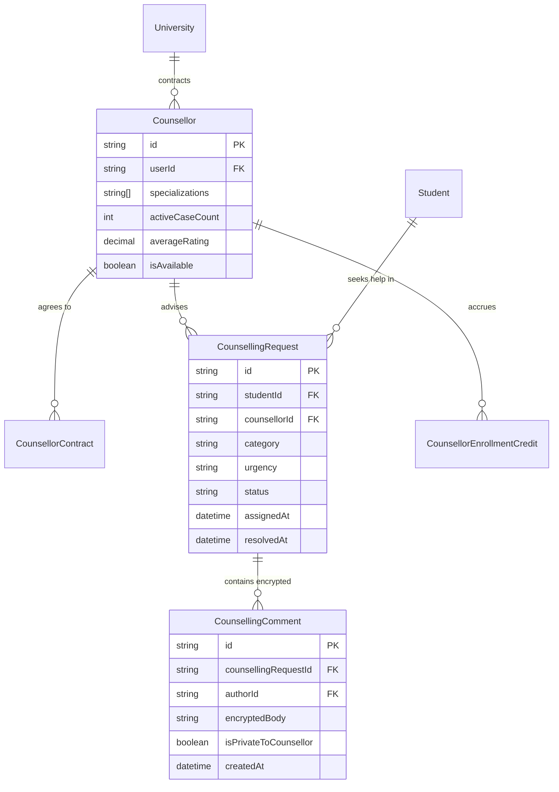
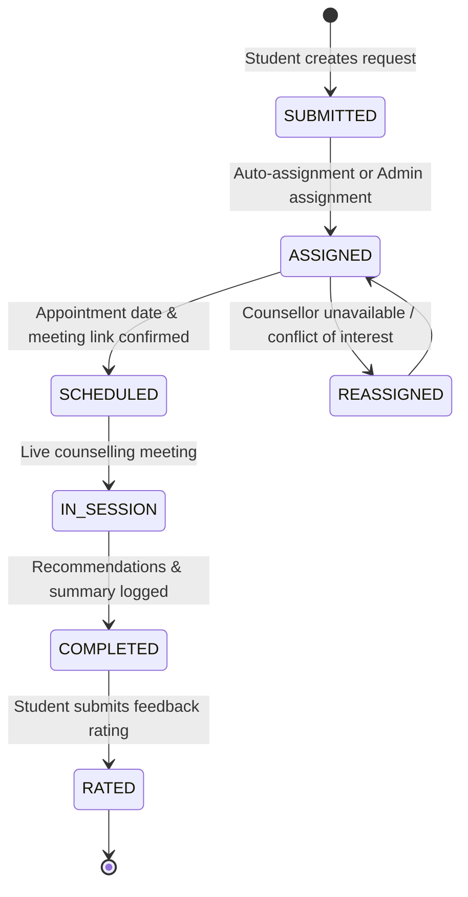

# Module 09: Counselling & Student Welfare — Technical Architecture

> **Scope**: Counsellor contract lifecycle, privacy fence architecture, auto-assignment heuristics, and data models.

---

## 1. Counselling Data Models & Privacy Fence

Case notes recorded during mental health or personal counselling are protected by an encrypted application-level privacy fence. Regular teaching faculty and non-administrative staff have zero database or API read access to `CounsellingComment` rows.

---

## 2. Request Lifecycle State Machine

