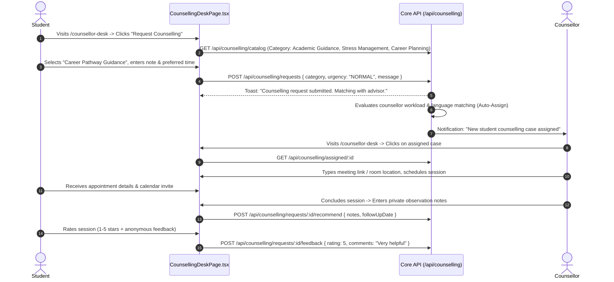

# Module 09: Counselling & Student Welfare — UI Click Flows

> **Scope**: Pre-admission and career guidance, psychological welfare counselling, counsellor contracts and enrollment credits, student appointment requests, confidential case notes, counsellor desk (`/counsellor-desk`), and university administration (`/counselling`).

---

## Screen Inventory

| Route | Page Component | Primary Actors | Key Capabilities |
|:---|:---|:---|:---|
| `/counselling` | `CounsellingAdminPage.tsx` | SuperAdmin, UnivAdmin | Counsellor registry, contract terms, credit allocations, global request queue, auto-assignment rules, ratings overview. |
| `/counsellor-desk` | `CounsellingDeskPage.tsx` | Counsellor, Student/Applicant | Case management desk: assigned appointments, recommendation notes, encrypted comments, session feedback ratings. |

---

## Flow 1: Student Welfare / Academic Counselling Request & Session Booking

### Granular Step-by-Step Table

| Step | Screen | User Interaction | Visual Changes & State | System Action / API Call | Redirection / Modal |
|:---|:---|:---|:---|:---|:---|
| 1.1 | `/counsellor-desk` | Student views active cases | List of previous sessions or empty state with "Request Counselling" button. | `GET /api/counselling/my-requests` | Table loads |
| 1.2 | `/counsellor-desk` | Clicks **"Request Counselling"** | Modal opens: category picker, preferred language, confidentiality notice. | `GET /api/counselling/catalog` | Modal opens |
| 1.3 | Modal | Fills details & clicks **"Submit"** | Case card appears with status badge `PENDING_ASSIGNMENT`. | `POST /api/counselling/requests` | Toast confirmation |
| 1.4 | `/counsellor-desk` (Counsellor) | Counsellor views assigned queue | Case card renders with student name, programme, category tag, and urgency pill. | `GET /api/counselling/assigned` | Case list |
| 1.5 | Case Detail | Enters recommendation note & clicks **"Record Recommendation"** | Note encrypted and saved; status updates to `COMPLETED`. | `POST /api/counselling/requests/:id/recommend` | Status badge green |
