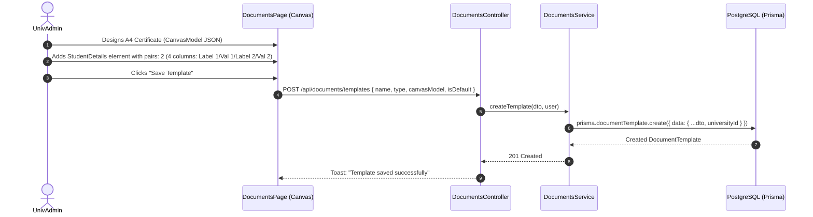
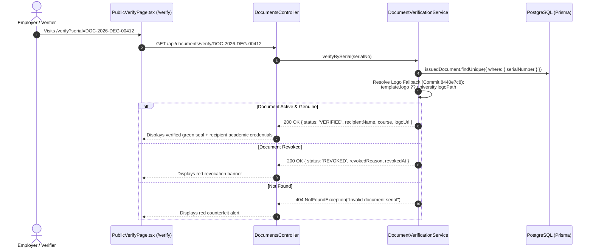

# Module 10: Documents, Certificates & Verification — End-to-End Action Processes

> **Enterprise Technical Specification**: Comprehensive document lifecycle management, visual canvas serialization, ID format tokenization with `document_type` custom tokens (commit `7e4a63a3`), physical certificate stock custody tracking with actor comments (commit `f23b646e`), pre-printed serial prompt and retry mechanics (commit `cd7838fa`), in-app scaled preview and print (commit `367b73a9`), public verification with logo fallback (commit `8440e7c8`), and external verification decision notifications (commit `ff8a09d1`).

---

## Complete Action & Endpoint Catalog

| Action # | Endpoint | HTTP Method | Primary Actor | Description & Security Scope |
|:---:|:---|:---:|:---|:---|
| **01** | `/api/documents/templates` | `POST` / `PATCH` | UnivAdmin | Creates or updates canvas document templates with visual layouts, pair grids, and token bindings. |
| **02** | `/api/documents/field-catalog` | `GET` | UnivAdmin | Returns dynamic metadata schema catalog (`student.*`, `academic.*`, `university.*`) for template authoring. |
| **03** | `/api/documents/templates/preview` | `POST` | UnivAdmin / Staff | Renders scaled in-app A4 preview modal with sample or live student data (commit `367b73a9`). |
| **04** | `/api/documents/issue` | `POST` | Exam Cell / Admin | Issues official document; derives serial from "Document Number" ID format; assigns physical stock. |
| **05** | `/api/documents/stock/batches` | `POST` | Admin | Records intake of pre-printed watermarked certificate stationary batches (e.g. Serial 10001 to 10500). |
| **06** | `/api/documents/stock` | `GET` | Admin | Queries certificate inventory with 5/10/20 paging and status filter counters (commits `acd19130`, `5a76cf44`). |
| **07** | `/api/documents/stock/:id` | `PATCH` | Admin | Marks serial as Damaged or Cancelled; stores actor email in comments (commit `f23b646e`). |
| **08** | `/api/documents/settings/pre-printed-serial` | `GET` / `PUT` | Admin | Toggles mandatory pre-printed serial requirement and sets serial number digit width (commit `8a62655c`). |
| **09** | `/api/documents/:id/delivery` | `PATCH` | Dispatch Desk | Updates delivery tracking: In-Person Collection, Postal Tracking Number, or Softcopy Download. |
| **10** | `/api/documents/:id/revoke` | `PATCH` | Registrar | Legally revokes document (e.g., degree cancellation); stores revocation reason in public verify registry. |
| **11** | `/api/documents/verify/:serialNo` | `GET` | Public / Employer | Cryptographic lookup by serial number; validates authenticity; returns fallback logo (commit `8440e7c8`). |
| **12** | `/api/documents/requests` | `POST` | Third-Party Verifier | Submits formal third-party background check request; dispatches `doc_verification_submitted` email. |
| **13** | `/api/documents/verification-requests/:id/decide` | `PATCH` | Verification Desk | Issues official verification decision letter; dispatches `doc_verification_decided` email (commit `ff8a09d1`). |

---

## Action 1: Create/Update Canvas Document Template (`POST /api/documents/templates`)

Per commit `62b5dae8`, the document template editor supports Student Details pair layouts (1, 2, or 3 label/value pairs) and table `firstRowHeader` flags.



### Protocol Specifications
- **HTTP Method & URL**: `POST /api/documents/templates`
- **Guards**: `JwtAuthGuard`, `RolesGuard('SuperAdmin', 'UnivAdmin')`
- **Request Body (DTO: `CreateDocumentTemplateDto`)**:
  ```json
  {
    "name": "Official B.Tech Degree Certificate",
    "type": "DEGREE_CERTIFICATE",
    "paperSize": "A4",
    "orientation": "PORTRAIT",
    "canvasModel": {
      "width": 794,
      "height": 1123,
      "elements": [
        {
          "id": "el_bg_watermark",
          "type": "IMAGE",
          "x": 200, "y": 300, "width": 400, "height": 400,
          "opacity": 0.08,
          "src": "data:image/png;base64,..."
        },
        {
          "id": "el_student_details_table",
          "type": "STUDENT_DETAILS",
          "x": 80, "y": 420, "width": 634,
          "pairs": 2,
          "columns": 4,
          "firstRowHeader": true,
          "rows": [
            [
              { "text": "Student Name:" },
              { "text": "{{student.fullName}}" },
              { "text": "Enrollment No:" },
              { "text": "{{student.enrollmentNumber}}" }
            ],
            [
              { "text": "Programme:" },
              { "text": "{{academic.programmeName}}" },
              { "text": "Cumulative CGPA:" },
              { "text": "{{academic.cgpa}}" }
            ]
          ]
        },
        {
          "id": "el_verification_qr",
          "type": "QR_CODE",
          "x": 620, "y": 950, "width": 100, "height": 100,
          "data": "{{document.verificationUrl}}"
        }
      ]
    },
    "signatoryIds": ["stf_dean_01", "stf_registrar_01"]
  }
  ```
- **Response (201 Created)**:
  ```json
  {
    "id": "tmpl_deg_2026_01",
    "name": "Official B.Tech Degree Certificate",
    "type": "DEGREE_CERTIFICATE",
    "isActive": true,
    "createdAt": "2026-09-11T12:00:00.000Z"
  }
  ```

---

## Action 2: Document Issuance & Physical Stock Allocation (`POST /api/documents/issue`)

Per commits `218bf299`, `7e4a63a3`, `f23b646e`, and `cd7838fa`:

```mermaid
sequenceDiagram
    autonumber
    actor Officer as Exam Superintendent
    participant Ctrl as DocumentsController
    participant DocService as DocumentsService
    participant IdService as IdFormatService
    participant DB as PostgreSQL (Prisma)
    participant Worker as Certificate Generator Worker

    Officer->>Ctrl: POST /api/documents/issue { templateId, studentId, prePrintedSerial }
    Ctrl->>DocService: issueDocument(dto, user)
    
    DocService->>IdService: generateNumber("Document Number", { document_type: template.type, year: 2026 })
    IdService->>DB: prisma.idSequenceCounter.update({ increment: 1 })
    IdService-->>DocService: Generated Serial "DOC-2026-DEG-00412"

    DocService->>DB: $transaction [
        1. Validate prePrintedSerial is UNUSED in CertificateStock
        2. certificateStock.update({ status: 'ISSUED', comment: 'issued: ' + enrollmentNo + '/' + user.email })
        3. issuedDocument.create({ serialNumber, prePrintedSerial, studentId, templateId })
    ]
    DB-->>DocService: Committed

    DocService->>Worker: Enqueue PDF generation job (Embeds QR Code & Signatures)
    DocService-->>Ctrl: Formatted Issued Document Payload
    Ctrl-->>Officer: 201 Created
```

### Protocol Specifications
- **HTTP Method & URL**: `POST /api/documents/issue`
- **Request Body (DTO: `IssueDocumentDto`)**:
  ```json
  {
    "templateId": "tmpl_deg_2026_01",
    "studentId": "std_2026_cse_042",
    "batchTermId": "bterm_2026_cse_t8",
    "deliveryMode": "HARDCOPY",
    "prePrintedSerial": "STK-2026-99120"
  }
  ```
- **Audit Comment Record (Commit `f23b646e`)**:
  When physical stock is assigned or marked damaged, the audit comment captures both the student enrollment and the user email who executed the action:
  ```typescript
  const comment = `issued: ${student.enrollmentNumber}/${req.user.email}`;
  // For damaged stock:
  // const comment = `damaged: ${dto.reason}/${req.user.email}`;
  ```
- **Prisma Database Mutation**:
  ```prisma
  await prisma.$transaction(async (tx) => {
    // Check pre-printed stock validity
    const stock = await tx.certificateStock.findUnique({
      where: { serialNumber: dto.prePrintedSerial }
    });
    if (stock.status !== "UNUSED") {
      throw new ConflictException(`Serial ${dto.prePrintedSerial} is already ${stock.status}`);
    }

    // Update physical inventory
    await tx.certificateStock.update({
      where: { serialNumber: dto.prePrintedSerial },
      data: {
        status: "ISSUED",
        comment: `issued: ${student.enrollmentNumber}/${req.user.email}`,
        issuedAt: new Date(),
        issuedToStudentId: student.id
      }
    });

    // Create legal issued record
    const issued = await tx.issuedDocument.create({
      data: {
        serialNumber: generatedSerialNo,
        prePrintedSerial: dto.prePrintedSerial,
        documentTemplateId: dto.templateId,
        studentId: dto.studentId,
        issuedById: req.user.id,
        status: "ISSUED",
        metadata: {
          termName: term.name,
          cgpa: studentResult.cgpa,
          division: studentResult.division
        }
      }
    });

    return issued;
  });
  ```
- **Response (201 Created)**:
  ```json
  {
    "id": "doc_iss_99120",
    "serialNumber": "DOC-2026-DEG-00412",
    "prePrintedSerial": "STK-2026-99120",
    "verificationUrl": "https://erp.university.edu/verify?serial=DOC-2026-DEG-00412",
    "issuedAt": "2026-09-11T12:00:00.000Z"
  }
  ```

---

## Action 3: Public Verification & University Logo Fallback (`GET /api/documents/verify/:serialNo`)

Per commit `8440e7c8`, public verification resolves the template-specific logo; if absent, it gracefully falls back to `University.logoPath`.



### Protocol Specifications
- **HTTP Method & URL**: `GET /api/documents/verify/:serialNo`
- **Security**: Publicly accessible; rate-limited (max 20 queries/min per IP).
- **Logo Fallback Code Logic (Commit `8440e7c8`)**:
  ```typescript
  const logoUrl = documentTemplate.logoUrl 
    ?? university.logoPath 
    ?? "/assets/brand/default-university-seal.png";
  ```
- **Response Payload (200 OK)**:
  ```json
  {
    "status": "VERIFIED",
    "serialNumber": "DOC-2026-DEG-00412",
    "prePrintedSerial": "STK-2026-99120",
    "recipientName": "Sarah Connor",
    "programme": "Bachelor of Technology in Computer Science & Engineering",
    "instituteName": "School of Engineering",
    "universityName": "State Technical University",
    "issuedDate": "2026-06-30",
    "cgpa": "9.42",
    "division": "FIRST_CLASS_WITH_DISTINCTION",
    "logoUrl": "https://storage.university.edu/brand/university_crest.png",
    "isGenuine": true
  }
  ```

---

## Action 4: Third-Party Verification Workflow & Email Dispatch (`PATCH .../decide`)

Per commit `ff8a09d1`, background check notifications are powered by Communication Message Templates:
- `doc_verification_submitted`: Confirms receipt of verification request and fee.
- `doc_verification_decided`: Dispatches official verification certificate or rejection notice to requesting agency.

- **HTTP Method & URL**: `PATCH /api/documents/verification-requests/:id/decide`
- **Guards**: `JwtAuthGuard`, `RolesGuard('UnivAdmin', 'SuperAdmin')`
- **Request Body**:
  ```json
  {
    "decision": "VERIFIED",
    "remarks": "Academic credentials matched with registrar archives. No disciplinary record.",
    "approverSignatureId": "sig_registrar_01"
  }
  ```
- **Notification Worker Event Dispatch**:
  ```typescript
  await this.messageTemplateService.send({
    templateKey: "doc_verification_decided",
    channel: "EMAIL",
    recipientEmail: request.requesterEmail,
    tokens: {
      requesterName: request.requesterName,
      documentSerial: request.serialNumber,
      studentName: request.student.fullName,
      decision: "VERIFIED",
      remarks: dto.remarks,
      verificationDate: new Date().toLocaleDateString()
    }
  });
  ```
- **Response (200 OK)**:
  ```json
  {
    "requestId": "vreq_99214",
    "status": "DECIDED",
    "decision": "VERIFIED",
    "notificationDispatched": true
  }
  ```
