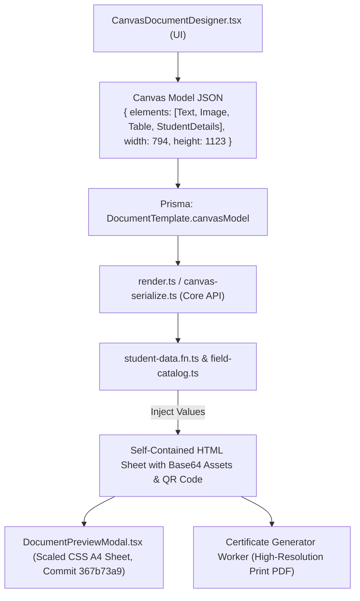
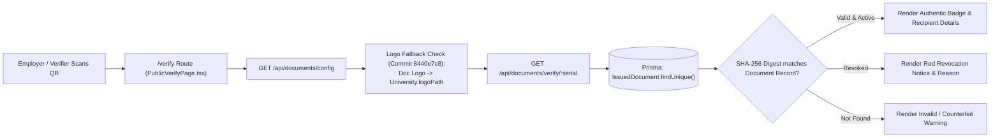

# Module 10: Documents, Certificates & Verification — Technical Architecture

> **Scope**: Canvas document serialization to HTML/PDF, ID format pattern tokenizer with `document_type` custom token, certificate physical inventory lifecycle, and QR verification cryptographic validation.

---

## 1. Document Canvas Rendering & Serialization Pipeline

Templates authored in `CanvasDocumentDesigner.tsx` serialize to a JSON model containing coordinates, styling, tables, pair layouts, and dynamic token placeholders.



---

## 2. Certificate Stock Inventory State Machine

Per commits `f23b646e`, `ca129574`, and `8a62655c`, physical stationary security sheets (watermarked paper with holographic serials) follow an audited custody lifecycle.

```mermaid
stateDiagram-v2
    [*] --> STOCK_BATCH_CREATED: Admin logs Batch of 500 Blank Certificates
    STOCK_BATCH_CREATED --> UNUSED: Stock Serials Generated (STK-001 to STK-500)
    
    state UNUSED {
        [*] --> InVault
        InVault --> VaultAudited: Page Size 5/10/20 Paging (Commit acd19130)
    }

    UNUSED --> ISSUED: Hardcopy Issue Flow (Commit cd7838fa)
    note right of ISSUED: Comment recorded: 'issued: <enrollmentNo>/<user email>' (Commit f23b646e)
    
    UNUSED --> DAMAGED: Physical Defect / Printer Jam
    note right of DAMAGED: Comment recorded: 'damaged: <reason>/<user email>' (Commit f23b646e)

    ISSUED --> REVOKED: Degree Withdrawn / Legal Invalidation
    DAMAGED --> [*]
    REVOKED --> [*]
```

---

## 3. QR Verification Cryptographic Validation Pipeline

Every certificate carries a 2D QR code embedding a signed verification URL:
`https://erp.university.edu/verify?serial=DOC-2026-DEG-00412`


