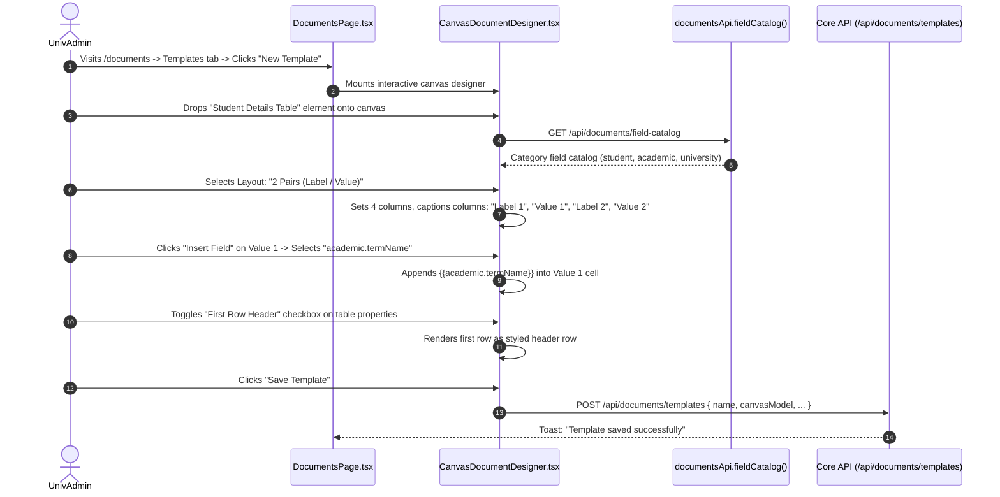
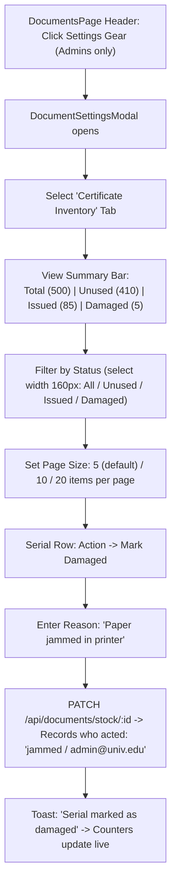

# Module 10: Documents, Certificates & Verification — UI Click Flows

> **Scope**: Canvas Document Designer (Student Details pair layout, field picker, table headers), Document Settings gear modal, Certificate Inventory (Unused/Issued/Damaged counters, 5/10/20 pagination, actor comments), Pre-printed serial numbers prompt, In-app scaled A4 preview modal with direct print, and Public Verification Portal (`/verify`).

---

## Screen Inventory

| Route | Page Component | Primary Actors | Key Capabilities |
|:---|:---|:---|:---|
| `/documents` | `DocumentsPage.tsx` | UnivAdmin, InstAdmin, Student | Document templates, Canvas designer, Issue Documents tab, My Documents, Certificate Inventory, and Page Header Gear Settings. |
| Page Header Gear | `DocumentSettingsModal.tsx` & `DocumentSettingsPanels.tsx` | SuperAdmin, UnivAdmin | Pre-printed serial toggles, Certificate stock batches, "Verify Document URL" config (renamed per `acd19130`), Verification requests review. |
| Modal | `DocumentPreviewModal.tsx` | All Users | In-app pop-up showing document as scaled A4/Letter sheet (per commit `367b73a9`) with direct "Print" button without opening browser tab. |
| `/verify` | `PublicVerifyPage.tsx` | Public, Employers, Embassies | Public document verification by QR code / Serial number, university logo fallback (per `8440e7c8`), official document lookup. |

---

## Flow 1: Canvas Document Template Designer (Pair Layouts & Field Picker)

Per commit `62b5dae8`, the Student Details component provides pair layout modes (1, 2, or 3 label/value pairs or Custom) and an insert-field picker from the dynamic field catalog.

### Granular Step-by-Step Table

| Step | Screen | User Interaction | Visual Changes & State | System Action / API Call | Redirection / Modal |
|:---|:---|:---|:---|:---|:---|
| 1.1 | `/documents` | Clicks **"+ Create Template"** | Opens `CanvasDocumentDesigner.tsx` with blank A4 canvas (794x1123 px). | None | Canvas designer |
| 1.2 | Canvas Sidebar | Drags **"Student Details"** widget onto canvas | Drops table widget; opens right-hand properties panel. | `GET /api/documents/field-catalog` | Properties open |
| 1.3 | Properties Panel| Clicks "Layout" select dropdown | Options: `1 Pair`, `2 Pairs`, `3 Pairs`, `Custom Columns` (per `62b5dae8`). | None | Layout modes |
| 1.4 | Properties Panel| Selects **"2 Pairs"** | Table automatically configures 4 columns (`Label 1 / Value 1 / Label 2 / Value 2`). | None | Table re-grids |
| 1.5 | Cell Editor | Focuses Value 1 cell $\to$ Clicks **"+ Insert Field"** | Field picker popover renders categories: Student Profile, Academic Term, University. | None | Popover opens |
| 1.6 | Field Popover | Selects `academic.termName` | Injects token `{{academic.termName}}` directly into cell (per `fe6dfbd7`). | None | Token inserted |
| 1.7 | Table Widget | Checks **"First row is header"** checkbox | First row styles with `font-bold bg-gray-100` in both live preview and HTML output. | None | Header formatted |
| 1.8 | Toolbar | Clicks **"Preview Sheet"** | Scaled in-app pop-up renders A4 sheet with sample data. | Client-side render | Preview modal |
| 1.9 | Toolbar | Clicks **"Save Template"** | Saves canvas model JSON. | `POST /api/documents/templates` | Toast: "Saved" |

---

## Flow 2: Certificate Inventory, 5/10/20 Paging & Audit Comments

Per commits `acd19130`, `f23b646e`, `5a76cf44`, `911a10d4`, and `ca129574`:

### Granular Step-by-Step Table

| Step | Screen | User Interaction | Visual Changes & State | System Action / API Call | Redirection / Modal |
|:---|:---|:---|:---|:---|:---|
| 2.1 | `/documents` | Admin clicks Gear icon in header | `DocumentSettingsModal.tsx` opens (relocated from Templates tab per `ab7943b4`). | None | Modal opens |
| 2.2 | Modal | Selects tab **"Certificate Inventory"** | Summary counter bar renders above list: `Unused (410) Issued (85) Damaged (5)` per `ca129574`. | `GET /api/documents/stock` | Tab active |
| 2.3 | Toolbar | Selects Status dropdown (width 160px) | Filters table to only `Issued` or `Damaged` without text search box per `911a10d4`. | None | Filter applied |
| 2.4 | Toolbar | Selects page size dropdown | Options: `5 (default)`, `10`, `20` per commit `acd19130`. | Local state update | Pagination |
| 2.5 | Table Row | Inspects Serial Comment column | Displays who acted and why: e.g. `issued: 2026-CSE-012/registrar@univ.edu` or `damaged: folded corner/clerk@univ.edu` per `f23b646e`. | None | Audit comments |
| 2.6 | Table Row | Clicks **"Mark Damaged"** on Unused serial | Prompts for damage reason: types *"Ink cartridge smudge"*. | None | ConfirmDialog |
| 2.7 | ConfirmDialog | Clicks **"Confirm"** | Status updates to `DAMAGED`; audit record stores user email in comment. | `PATCH /api/documents/stock/:id` | Counters update |

---

## Flow 3: Hardcopy Issuance with Pre-Printed Serial Prompt & In-App Preview

Per commits `cd7838fa`, `367b73a9`, and `218bf299`:

| Step | Screen | User Interaction | Visual Changes & State | System Action / API Call | Redirection / Modal |
|:---|:---|:---|:---|:---|:---|
| 3.1 | `/documents` | Visits "Issue Documents" tab | Selects Student and Template (`Degree Certificate`). | `GET /api/documents/templates` | Selection active |
| 3.2 | Action Bar | Clicks **"Preview"** | In-app pop-up modal (`DocumentPreviewModal.tsx`) renders scaled A4 sheet. Does NOT open new tab per `367b73a9`. | In-app modal | Preview modal |
| 3.3 | Preview Modal | Clicks **"Print"** from within modal | Triggers browser print dialog directly from the modal view. | `window.print()` | Print dialog |
| 3.4 | Issue Form | Selects Mode: `HARDCOPY` $\to$ Clicks **"Issue Certificate"** | Pre-printed serial prompt dialog appears for all issue roles per `cd7838fa`. | None | Prompt modal |
| 3.5 | Prompt Dialog | Enters physical stationary number: `CERT-2026-0812` | If serial already used or missing: prompt-and-retry fallback allows re-entering number. | `POST /api/documents/issue` | Serial validated |
| 3.6 | Prompt Dialog | Confirms serial | Issued document serial generated from "Document Number" ID format per `218bf299`. | None | Success toast |

---

## Flow 4: Public Verification Portal (`/verify`) with University Logo Fallback

Per commit `8440e7c8` and `ff8a09d1`:

| Step | Screen | User Interaction | Visual Changes & State | System Action / API Call | Redirection / Modal |
|:---|:---|:---|:---|:---|:---|
| 4.1 | `/verify` | Public user visits without logging in | Clean verification interface with university branding. | `GET /api/documents/public-config` | Public page |
| 4.2 | `/verify` | Checks logo display | If template has no custom logo, system falls back to `University.logoPath` per `8440e7c8`. | None | Logo rendered |
| 4.3 | Search Bar | Enters Certificate Serial or scans QR | Types `DOC-2026-CSE-9912` and solves Captcha. | `GET /api/documents/verify/:serial` | Verification run |
| 4.4 | Result Card | Document verified | Displays green checkmark, Recipient Name, Course, Issue Date, Digital Signature status. | None | Verified card |
| 4.5 | Result Card | If external verification requested | Submits employer request. Automated emails sent via `doc_verification_submitted` and `doc_verification_decided` templates per `ff8a09d1`. | `POST /api/documents/requests` | Email dispatched |
