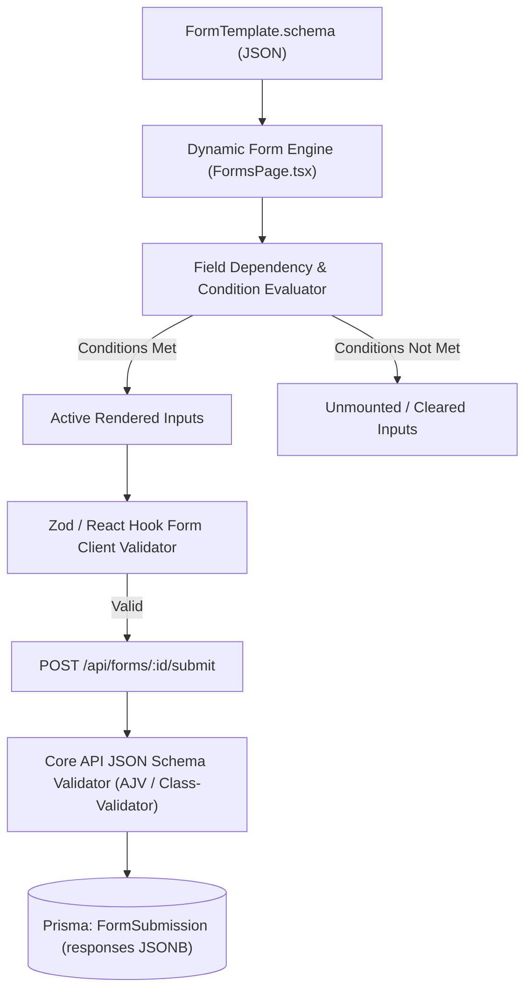
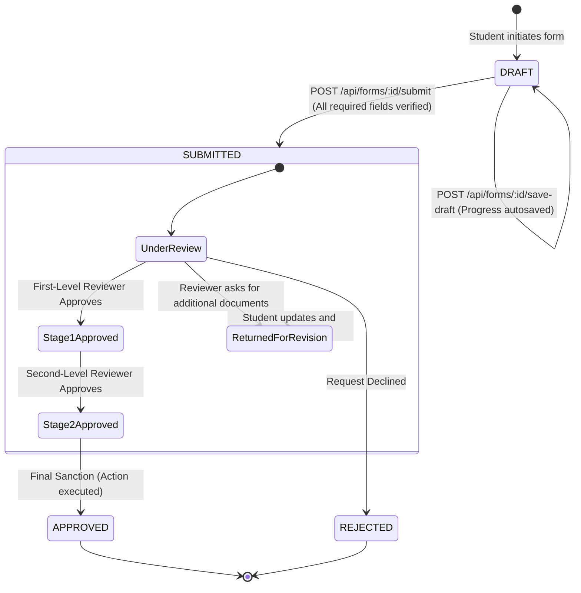

# Module 11: Dynamic Forms & Surveys — Technical Architecture

> **Scope**: Dynamic schema architecture, field dependency evaluation engine, workflow trigger integration, and submission lifecycle models.

---

## 1. Dynamic Form Schema Architecture

Form schemas are defined in JSON Schema standard format, rendering through a dynamic React field component engine.

---

## 2. Form Submission Lifecycle State Machine

