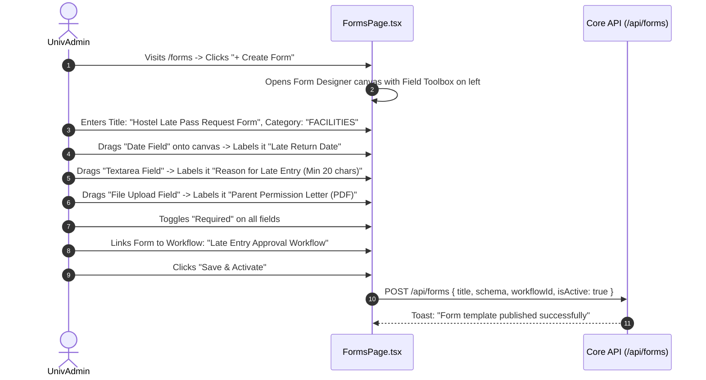

# Module 11: Dynamic Forms & Surveys — UI Click Flows

> **Scope**: Visual drag-and-drop form template builder, dynamic field components (Text, Number, Date, Select, Radio, File Upload, Signature, Section Break), validation rule builder, form submission workflows, review dashboards, and read-only renderers.

---

## Screen Inventory

| Route | Page Component | Primary Actors | Key Capabilities |
|:---|:---|:---|:---|
| `/forms` | `FormsPage.tsx` | UnivAdmin, InstAdmin, All Users | Template builder, schema editor, activation/deactivation, submissions table, review modal, and user form filling interface. |
| Component / View | `ReadOnlyFormView.tsx` | Reviewers, Approvers | Immutable historical snapshot of submitted user form data with field layout and attachments preview. |

---

## Flow 1: Form Template Authoring (Visual Schema Designer)

### Granular Step-by-Step Table

| Step | Screen | User Interaction | Visual Changes & State | System Action / API Call | Redirection / Modal |
|:---|:---|:---|:---|:---|:---|
| 1.1 | `/forms` | Visits page | Form templates gallery (Active, Inactive, Drafts). "Create Form" button. | `GET /api/forms` | Gallery renders |
| 1.2 | `/forms` | Clicks **"+ Create Form"** | Visual designer mounts: Palette left, Form Preview center, Field Properties right. | None | Builder opens |
| 1.3 | Builder | Drags **"Radio Group"** onto canvas | Adds field block. Right panel displays options editor: Option 1, Option 2, Add Option. | None | Canvas updates |
| 1.4 | Right Panel | Enters Label: *"Mode of Travel"*, options: `College Bus`, `Personal Vehicle`, `Public Transport` | Live preview renders radio buttons in real time. | None | Live sync |
| 1.5 | Right Panel | Sets Conditional Visibility: *"Show if Department == 'Engineering'"* | Rule condition tag attaches to field block. | None | Condition badge |
| 1.6 | Toolbar | Clicks **"Preview as Student"** | Opens simulated student form modal with full responsive behavior. | None | Preview modal |
| 1.7 | Toolbar | Clicks **"Publish Form"** | Saves schema; status badge turns emerald `ACTIVE`. | `POST /api/forms` | Toast confirmation |

---

## Flow 2: User Form Submission & Review Tracking

| Step | Screen | User Interaction | Visual Changes & State | System Action / API Call | Redirection / Modal |
|:---|:---|:---|:---|:---|:---|
| 2.1 | `/forms` | Student selects published form | Form renders dynamically with required field asterisks (`*`) and section dividers. | `GET /api/forms/:id` | Dynamic form |
| 2.2 | Dynamic Form | Fills fields, uploads attachment document | Dropzone validates file size (< 5MB) and mime type (PDF/JPEG). | `POST /api/upload/form-attachment` | File attached |
| 2.3 | Dynamic Form | Clicks **"Save as Draft"** | Saves progress; draft indicator confirms *"Saved at 12:05 PM"*. | `POST /api/forms/:id/save-draft` | Toast: "Draft saved" |
| 2.4 | Dynamic Form | Clicks **"Submit Form"** | Validates all rules; locks submission; generates tracking reference. | `POST /api/forms/:id/submit` | Submission receipt |
| 2.5 | `/forms` (Reviewer) | Reviewer clicks Submissions tab $\to$ Row **"Review"** | `ReadOnlyFormView.tsx` renders submitted data. Reviewer clicks **"Approve"**. | `PATCH /api/forms/submissions/:id/review` | Status `APPROVED` |
