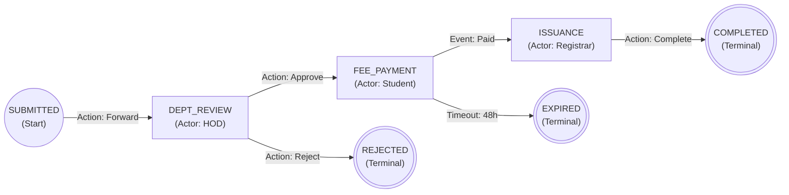
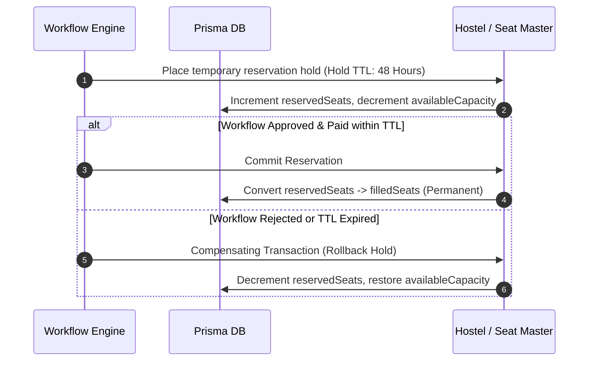
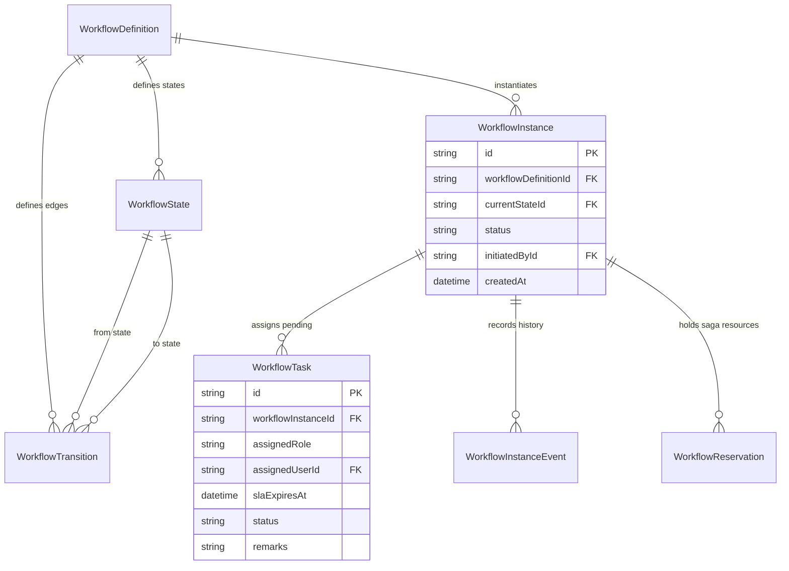

# Module 12: Visual Workflow Engine & Approvals — Technical Architecture

> **Scope**: Directed graph execution engine, Saga pattern reservation holds, SLA aging algorithms, and workflow data models.

---

## 1. Directed Graph State Machine Execution Model

Workflow definitions represent deterministic finite state automata (DFA). Transitions are evaluated using incoming user actions and conditional predicates.

---

## 2. Saga Pattern Resource Reservation Holds

When a workflow requires scarce resources (hostel room bed, admission seat, bus pass quota), the engine places a temporary **Saga Hold** (`WorkflowReservation`).

---

## 3. Workflow Entity Relationships

