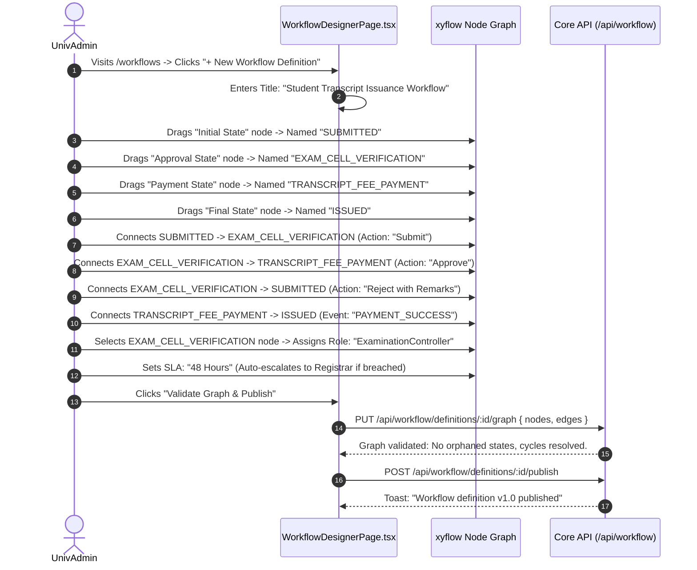

# Module 12: Visual Workflow Engine & Approvals — UI Click Flows

> **Scope**: Visual node-based workflow designer (`@xyflow/react`), state definitions, transitions, conditions, role assignments, Task Inbox (`/my-tasks`), Workflow Monitor (`/workflow-monitor`), SLA tracking, and resource holds.

---

## Screen Inventory

| Route | Page Component | Primary Actors | Key Capabilities |
|:---|:---|:---|:---|
| `/workflows` | `WorkflowDesignerPage.tsx` | SuperAdmin, UnivAdmin | Visual node-based graph editor: drag-and-drop states (Start, Review, Payment, Hold, End), connect transitions, assign actor roles, define timeout SLAs. |
| `/my-tasks` | `MyTasksPage.tsx` | All Authenticated Users | Unified universal task inbox: pending approvals, form reviews, payment authorizations, comments, re-assign actions. |
| `/workflow-monitor` | `WorkflowMonitorPage.tsx` | UnivAdmin, InstAdmin | Real-time instance execution viewer: visual progress graph, aging timers, bottleneck analysis, manual transition override. |

---

## Flow 1: Visual Workflow Graph Authoring (`/workflows`)

### Granular Step-by-Step Table

| Step | Screen | User Interaction | Visual Changes & State | System Action / API Call | Redirection / Modal |
|:---|:---|:---|:---|:---|:---|
| 1.1 | `/workflows` | Opens Workflow Designer | Node palette on left: Start Node, Approval Node, Payment Gate, Automated Action, Terminus. | `GET /api/workflow/definitions` | Canvas mounted |
| 1.2 | Canvas | Connects Edge from `Approval Node` to `Terminus` | Animated dashed edge turns solid green when connected to target handle. | None | Edge drawn |
| 1.3 | Properties Panel| Sets Transition Action: `APPROVE`, Required Role: `HOD` | Properties panel saves state parameters locally. | None | Node labelled |
| 1.4 | Properties Panel| Checks "Require Decision Comment" toggle | Enforces mandatory reviewer notes on rejection or approval. | None | Property saved |
| 1.5 | Toolbar | Clicks **"Validate Graph"** | Validation engine verifies: single entry point, reachable terminus, valid edge conditions. | None | Badge: "Valid Graph" |
| 1.6 | Toolbar | Clicks **"Publish Definition"** | Definition marked immutable; creates new active version. | `POST /api/workflow/definitions/:id/publish` | Toast confirmation |

---

## Flow 2: Approver Decision Action from Unified Task Inbox (`/my-tasks`)

| Step | Screen | User Interaction | Visual Changes & State | System Action / API Call | Redirection / Modal |
|:---|:---|:---|:---|:---|:---|
| 2.1 | `/my-tasks` | User views pending tasks | Task inbox cards show: Workflow Name, Submitted By, Time in Stage, SLA status badge (Green/Yellow/Red Breached). | `GET /api/workflow/inbox` | Inbox rendered |
| 2.2 | Task Card | Clicks task card `TSK-9912` | Sliding drawer (`InstanceDrawer.tsx`) opens displaying workflow progress bar, form data snapshot, and action buttons. | `GET /api/workflow/instances/:id` | Drawer opens |
| 2.3 | Drawer | Inspects attached student documents | In-drawer document preview; marks items as checked. | None | Documents viewed |
| 2.4 | Drawer | Clicks **"Approve"** button | Enters review comment: *"Verified against physical grade ledger"*. | None | Confirmation modal |
| 2.5 | Drawer | Clicks **"Confirm Action"** | Task disappears from inbox; workflow advances to next state in real time. | `POST /api/workflow/tasks/:id/act { action: 'APPROVE', remarks }` | Toast: "Task approved" |
