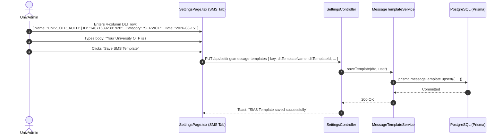
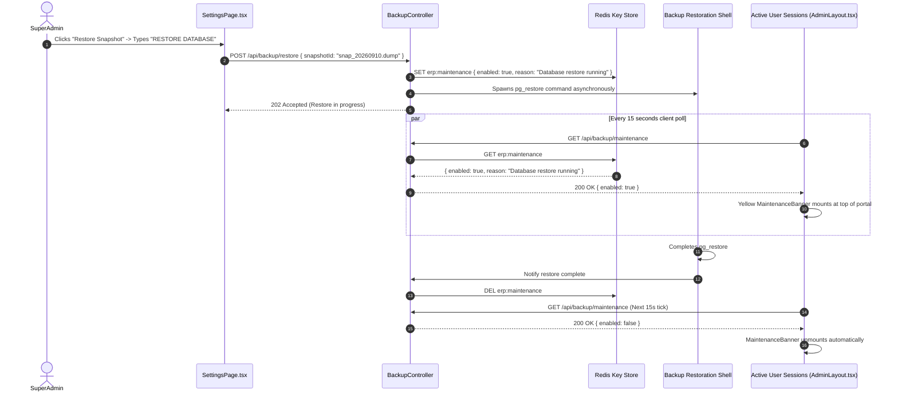

# Module 13: System Governance & Administration — End-to-End Action Processes

> **Enterprise Technical Specification**: Comprehensive system governance, User lifecycle and multi-role RBAC assignments, security policies and session timeouts in page-level gear modal (commit `6f060a59`), telecom SMS DLT metadata registrations with 4-column layout (commit `b2c9fe5f`), navigation menu layouts, database backup/restore with live maintenance banner polling, and immutable enterprise audit streams.

---

## Complete Action & Endpoint Catalog

| Action # | Endpoint | HTTP Method | Primary Actor | Description & Security Scope |
|:---:|:---|:---:|:---|:---|
| **01** | `/api/users` | `GET` / `POST` | SuperAdmin / InstAdmin | User catalog pagination, search, filter by role, and administrative account provisioning. |
| **02** | `/api/users/:id/roles` | `PUT` | SuperAdmin / UnivAdmin | Assigns primary application role and multi-role assignments (`applicationRoles[]`). |
| **03** | `/api/users/:id/unlock` | `PATCH` | Admin | Clears account lockout timestamp (`lockedUntil = null`) and resets failed attempt counters. |
| **04** | `/api/users/:id/activate` | `PATCH` | Admin | Toggles active/suspended state of user account; instantly revokes active JWT sessions. |
| **05** | `/api/settings/password-policy` | `GET` / `PUT` | SuperAdmin | Institutional password complexity rules (min length, symbol requirement, history cycle count). |
| **06** | `/api/settings/session` | `GET` / `PUT` | SuperAdmin | Enforces idle logout timeout minutes and concurrent session constraints (commit `6f060a59`). |
| **07** | `/api/settings/message-templates` | `PUT` | UnivAdmin | Captures DLT Template Name, 19-digit DLT ID, category, and approval date in 4-column layout (commit `b2c9fe5f`). |
| **08** | `/api/settings/nav-layout` | `GET` / `PUT` | SuperAdmin | Manages university-wide sidebar ordering and folder grouping (persisted in `University.config`). |
| **09** | `/api/settings/notice-board` | `GET` / `PUT` | UnivAdmin | Notice Board category and priority settings (moved to page gear modal per commit `81b9a901`). |
| **10** | `/api/backup/run` | `POST` | SuperAdmin | Triggers automated PostgreSQL database dump (`pg_dump`) to local/S3 destination. |
| **11** | `/api/backup/restore` | `POST` | SuperAdmin | Orchestrates database restore; sets Redis maintenance mode; triggers live `MaintenanceBanner`. |
| **12** | `/api/backup/maintenance` | `GET` | Public / SPA | Polled every 15 seconds by all connected clients to display or hide maintenance warning banner. |
| **13** | `/api/audit/logs` | `GET` | SuperAdmin / Auditor | Queries immutable enterprise audit stream with filtering by user, action, entity, date, and IP. |

---

## Action 1: Role Assignment & Multi-Role Authorization Update (`PUT /api/users/:id/roles`)

```mermaid
sequenceDiagram
    autonumber
    actor Admin as SuperAdmin / UnivAdmin
    participant Ctrl as UsersController
    participant Service as UsersService
    participant DB as PostgreSQL (Prisma)
    participant Redis as Redis Session Cache

    Admin->>Ctrl: PUT /api/users/:id/roles { applicationRole: "InstAdmin", applicationRoles: ["InstAdmin", "TeachingFaculty"] }
    Ctrl->>Service: updateRoles(id, dto, adminUser)
    
    Service->>DB: Check admin has authority over target institute
    Service->>DB: $transaction [
        1. user.update({ applicationRole, applicationRoles, roles })
        2. auditLog.create({ action: 'USER_ROLES_MODIFIED', details: { oldRoles, newRoles } })
    ]
    DB-->>Service: Committed
    
    Service->>Redis: Invalidate cached session for userId
    Service-->>Ctrl: Updated User Object
    Ctrl-->>Admin: 200 OK
```

### Protocol Specifications
- **HTTP Method & URL**: `PUT /api/users/:id/roles`
- **Guards**: `JwtAuthGuard`, `RolesGuard('SuperAdmin', 'UnivAdmin')`
- **Request Body (DTO: `UpdateUserRolesDto`)**:
  ```json
  {
    "applicationRole": "InstAdmin",
    "applicationRoles": ["InstAdmin", "TeachingFaculty"],
    "roles": ["Associate Professor", "HOD - Computer Science"]
  }
  ```
- **Prisma Database Mutation**:
  ```prisma
  await prisma.$transaction(async (tx) => {
    const user = await tx.user.findUnique({ where: { id: params.id } });

    const updated = await tx.user.update({
      where: { id: params.id },
      data: {
        applicationRole: dto.applicationRole,
        applicationRoles: dto.applicationRoles,
        roles: dto.roles
      }
    });

    await tx.auditLog.create({
      data: {
        action: "USER_ROLES_UPDATED",
        userId: req.user.id,
        entity: "User",
        entityId: params.id,
        oldData: { primary: user.applicationRole, multi: user.applicationRoles },
        newData: { primary: dto.applicationRole, multi: dto.applicationRoles }
      }
    });

    return updated;
  });
  ```
- **Response (200 OK)**:
  ```json
  {
    "id": "usr_9921448",
    "email": "faculty.john@university.edu",
    "applicationRole": "InstAdmin",
    "applicationRoles": ["InstAdmin", "TeachingFaculty"],
    "roles": ["Associate Professor", "HOD - Computer Science"],
    "updatedAt": "2026-09-11T12:00:00.000Z"
  }
  ```

---

## Action 2: SMS DLT Registration & 4-Column Metadata (`PUT /api/settings/message-templates`)

Per commit `b2c9fe5f`, SMS template configuration captures the "DLT Template Name" ahead of its numeric ID, arranged in an expanded 4-column layout without affecting wire serialization.



### Protocol Specifications
- **HTTP Method & URL**: `PUT /api/settings/message-templates`
- **Request Body (DTO: `SaveMessageTemplateDto`)**:
  ```json
  {
    "key": "otp_login_verification",
    "channel": "SMS",
    "dltTemplateName": "UNIV_OTP_AUTH",
    "dltTemplateId": "140716892301928",
    "category": "SERVICE_IMPLICIT",
    "approvalDate": "2026-08-15",
    "body": "Dear User, your login verification OTP for State Technical University is {#var#}. Valid for 5 minutes. Do not share."
  }
  ```
- **Response (200 OK)**:
  ```json
  {
    "key": "otp_login_verification",
    "dltTemplateName": "UNIV_OTP_AUTH",
    "dltTemplateId": "140716892301928",
    "status": "APPROVED",
    "updatedAt": "2026-09-11T12:00:00.000Z"
  }
  ```

---

## Action 3: Database Restore Execution & Maintenance Banner (`POST /api/backup/restore` & `GET /api/backup/maintenance`)


