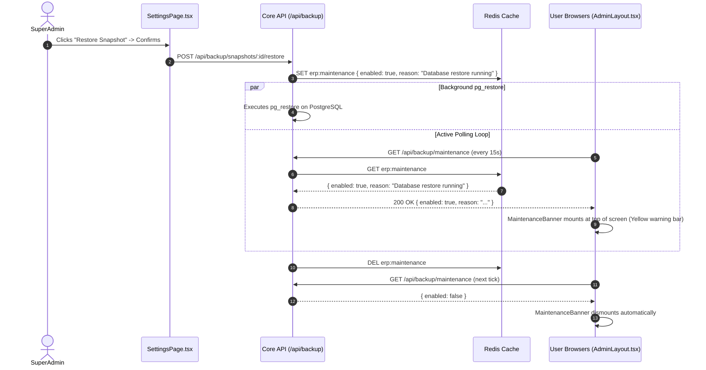
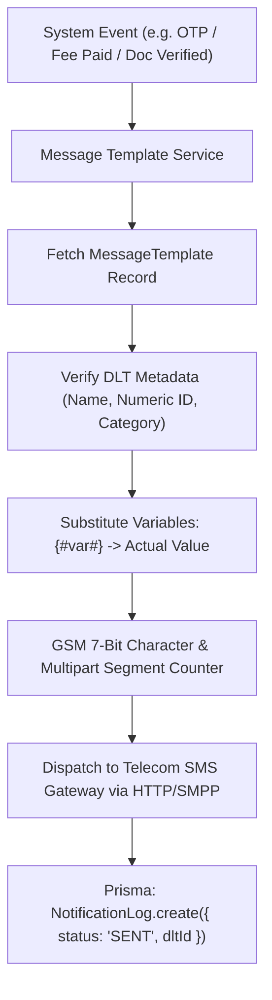

# Module 13: System Governance & Administration — Technical Architecture

> **Scope**: Immutable audit log stream, telecom SMS DLT regulatory pipeline, disaster recovery maintenance polling architecture, and dynamic navigation layout normalization.

---

## 1. Disaster Recovery & Global Maintenance Polling Architecture

During disruptive maintenance operations (such as a database snapshot restore), a global banner prevents user operations that could corrupt in-flight transactions.

---

## 2. Telecom SMS DLT Pipeline Architecture

Per regulatory mandates (TRAI / DLT), SMS payloads must strictly adhere to pre-approved header/body formats. Commit `b2c9fe5f` incorporates the operator template name alongside the numeric ID without modifying byte serialization.

---

## 3. Navigation Layout Normalization Model

Per `navLayout.ts`, layouts stored in `University.config.navLayout` are normalized upon load and save to ensure consistency against `ALL_NAV_TOS`.

$$\text{Normalized Layout} = (\text{Stored Layout} \cap \text{Known Targets}) \cup (\text{Known Targets} \setminus \text{Stored Targets})$$

This mathematical property guarantees:
1. Dead or deleted routes are automatically pruned from stored folders.
2. Newly developed modules (appended to `NAV_ITEMS`) automatically appear at the end of the top level without requiring manual configuration.
3. No duplicate routes can exist across folders and top-level entries.
