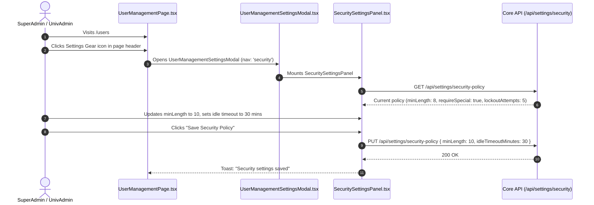
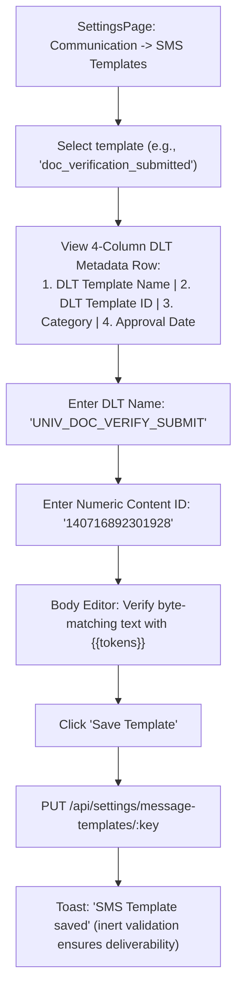

# Module 13: System Governance & Administration — UI Click Flows

> **Scope**: User Management (`/users`), Security Settings panel in page gear modal, Navigation Menu visual layout builder, SMS Communication Templates with DLT 4-column layout, Notice Board gear settings, Audit Log inspections (`/audit`), Database Backup/Restore with live maintenance banner, and University Branding.

---

## Screen Inventory

| Route | Page Component | Primary Actors | Key Capabilities |
|:---|:---|:---|:---|
| `/users` | `UserManagementPage.tsx` | SuperAdmin, UnivAdmin, InstAdmin | User directory, primary & multi-role assignments, active/suspended toggles, password resets, and page gear opening `UserManagementSettingsModal.tsx`. |
| Page Gear Modal | `SecuritySettingsPanel.tsx` | SuperAdmin, UnivAdmin | Password policy rules (min length, special chars, history lockout), session idle timeouts, MFA enforcement policies (moved to gear per `6f060a59`). |
| `/settings` | `SettingsPage.tsx` | SuperAdmin, UnivAdmin | Navigation Menu drag-and-drop layout builder, Communication templates (SMS DLT 4-col layout per `b2c9fe5f`), Email SMTP, System Config, Branding logos. |
| `/notice-board` | `NoticeBoardPage.tsx` | All Users, Admins | Campus notice publications, pinned alerts, target audience filters, and Page Gear modal for notice category settings (per `81b9a901`). |
| `/audit` | `AuditLogPage.tsx` | SuperAdmin, UnivAdmin | Immutable audit stream: user, action, entity, IP address, timestamp, drill-down diff modal (`DrillModal.tsx`). |
| Topbar | `AdminLayout.tsx` | All Users | Live `MaintenanceBanner` warning users during database restore execution. |

---

## Flow 1: Security Policy Management via User Management Gear Modal

Per commit `6f060a59`, Security Settings was moved from global settings into the gear modal on `/users`.

### Granular Step-by-Step Table

| Step | Screen | User Interaction | Visual Changes & State | System Action / API Call | Redirection / Modal |
|:---|:---|:---|:---|:---|:---|
| 1.1 | `/users` | Views page header | Gear icon button `<Settings>` visible next to "User Management". | None | Page rendered |
| 1.2 | `/users` | Clicks **Gear** icon | `UserManagementSettingsModal.tsx` opens with side tabs. | None | Modal opens per `6f060a59` |
| 1.3 | Modal | Selects tab **"Security"** | Mounts `SecuritySettingsPanel.tsx`. Shows password policy sliders, lockout rules, session timeouts. | `GET /api/settings/security-policy` | Panel rendered |
| 1.4 | Security Panel | Modifies "Idle Logout Timeout" to `20` minutes | Input accepts 5 to 120 minutes. | None | Draft state |
| 1.5 | Security Panel | Toggles "Enforce 2FA for Admin Roles" | Checkbox checked. | None | Toggle active |
| 1.6 | Security Panel | Clicks **"Save Security Policy"** | Spinner runs on button. | `PUT /api/settings/security-policy` | Toast: "Security policy updated" |

---

## Flow 2: SMS Templates with DLT Template Name & 4-Column Layout

Per commit `b2c9fe5f`, SMS template configuration captures the "DLT Template Name" ahead of its numeric ID, arranged in an expanded 4-column layout:
`[ DLT Template Name | DLT Template ID | Category | Approval Date ]`.

### Granular Step-by-Step Table

| Step | Screen | User Interaction | Visual Changes & State | System Action / API Call | Redirection / Modal |
|:---|:---|:---|:---|:---|:---|
| 2.1 | `/settings` | Navigates to "Communication" tab $\to$ "SMS" | Table lists registered SMS triggers (OTP, Fee Receipt, Verification). | `GET /api/settings/message-templates?channel=SMS` | Table rendered |
| 2.2 | SMS Templates | Clicks row to edit template | Editor drawer opens. Top row displays 4 columns per commit `b2c9fe5f`. | None | Drawer opens |
| 2.3 | 4-Column Row | Inspects Column 1: **"DLT Template Name"** | Input captures operator template name as registered on telecom DLT portal (e.g. `UNIV_ADMIT_OFFER`). | None | Input active |
| 2.4 | 4-Column Row | Inspects Column 2: **"DLT Template ID"** | Captures 19-digit regulatory content ID. | None | Input active |
| 2.5 | 4-Column Row | Columns 3 & 4: Category & Approval Date | Service / Transactional category pill, date picker for DLT approval record. | None | 4 columns fit row |
| 2.6 | Drawer | Edits SMS Body with exact byte-match | Body counter displays GSM 7-bit character count (`142/160 characters - 1 SMS`). | None | Character counter |
| 2.7 | Drawer | Clicks **"Save SMS Template"** | Submits payload; inert attributes stored in override json. | `PUT /api/settings/message-templates/:key` | Toast: "Saved" |

---

## Flow 3: Navigation Menu Layout Builder (`/settings`)

Per `navLayout.ts` and commit `71e2fdf3`:

| Step | Screen | User Interaction | Visual Changes & State | System Action / API Call | Redirection / Modal |
|:---|:---|:---|:---|:---|:---|
| 3.1 | `/settings` | Clicks **"Navigation Menu"** tab | Visual tree of sidebar menu items renders: Top-level items and Folders. | `GET /api/settings/nav-layout` | Tree rendered |
| 3.2 | Nav Tree | Clicks **"+ Add Folder"** | New folder block created: default label *"New folder"*, collapsed by default. | None | Folder added |
| 3.3 | Nav Tree | Renames folder to *"Academics & Teaching"* | In-place text input update. | None | Label updated |
| 3.4 | Nav Tree | Drags or clicks arrow to move `/attendance` into folder | Item moves inside folder indentation. | None | Tree reorders |
| 3.5 | Toolbar | Clicks **"Save Navigation Layout"** | Serializes `NavLayout` JSON to `University.config.navLayout`. | `PUT /api/settings/nav-layout` | Toast $\to$ Sidebar updates |

---

## Flow 4: Database Restore & Global Maintenance Banner

| Step | Screen | User Interaction | Visual Changes & State | System Action / API Call | Redirection / Modal |
|:---|:---|:---|:---|:---|:---|
| 4.1 | `/settings` | SuperAdmin visits "Backup & Disaster Recovery" | Lists automated PostgreSQL dump snapshots. | `GET /api/backup/snapshots` | Table rendered |
| 4.2 | Snapshot Row | Clicks **"Restore Snapshot"** | High-risk confirmation dialog: requires typing "RESTORE DATABASE". | None | ConfirmDialog |
| 4.3 | ConfirmDialog | Clicks **"Proceed with Restore"** | Core API enters Maintenance Mode: `maintenance.enabled = true`. | `POST /api/backup/snapshots/:id/restore` | Maintenance started |
| 4.4 | All Users (Portal) | User browses any portal page | Top yellow alert banner instantly displays: *"⚠ Maintenance in progress — Database restore running. Some features are temporarily unavailable."* | `MaintenanceBanner` component polls `/api/backup/maintenance` every 15s | Banner mounts |
| 4.5 | All Users (Portal) | Restore completes | Server exits maintenance mode. Next 15s poll hides banner automatically. | Maintenance poll returns `enabled: false` | Banner dismounts |
