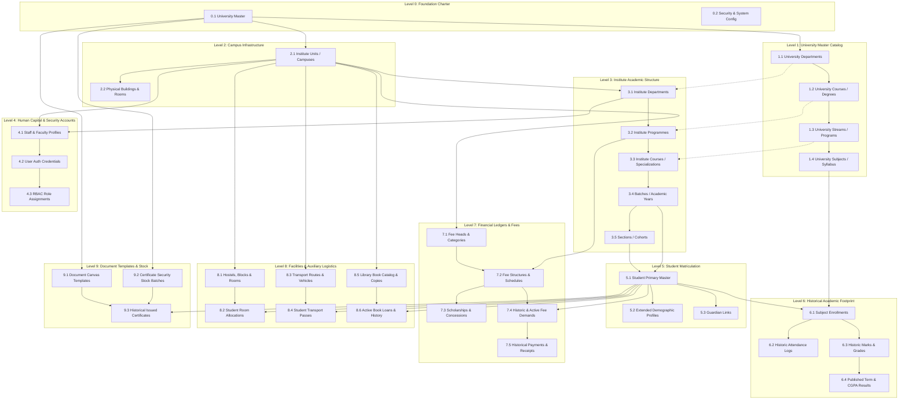

# Institutional Data Migration: Ingestion Dependency Graph & Topological Execution
## Sequential Hierarchy for Legacy Enterprise Data Cutover

```
========================================================================================================================
UNIVERSITY ENTERPRISE RESOURCE PLANNING (UniversityERP)
DOCUMENT ID: UERP-MIG-TOPO-V4.2
CLASSIFICATION: ENTERPRISE DATA ARCHITECTURE & MIGRATION SPECIFICATION
TARGET AUDIENCE: CHIEF INFORMATION OFFICERS, LEAD DATA ARCHITECTS, DATABASE ADMINISTRATORS, ETL ENGINEERS
========================================================================================================================
```

---

## Executive Overview & Ingestion Philosophy

Migrating an accredited multi-campus university from legacy disparate systems (or flat spreadsheets) to **UniversityERP** is a high-consequence enterprise operation. A typical university houses hundreds of relational entities with deep interdependencies:
- A **Student** cannot exist without an active **Batch** and **Section**.
- A **Batch** cannot exist without a defined **Course** and **Programme**.
- A **Course** cannot exist without an overarching **Department** and **Institute**.
- An **Institute** cannot exist without the parent **University** charter.
- Furthermore, **Fee Demands**, **Historical Marks**, **Biometric Attendance**, and **Hostel Allocations** strictly demand previously validated student primary keys.

Attempting out-of-order data ingestion produces foreign key constraint violations (`PrismaClientKnownRequestError: P2003`), dangling pointer corruptions, or broken billing ledgers.

This specification outlines the **strict 10-level Topological Directed Acyclic Graph (DAG)** that all ETL pipelines, bulk-import scripts, and institutional implementation teams must execute.

---

## Topological Ingestion DAG (Directed Acyclic Graph)



---

## Detailed Ingestion Phasing & Entity Prerequisite Matrix

### Phase 1: Institutional Foundation & Catalog (Levels 0–1)
*Must be executed by SuperAdmin before any campus onboarding.*

| Level | Ingestion Order | Entity Name | Prisma Model | Natural Business Key | Prerequisite Ingestion |
| :---: | :---: | :--- | :--- | :--- | :--- |
| **0** | **0.1** | University Master | `University` | `name`, `code` | *None (Root)* |
| **0** | **0.2** | System Configuration | `University.config` | `universityId` | `0.1` |
| **1** | **1.1** | University Department | `UniversityDepartment` | `code` + `universityId` | `0.1` |
| **1** | **1.2** | University Course (Degree) | `UniversityCourse` | `code` + `deptId` | `1.1` |
| **1** | **1.3** | University Stream (Program) | `UniversityStream` | `code` + `courseId` | `1.2` |
| **1** | **1.4** | Stream Curriculum Labels | `StreamLabel` | `name` + `streamId` | `1.3` |
| **1** | **1.5** | University Subjects | `UniversitySubject` | `code` + `streamId` | `1.3` |

---

### Phase 2: Campus Infrastructure & Academic Structure (Levels 2–3)
*Defines physical campuses, departments, cohorts, and teaching sections.*

| Level | Ingestion Order | Entity Name | Prisma Model | Natural Business Key | Prerequisite Ingestion |
| :---: | :---: | :--- | :--- | :--- | :--- |
| **2** | **2.1** | Institute Campuses | `Institute` | `schemaName`, `shortName` | `0.1` |
| **2** | **2.2** | Rooms & Buildings | `Room`, `Equipment` | `code` + `instituteId` | `2.1` |
| **3** | **3.1** | Institute Departments | `Department` | `code` + `instituteId` | `2.1`, `1.1` |
| **3** | **3.2** | Institute Programmes | `Programme` | `code` + `deptId` | `3.1`, `1.2` |
| **3** | **3.3** | Institute Courses | `Course` | `code` + `programmeId` | `3.2`, `1.3` |
| **3** | **3.4** | Batches (Academic Cohorts) | `Batch` | `batchName` + `courseId` | `3.3` |
| **3** | **3.5** | Sections (Classes) | `Section` | `name` + `batchId` | `3.4` |
| **3** | **3.6** | Batch Terms & Subjects | `BatchTerm`, `BatchTermSubject`| `termNumber` + `batchId` | `3.4`, `1.5` |

---

### Phase 3: Human Resources & User Access (Level 4)
*Provisions administrative, faculty, and support personnel.*

| Level | Ingestion Order | Entity Name | Prisma Model | Natural Business Key | Prerequisite Ingestion |
| :---: | :---: | :--- | :--- | :--- | :--- |
| **4** | **4.1** | Staff & Faculty Profiles | `Staff` | `employeeId` + `instituteId` | `2.1`, `3.1` |
| **4** | **4.2** | User Credentials | `User` | `email` or `phone` | `4.1` |
| **4** | **4.3** | RBAC Role Assignments | `UserRoleAssignment`, `Role` | `userId` + `roleId` | `4.2` |
| **4** | **4.4** | Staff Subject Mappings | `StaffSubject` | `staffId` + `subjectId` | `4.1`, `3.6` |

---

### Phase 4: Student Matriculation & Profiles (Level 5)
*Onboards active and historic students into the platform.*

| Level | Ingestion Order | Entity Name | Prisma Model | Natural Business Key | Prerequisite Ingestion |
| :---: | :---: | :--- | :--- | :--- | :--- |
| **5** | **5.1** | Student Primary Record | `Student` | `enrollmentNo` | `3.4`, `3.5` |
| **5** | **5.2** | Student User Account | `User` (Role: STUDENT) | `email` or `enrollmentNo` | `5.1` |
| **5** | **5.3** | Extended Profile & Bio | `StudentProfile` | `userId` | `5.2` |
| **5** | **5.4** | Guardian Links | `ParentLink` | `studentId` + `mobile` | `5.1` |

---

### Phase 5: Academic History & Evaluation (Level 6)
*Backfills past semester performance for ongoing senior batches.*

| Level | Ingestion Order | Entity Name | Prisma Model | Natural Business Key | Prerequisite Ingestion |
| :---: | :---: | :--- | :--- | :--- | :--- |
| **6** | **6.1** | Subject Enrollments | `StudentSubjectEnrollment` | `studentId` + `termSubjectId` | `5.1`, `3.6` |
| **6** | **6.2** | Historic Marks Records | `StudentMarks` | `enrollmentId` + `component` | `6.1` |
| **6** | **6.3** | Historic Attendance | `StudentSubjectAttendance` | `enrollmentId` + `type` | `6.1` |
| **6** | **6.4** | Term Results (SGPA) | `StudentTermResult` | `studentId` + `termId` | `6.2` |
| **6** | **6.5** | Cumulative GPA (CGPA) | `StudentCumulativeResult` | `studentId` | `6.4` |

---

### Phase 6: Financial Architecture & Historical Ledgers (Level 7)
*Sets up fee schedules and imports opening balances.*

| Level | Ingestion Order | Entity Name | Prisma Model | Natural Business Key | Prerequisite Ingestion |
| :---: | :---: | :--- | :--- | :--- | :--- |
| **7** | **7.1** | Fee Heads | `FeeHead` | `code` + `instituteId` | `2.1` |
| **7** | **7.2** | Fee Structures | `FeeStructure` | `programmeId` + `acadYear` | `3.2`, `7.1` |
| **7** | **7.3** | Scholarships & Concessions | `Scholarship`, `StudentConcession` | `studentId` + `type` | `5.1`, `7.1` |
| **7** | **7.4** | Fee Demands (Invoices) | `FeeDemand` | `demandNo` / `studentId` + `head` | `5.1`, `7.1` |
| **7** | **7.5** | Historical Payments | `Payment`, `FeeLedger` | `receiptNo` / `txnRef` | `7.4` |

---

### Phase 7: Campus Logistics & Auxiliary Operations (Level 8)
*Imports hostel residents, bus commuters, and library inventory.*

| Level | Ingestion Order | Entity Name | Prisma Model | Natural Business Key | Prerequisite Ingestion |
| :---: | :---: | :--- | :--- | :--- | :--- |
| **8** | **8.1** | Hostels & Rooms | `Hostel`, `HostelRoom` | `roomNumber` + `hostelId` | `2.1` |
| **8** | **8.2** | Hostel Allocations | `HostelAllocation` | `studentId` + `roomId` | `5.1`, `8.1` |
| **8** | **8.3** | Transport Routes & Buses | `TransportRoute`, `TransportVehicle`| `routeNumber` / `regNo` | `2.1` |
| **8** | **8.4** | Transport Passes | `TransportPass` | `passNumber` + `studentId` | `5.1`, `8.3` |
| **8** | **8.5** | Library Books & Copies | `Book`, `BookCopy` | `isbn` / `barcode` | `2.1` |
| **8** | **8.6** | Active Book Loans | `BookIssue` | `copyId` + `studentId` | `5.1`, `8.5` |

---

### Phase 8: Document Templates & Security Certificate Stock (Level 9)
*Configures canvas certificates, security serials, and historical issuances.*

| Level | Ingestion Order | Entity Name | Prisma Model | Natural Business Key | Prerequisite Ingestion |
| :---: | :---: | :--- | :--- | :--- | :--- |
| **9** | **9.1** | Document Canvas Templates | `DocumentTemplate` | `code` + `universityId` | `0.1` |
| **9** | **9.2** | Certificate Stock Batches | `CertificateStockBatch` | `prefix` + `range` | `0.1` |
| **9** | **9.3** | Individual Security Serials | `CertificateStock` | `serialNumber` | `9.2` |
| **9** | **9.4** | Historical Issued Documents | `IssuedDocument` | `serialNo` + `studentId` | `5.1`, `9.1`, `9.3` |

---

## Cyclic Dependency Resolution Strategies

In complex university environments, three classical circular references frequently arise:

### 1. Department Head vs Staff Account Circularity
- **Problem**: `Department.headStaffId` references `Staff.id`, but `Staff.departmentId` references `Department.id`.
- **Solution**:
  1. Ingest `Department` records with `headStaffId = null`.
  2. Ingest `Staff` records with their respective `departmentId`.
  3. Execute an idempotent post-migration patch to populate `Department.headStaffId`.

### 2. Student User vs Student Profile Circularity
- **Problem**: `User.id` is required by `Student.userId`, while `StudentProfile.userId` references `User.id`.
- **Solution**:
  - Ingest `User` with role `STUDENT` first.
  - Ingest `Student` linking to `User.id`.
  - Ingest `StudentProfile` linking to the same `User.id`.
  - Wrapped inside an atomic database transaction (`prisma.$transaction`).

### 3. Subject Pool vs Subject Pool Member Circularity
- **Problem**: NEP 2020 elective pools group subjects that might cross-reference each other.
- **Solution**:
  - Ingest all `UniversitySubject` entities first.
  - Ingest `SubjectPool` master containers.
  - Ingest `SubjectPoolMember` junction records linking pools to subjects.

---

## Pre-Ingestion Data Cleansing Protocols

Before running any ETL script or bulk-import payload, the data engineering team must execute the following validation checks on source datasets:

1. **Email & Phone Normalization**:
   - All email addresses lowercased and trimmed.
   - All mobile numbers converted to E.164 standard (`+91XXXXXXXXXX`).
2. **Date Format Standardization**:
   - All birth dates, joining dates, and fee due dates converted to ISO-8601 (`YYYY-MM-DD`).
3. **Enum Key Harmonization**:
   - Gender: normalize values (`M`, `Male`, `MALE`) to strict enum `'M' | 'F' | 'O'`.
   - Category: normalize to `'GEN' | 'OBC' | 'SC' | 'ST' | 'EWS'`.
   - Attendance Status: normalize to `'lecture' | 'tutorial' | 'practical'`.
4. **Referential Integrity Audit**:
   - Verify that 100% of student batch references correspond to existing batch records in Level 3.
   - Verify that all fee heads in the historical demand sheet exist in Level 7.

---
```
========================================================================================================================
END OF SPECIFICATION: DATA INGESTION DEPENDENCY GRAPH (UERP-MIG-TOPO-V4.2)
========================================================================================================================
```
