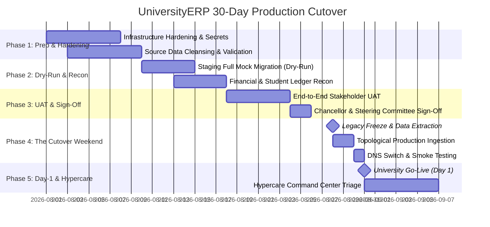

# Institutional Go-Live Runbook & Cutover Playbook
## 30-Day Operational Transition Plan: From Legacy Systems to UniversityERP Production

```
========================================================================================================================
UNIVERSITY ENTERPRISE RESOURCE PLANNING (UniversityERP)
DOCUMENT ID: UERP-OPS-RUNBOOK-V4.2
CLASSIFICATION: ENTERPRISE OPERATIONS & DEPLOYMENT PLAYBOOK
TARGET AUDIENCE: STEERING COMMITTEE, CIO, REGISTRAR, FINANCE CONTROLLER, INFRASTRUCTURE ENGINEERS, ETL LEADS
========================================================================================================================
```

---

## Executive Overview & Governance Framework

Transitioning an entire university ecosystem—comprising tens of thousands of active students, thousands of faculty and staff, historical grade transcripts, and active fee ledgers—demands an air-tight, militaristic cutover strategy.

This **Institutional Go-Live Runbook** establishes a structured 30-day transition timeline:
- **T-30 to T-21**: Infrastructure hardening, security provisioning, and pre-migration sanitization.
- **T-20 to T-10**: Full-scale staging dry-run and financial balance reconciliation.
- **T-09 to T-03**: Multi-stakeholder User Acceptance Testing (UAT) and institutional sign-offs.
- **T-02 to T-00**: **The Cutover Weekend Playbook** (hour-by-hour operational sequence).
- **T+01 to T+07**: Hypercare support, command center triage, and daily executive audits.

---

## 30-Day Transition Master Schedule



---

## Phase 1: Environment Readiness & Pre-Migration Audits (T-30 to T-21)

### 1.1 Infrastructure Hardening & Capacity Verification
- [ ] **Database Provisioning**: PostgreSQL 16 deployed on high-availability cluster (Primary + Standby Read Replica) with NVMe storage and continuous WAL archiving.
- [ ] **Connection Pooling**: PgBouncer configured for transaction-level pooling with `max_client_conn = 5000` and `default_pool_size = 50`.
- [ ] **Redis Cluster**: Provisioned for high-performance session state, BullMQ background queues, and rate-limiting.
- [ ] **Object Storage (S3 / GCS)**: Encrypted private bucket created for student photos, scanned marksheets, and degree certificates.
- [ ] **External Service Handshakes**:
  - Razorpay: Live Merchant ID, Key ID, Key Secret, and Webhook Endpoint registered with HMAC SHA-256 validation.
  - Telephony / SMS: TRAI DLT registration confirmed with approved Header ID and transactional message templates.
  - SMTP / SES: High-reputation transactional email relay configured with DKIM, SPF, and DMARC passing.

### 1.2 Legacy Data Cleansing & Extraction
- [ ] Legacy database dumped and sanitized against the [Field Mapping Matrix](file:///home/admin/UniversityERP/flow/DATA_MIGRATION_AND_TEMPLATES/03_FIELD_MAPPING_MATRIX_AND_DATA_DICTIONARY.md).
- [ ] Duplicate student records eliminated (matching on National ID / Birth Date + Father Name).
- [ ] Legacy fee balances grouped into historical opening balances per student.

---

## Phase 2: Pilot Migration & Financial Reconciliation (T-20 to T-10)

### 2.1 Staging Mock Migration
- Execute full dry-run ingestion on an isolated Staging environment identical to Production.
- Measure precise execution runtimes for each topological layer to build the cutover schedule.

### 2.2 Financial Ledger Parity Audit (The Gold Standard)
The Finance Controller must verify that:

$$\sum \text{Legacy Unpaid Receivables} \equiv \sum \text{UniversityERP Opening Outstanding Demands}$$

$$\sum \text{Legacy Caution Deposits} \equiv \sum \text{UniversityERP Caution Ledger Balance}$$

```
+----------------------------------------------------------------------------------------------------+
|                                FINANCIAL RECONCILIATION AUDIT                                      |
+----------------------------------------------------------------------------------------------------+
  [Audit Check 1: Student Count Parity]
      * Total Active Matriculated Students: 12,450 (Legacy) vs 12,450 (ERP) -> [PASS]
      * Graduated Alumni Records: 48,200 (Legacy) vs 48,200 (ERP)           -> [PASS]

  [Audit Check 2: Academic Transcripts Parity]
      * Historical Course Grades: 384,120 records migrated with zero orphan grades -> [PASS]
      * Backlog Flag Accuracy: 100% matched with legacy examination registers     -> [PASS]

  [Audit Check 3: Fee Balances Parity]
      * Total Outstanding Student Debt: ₹ 4,12,85,000.00 (Legacy) 
        vs ₹ 4,12,85,000.00 (ERP)                                            -> [MATCH - 100%]
      * Total Caution Deposits Held: ₹ 2,49,00,000.00 (Legacy)
        vs ₹ 2,49,00,000.00 (ERP)                                            -> [MATCH - 100%]
+----------------------------------------------------------------------------------------------------+
```

---

## Phase 3: User Acceptance Testing (UAT) & Sign-Offs (T-09 to T-03)

### 3.1 Role-Specific UAT Scenarios

| Stakeholder Group | Required UAT Test Scenario | Validation Criteria | Sign-off Authority |
| :--- | :--- | :--- | :--- |
| **Admissions Office** | Create application, verify documents, issue offer letter, accept fee | Status transitions smoothly; Student & Profile records created | Dean of Admissions |
| **Academic Heads** | Section allocation, NEP 2020 elective selection, timetable display | Timetable conflicts detected; electives mapped to CBCS baskets | Dean of Academic Affairs |
| **Examination Cell** | Mark CIA tests, generate admit cards, compute SGPA/CGPA, print grade sheet | GPA formulas match university regulations; QR code verifies | Controller of Examinations |
| **Finance Division** | Bulk demand generation, online Razorpay settlement, manual receipting, refund | Ledger balances calculate accurately; receipt PDF renders | Chief Finance Officer |
| **Hostel & Transport**| Allocate room, issue bus pass, process room vacation | Inventory decrements accurately; passes render scannable QR | Chief Warden / Logistics Head|
| **Registrar Office** | Enrollment cancellation with 15-day timer, multi-dept No Dues clearance | Account deactivates at timer; degree stock serial tracked | University Registrar |

### 3.2 Formal Go/No-Go Decision Gate (T-03)
The Executive Steering Committee convenes to review:
1. UAT defect count (Zero Severity-1 or Severity-2 defects permitted).
2. Financial reconciliation sign-off by external/internal auditors.
3. Network and infrastructure penetration test sign-off (OWASP Top 10 compliance).
- **Outcome**: Unanimous formal sign-off executed on the **Go-Live Authorization Document**.

---

## Phase 4: The Cutover Weekend Playbook (T-02 to T-00)

*The cutover commences on Friday at 18:00 and concludes on Monday at 08:00.*

### Detailed Hour-by-Hour Operational Timeline

```
======================================================================================================
FRIDAY: LEGACY FREEZE & FINAL EXTRACTION
======================================================================================================
18:00 - T-42h | CIO announces Legacy System Freeze. All legacy ERP/portal logins set to read-only.
18:15 - T-41h | Database Administrators initiate final differential data extraction from legacy systems.
20:00 - T-39h | Extraction completed. MD5 checksums generated and validated against source dumps.
21:00 - T-38h | Production PostgreSQL database wiped, fresh schema applied via `prisma migrate deploy`.
22:00 - T-37h | Production sanity checks: DB extensions, roles, tables, indexes, and triggers verified.

======================================================================================================
SATURDAY: TOPOLOGICAL INGESTION EXECUTION
======================================================================================================
00:00 - T-35h | [Level 0 & 1] Ingest University Master, Config, Catalog, Courses & Subjects.
02:00 - T-33h | [Level 2 & 3] Ingest Institutes, Facilities, Programmes, Batches & Sections.
05:00 - T-30h | [Level 4] Ingest Staff & Faculty Directory, User Accounts & RBAC Roles.
08:00 - T-27h | [Level 5] Ingest Student Primary Matriculation Records, Demographic Profiles & Guardians.
12:00 - T-23h | [Level 6] Ingest Historical Academic Footprint (Term Enrollments, Marks, Attendance).
16:00 - T-19h | [Level 7] Ingest Financial Architecture (Fee Heads, Structures, Demands & Payments).
20:00 - T-15h | [Level 8] Ingest Campus Logistics (Hostel Rooms, Allocations, Transport Passes, Library).
23:00 - T-12h | [Level 9 & 10] Ingest Document Canvas Templates, Certificate Stock & Dynamic Forms.

======================================================================================================
SUNDAY: PRODUCTION SANITY AUDIT & DNS CUTOVER
======================================================================================================
02:00 - T-09h | Automated post-migration verification script executes (verifies row counts & FK integrity).
04:00 - T-07h | Finance Controller logs in to Production, verifies Opening Ledger Balances.
06:00 - T-05h | Core engineering team runs end-to-end smoke test suite on production endpoints.
08:00 - T-03h | Public DNS switch: point `portal.university.edu` and `erp.university.edu` to Cloudflare/ALB.
09:00 - T-02h | SSL certificate handshakes verified; edge CDN caches cleared.
10:00 - T-01h | System Administrator sends initial welcome broadcast credentials via SMS & Email.
11:00 - T-00h | UniversityERP formally declared LIVE.

======================================================================================================
MONDAY 08:00: UNIVERSITY CAMPUS DOORS OPEN (GO-LIVE DAY 1)
======================================================================================================
```

---

## Phase 5: Hypercare & Day-1 Protocols (T+01 to T+07)

### 5.1 Command Center Setup
- **Physical Command Center**: Main Campus Administrative Building, Boardroom 1.
- **Virtual Command Center**: Dedicated Slack/Teams war room monitored 24/7 by Lead Architects and DBAs.
- **Help Desk Hotlines**: Tier-1 support desks operational in every constituent institute library.

### 5.2 Incident Escalation Matrix

| Severity Level | Definition | Maximum Target Response | Target Resolution | Escalation Contact |
| :--- | :--- | :--- | :--- | :--- |
| **P1 - Critical** | System-wide outage, fee payment gateway failure, login service down | 15 Minutes | 2 Hours | Lead Architect & CIO |
| **P2 - Major** | Cohort unable to register courses, grade sheet printing failure | 30 Minutes | 4 Hours | Lead Module Engineer |
| **P3 - Minor** | Formatting defect on custom document, single user profile typo | 2 Hours | 1 Business Day | Support Helpdesk Lead |

---

## Contingency & Rollback Procedures

If an insurmountable P1 blocker occurs during the cutover window (e.g. unresolvable data corruption during Level 7 fee ingestion that cannot be patched before Sunday 18:00):

1. **Rollback Decision Trigger**: Executive Steering Committee convenes at Sunday 18:00 if critical milestones are unmet.
2. **Rollback Actions**:
   - Revert DNS CNAME records back to legacy server IP addresses.
   - Remove read-only lock on legacy database.
   - Broadcast emergency SMS to faculty and students indicating extended maintenance.
   - Freeze UniversityERP production database for forensic analysis.
3. **Post-Mortem**: Convene within 24 hours to schedule revised cutover date.

---
```
========================================================================================================================
END OF SPECIFICATION: INSTITUTIONAL GO-LIVE RUNBOOK (UERP-OPS-RUNBOOK-V4.2)
========================================================================================================================
```
