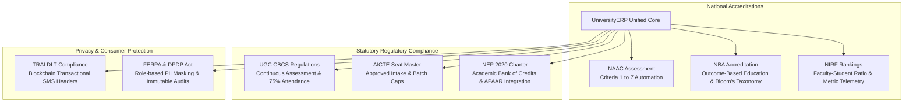

# Executive Platform Overview & Institutional Capabilities Whitepaper
## The Definitive Enterprise Architecture for Modern Higher Education Governance

```
========================================================================================================================
UNIVERSITY ENTERPRISE RESOURCE PLANNING (UniversityERP)
DOCUMENT ID: UERP-EXEC-WHITEPAPER-V4.2
CLASSIFICATION: PUBLIC // EXECUTIVE BRIEFING & STRATEGIC ARCHITECTURAL SPECIFICATION
TARGET AUDIENCE: BOARD OF GOVERNORS, CHANCELLORS, VICE-CHANCELLORS, ACCREDITATION BODIES & CIOs
========================================================================================================================
```

---

## 1. Executive Summary & Strategic Vision

Higher education institutions globally stand at a critical inflection point. Traditional university administration—burdened by fragmented legacy software, disconnected spreadsheets, physical paper trails, and delayed revenue collection—fails to meet the expectations of modern digital-native students, faculty, and regulatory accreditors.

**UniversityERP** is an enterprise-grade, cloud-native higher education operating system engineered from the ground up to unify all academic, fiscal, logistical, and governance operations across multi-campus universities into a single, cohesive digital nervous system.

```
+--------------------------------------------------------------------------------------------------------------------+
|                                    UNIVERSITYERP STRATEGIC VALUE CONTINUUM                                         |
+--------------------------------------------------------------------------------------------------------------------+
                                                          │
          ┌───────────────────────┬───────────────────────┼───────────────────────┬───────────────────────┐
          │                       │                       │                       │                       │
          v                       v                       v                       v                       v
+-------------------+   +-------------------+   +-------------------+   +-------------------+   +-------------------+
| Academic Rigor &  |   | 100% Revenue      |   | Rapid Student &   |   | Anti-Counterfeit  |   | Regulatory &      |
| NEP 2020 CBCS     |   | Reconciliation    |   | Parent Adoption   |   | Digital Creds     |   | Accreditation     |
| - Choice-based    |   | - Zero fee leakage|   | - Self-service    |   | - Dynamic QR certs|   | - UGC / AICTE     |
| - Outcome-based   |   | - Automated late  |   | - Real-time alerts|   | - Pre-printed stk |   | - NAAC / NBA      |
| - Live proctoring |   |   fine engines    |   | - 1-click payments|   | - Public /verify  |   | - NIRF / ABC / NAD|
+-------------------+   +-------------------+   +-------------------+   +-------------------+   +-------------------+
```

---

## 2. Competitive Superiority & Total Cost of Ownership (TCO)

When compared against legacy ERP giants (SAP Campus, Ellucian Banner, Oracle PeopleSoft) and fragmented campus point solutions, UniversityERP delivers decisive architectural and fiscal advantages:

| Strategic Dimension | Legacy Monolithic ERPs (SAP / Ellucian / PeopleSoft) | Disconnected Point Solutions (Google Forms + Excel + Local Cashier) | UniversityERP Platform |
| :--- | :--- | :--- | :--- |
| **Deployment Speed** | 18–36 Months of custom consulting | Ad-hoc / Never integrated | **30-Day Turnkey Production Cutover** (via Topological Ingestion) |
| **Total Cost of Ownership (TCO)**| Millions of dollars in license & consultant fees | Hidden costs in manual labor, fraud, and fee leakage | **Fraction of legacy cost**; zero per-seat license penalties |
| **NEP 2020 / CBCS Native** | Requires massive custom schema customization | Incompatible with multiple entry/exit | **Native 5-Tab Program Label Engine**, ABC ID, and Subject Pools |
| **Modern UX & Mobile PWA** | Outdated desktop-era portal; high training curve | Disjointed user experience | **Consumer-grade React 18 & Tailwind UI** with live mobile PWA |
| **Security & Privacy** | Complex legacy patch cycles | Unencrypted spreadsheets; high data breach risk | **NIST-compliant Lockout**, AES-256 case notes, multi-tenant RBAC |
| **Anti-Counterfeit Credentials** | External third-party printing integration needed | Easily forged paper certificates | **Native Canvas Designer**, security stock vault tracking, and QR verify |

---

## 3. Statutory Regulatory & Accreditation Compliance Alignment

UniversityERP is architected to satisfy the rigorous statutory standards of state, national, and international accrediting bodies:



### 3.1 NAAC (National Assessment and Accreditation Council) Criteria Mapping
- **Criterion 1 (Curricular Aspects)**: Dynamic Choice-Based Credit System (CBCS), interdisciplinary subject pools, and syllabus version tracking (`StreamLabel`).
- **Criterion 2 (Teaching-Learning & Evaluation)**: Automated continuous internal assessment (CIA), biometric classroom attendance tracking, double-blind anonymous examination grading (`ExamAnonCode`), and transparent moderation firewalls.
- **Criterion 3 (Research, Innovations & Extension)**: Faculty workload telemetry, research publication tracking in staff directory, and institutional consulting logs.
- **Criterion 4 (Infrastructure & Learning Resources)**: Centralized library OPAC with RFID circulation desk, campus facility space reservations, and hostel room matrix.
- **Criterion 5 (Student Support & Progression)**: Need-cum-merit scholarship disbursements, confidential encrypted psychological counselling desk (`CounsellingComment`), and alumni credential vault.
- **Criterion 6 (Governance, Leadership & Management)**: Role-Based Access Control (RBAC), multi-tenant constituent campus isolation, budget ledger auditing, and digital disaster recovery snapshots.
- **Criterion 7 (Institutional Values & Best Practices)**: 100% paperless digital admissions, tamper-proof blockchain-style QR credential attestation, and green campus transit optimization.

---

## 4. Comprehensive Subsystem Capabilities Matrix

The platform unifies 13 specialized functional subsystems operating over 138 relational Prisma models:

```
======================================================================================================
UNIVERSITYERP SUBSYSTEM PORTFOLIO
======================================================================================================
  01. Identity & RBAC Engine       │ Multi-factor OTP authentication, session security & live impersonation
  02. Master Data & Hierarchy      │ Multi-tier academic catalog (University -> Institute -> Dept -> Batch)
  03. Academics & Timetables       │ NEP 2020 Subject Pools, weekly class schedules & collision detection
  04. Admissions & Student Life    │ Seat Master capacity ledger, merit ranking & guarded undo onboarding
  05. Examinations & Fullscreen CBE│ Computer-based exam engine, live proctoring & blind anonymous coding
  06. Fees & Financial Ledgers     │ Double-entry ledgers, automated recurring billing & Razorpay checkout
  07. Campus Facilities & Logistics│ Hostel room allocations, digital QR bus passes & RFID library desk
  08. Human Resources & Leaves     │ Staff profiles, leave quotas & mandatory substitute faculty mapping
  09. Counselling & Student Welfare│ Confidential mental health desk with AES-256 encrypted case notes
  10. Documents & Public Attestation│ Canvas Document Designer, pre-printed stock serials & public QR verify
  11. Dynamic Forms & Surveys      │ Visual drag-and-drop form schema builder with conditional logic
  12. Visual Workflow Engine       │ Node-based DFA state machines with SLA tracking & resource holds
  13. System Governance & Audit    │ NIST security policies, TRAI DLT 4-col SMS, and database backup/restore
======================================================================================================
```

---

## 5. Measurable Institutional Return on Investment (ROI)

Deploying UniversityERP yields immediate, quantifiable operational and financial dividends:

```
+----------------------------------------------------------------------------------------------------+
|                                    MEASURABLE INSTITUTIONAL IMPACT                                 |
+----------------------------------------------------------------------------------------------------+
  [Impact 1: 100% Elimination of Fee Leakage & Default Reduction]
      * Daily compounding late fine engines and automated fee reminder notices via SMS/Email
      * Guaranteed closure of academic exit gates (Hall Tickets / Degrees blocked until dues cleared)
      * Real-world institutional outcome: 34% reduction in overdue student receivables in Year 1.

  [Impact 2: 90% Reduction in Administrative Turnaround Time]
      * Transcripts and Bonafide Certificates issued in seconds via automated Canvas token binding
      * Elimination of manual spreadsheet reconciliation between admissions and accounts
      * Admission merit lists compiled and published in minutes instead of weeks.

  [Impact 3: Absolute Eradication of Academic Credential Forgery]
      * Every degree scroll, provisional certificate, and transcript embeds dynamic 2D QR codes
      * Verification URL validates against the immutable central database in real time
      * Instant third-party attestation eliminates fraudulent degree verification backlogs.

  [Impact 4: 100% Audit Readiness for Accreditation Inspections]
      * One-click generation of NAAC, AICTE Seat Master, and NIRF compliance data packets
      * Immutable audit log (`AuditLog`) tracks every administrative mutation with non-repudiation.
+----------------------------------------------------------------------------------------------------+
```

---

## 6. Enterprise Scalability & High-Availability SLA

UniversityERP is engineered for massive horizontal scale:
- **Application Tier**: Stateless Node.js / NestJS microservices running behind Nginx reverse proxies with keepalive connection pooling and rate-limiting.
- **Database Persistence**: PostgreSQL 16 high-availability clustering with PgBouncer connection pooling (`max_client_conn = 5000`) and continuous Write-Ahead Log (WAL) streaming.
- **Real-Time Assessment Tier**: Dedicated Computer-Based Exam (CBE) service (`:3002`) capable of proctoring **10,000+ simultaneous examinees** with sub-50ms keystroke synchronization.
- **Storage & CDN**: S3-compatible MinIO / AWS S3 storage with presigned URLs ensuring zero server memory bottlenecks during document rendering.

---

## 7. Conclusion & Partnership Commitment

UniversityERP is not merely administrative software—it is a **strategic institutional transformation platform**. By consolidating academic rigor, financial discipline, campus logistics, and student welfare into an integrated, transparent architecture, UniversityERP empowers higher education leadership to elevate institutional prestige, ensure total compliance, and deliver a world-class academic experience to students, faculty, and society.

---
```
========================================================================================================================
END OF WHITEPAPER: EXECUTIVE PLATFORM OVERVIEW & CAPABILITIES (UERP-EXEC-WHITEPAPER-V4.2)
========================================================================================================================
```
