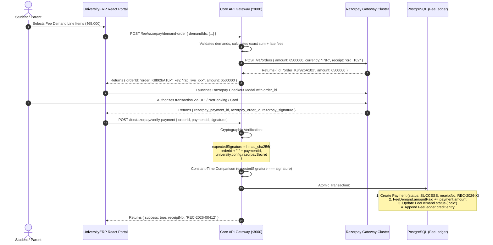
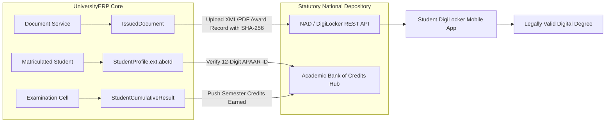

# External Integrations & Statutory Gateways Architecture
## Technical Specifications for Payment Gateways, DLT SMS, DigiLocker / ABC, Biometrics, and Object Storage

```
========================================================================================================================
UNIVERSITY ENTERPRISE RESOURCE PLANNING (UniversityERP)
DOCUMENT ID: UERP-INT-GATEWAYS-V4.2
CLASSIFICATION: ENTERPRISE INTEGRATION ARCHITECTURE SPECIFICATION
AUTHORITY: OFFICE OF THE CHIEF TECHNOLOGY OFFICER & PRINCIPAL INTEGRATION ARCHITECT
APPLIES TO: BANKING WEBHOOKS, TELECOM DLT, NATIONAL REPOSITORIES, IOT HARDWARE & CLUSTER STORAGE
========================================================================================================================
```

---

## Executive Overview & External Boundary Model

Modern higher education institutions cannot operate as isolated data silos. **UniversityERP** is designed with an API-first integration perimeter that interfaces seamlessly with national identity registries, statutory academic repositories, banking gateways, telecom aggregators, and physical campus IoT hardware:

```
+--------------------------------------------------------------------------------------------------------------------+
|                                    UNIVERSITYERP EXTERNAL INTEGRATION PERIMETER                                    |
+--------------------------------------------------------------------------------------------------------------------+
                                                          │
          ┌───────────────────────┬───────────────────────┼───────────────────────┬───────────────────────┐
          │                       │                       │                       │                       │
          v                       v                       v                       v                       v
+-------------------+   +-------------------+   +-------------------+   +-------------------+   +-------------------+
|  Payment Gateways |   |  Telecom DLT SMS  |   |  National Depo    |   | Biometric & IoT   |   | S3 Object Storage |
|  - Razorpay       |   |  - TRAI DLT Hub   |   |  - DigiLocker     |   |  - RFID Readers   |   |  - MinIO Cluster  |
|  - UPI / NetBank  |   |  - Transactional  |   |  - NAD / APAAR    |   |  - Bus GPS Units  |   |  - AWS S3 / GCS   |
|  - Webhook Engine |   |  - SMS Gateway    |   |  - ABC Credit Dep |   |  - Turnstiles     |   |  - Presigned URLs |
+-------------------+   +-------------------+   +-------------------+   +-------------------+   +-------------------+
```

---

## 1. Banking & Payment Gateway Integration (Razorpay / UPI)

### 1.1 Architectural Flow & Cryptographic Signature Verification
To prevent tampering with transaction amounts or spoofing success responses, UniversityERP enforces a two-phase server-side order and signature verification handshake:



### 1.2 Webhook Engine & Idempotency Guarantee
If the user's browser closes or crashes before the frontend verification postback, Razorpay dispatches an asynchronous server-to-server webhook (`payment.captured`):
- **Endpoint**: `POST /fee/razorpay/webhook`
- **Signature Check**: Verified against `X-Razorpay-Signature` header using the webhook secret.
- **Idempotency Safeguard**: System queries `Payment` by `transactionRef = razorpay_payment_id`. If already settled by the frontend callback, the webhook safely returns `HTTP 200 OK` with zero duplicate ledger mutations.

---

## 2. Telecom Regulatory Authority of India (TRAI) DLT SMS Integration

### 2.1 Regulatory Mandate & Flow
Under TRAI regulations, all enterprise commercial communications in India must be routed through Distributed Ledger Technology (DLT) blockchains (e.g. Vilpower, PingConnect, Airtel DLT) to prevent unsolicited spam.

```
+----------------------------------------------------------------------------------------------------+
|                                      TRAI DLT SMS PIPELINE                                         |
+----------------------------------------------------------------------------------------------------+
  [Step 1: Entity Registration]
      * University registers legal entity -> receives Principal Entity ID (`PE_ID`)

  [Step 2: Header Registration]
      * University registers 6-character Alpha Header -> receives Sender Header (`HEADER_ID` e.g. "UNIVER")

  [Step 3: Content Template Registration]
      * Transactional template submitted to telecom blockchain with variable tags `{#var#}`
      * Telecom approves and assigns 19-digit Template Registration ID (`TEMPLATE_ID`)

  [Step 4: UniversityERP Runtime Dispatch]
      * System binds runtime variables -> submits payload via REST API:
        Payload: {
          peId: "1201160000000001234",
          header: "UNIVER",
          templateId: "1107168920412356789",
          mobile: "+919876543210",
          message: "Dear Rohit, fee of Rs 65000 is due on 2026-08-10. - UNIVER"
        }
+----------------------------------------------------------------------------------------------------+
```

### 2.2 Telephony Failover & Multi-Vendor Routing
UniversityERP supports multi-vendor telephony routing (`telephony.module.ts`):
- Primary: ValueFirst / Gupshup.
- Secondary Failover: Twilio / AWS SNS.
- If primary provider returns HTTP 5xx or delivery timeout within 3 seconds, the dispatcher automatically reroutes through the secondary gateway, recording the event in `NotificationLog`.

---

## 3. DigiLocker, National Academic Depository (NAD) & APAAR / ABC

### 3.1 Statutory NEP 2020 Compliance Architecture
The National Education Policy (NEP 2020) mandates that all accredited higher education institutions in India integrate with:
1. **Academic Bank of Credits (ABC)**: To allow multiple entry and exit pathways, tracking earned credits across institutions.
2. **Automated Permanent Academic Account Registry (APAAR)**: The "One Nation, One Student ID" national registry.
3. **DigiLocker / NAD**: National repository for digital, tamper-proof academic awards (degrees, diplomas, marksheets).



### 3.2 Automated Credit Push Specifications
- **Frequency**: Automated batch dispatch within 72 hours of official result publication by the Controller of Examinations.
- **Payload Format**: Standardized CSV / JSON compliant with National Academic Depository Schema v2.1:
  - `University_Code`, `Student_ABC_ID`, `Candidate_Name`, `Enrollment_No`, `Degree_Code`, `Year_Of_Passing`, `Credits_Earned`, `SGPA`, `CGPA`, `Grade_Awarded`.

---

## 4. Biometric & Campus IoT Hardware Integration

### 4.1 Biometric Attendance Machines (Fingerprint & Facial Recognition)
- **Protocol**: HTTP/HTTPS Push API over TCP/IP (ZKTeco, eSSL, Realtime Biometrics).
- **Architecture**:
  1. Biometric terminal captures physical punch (Face / Fingerprint / RFID card).
  2. Device sends real-time HTTP POST to `/attendance/biometric-push`:
     ```json
     {
       "deviceSerial": "ZK_BIO_ROOM_101",
       "userId": "2024CSE0042",
       "timestamp": "2026-09-11 09:02:14",
       "verifyType": "FACE"
     }
     ```
  3. API controller maps `deviceSerial` to `Room` $\to$ queries active lecture in `TimetableEntry` for that timeslot $\to$ records `StudentSubjectAttendance.attended = 1`.

### 4.2 Fleet GPS Tracking & Conductor QR Readers
- **Vehicle GPS Units**: Transmit location telemetry (Latitude, Longitude, Speed) every 15 seconds to `/transport/gps-telemetry`.
- **Student Transit Tracking**: Students view live bus location on their mobile dashboard with Estimated Time of Arrival (ETA) at their designated pickup stop.
- **Conductor Handheld Scanners**: Conductor scans student mobile app QR code; device validates pass validity against `/transport/verify-pass` even in offline caching mode.

---

## 5. Enterprise Cloud Object Storage (MinIO / AWS S3 / GCS)

### 5.1 Storage Architecture & Encryption Standards
All binary assets (student photos, scanned marksheets, question bank diagrams, generated degree PDFs) are stored in an S3-compatible encrypted object storage cluster (`upload.module.ts`):

```
+----------------------------------------------------------------------------------------------------+
|                                  OBJECT STORAGE BUCKET TAXONOMY                                    |
+----------------------------------------------------------------------------------------------------+
  Bucket: `university-erp-vault`
    ├── /public
    │     ├── /branding          -> University logos, institute watermarks (Public CDN cached)
    │     └── /notices           -> Public circulars and examination notifications
    └── /private (Protected via Presigned URLs)
          ├── /students
          │     ├── /photos      -> Passport photos (AES-256 server-side encrypted)
          │     └── /documents   -> Scanned 10th/12th marksheets, caste certificates
          ├── /degrees           -> High-resolution generated degree PDFs
          └── /cbe_snapshots     -> Live proctoring webcam violation captures
+----------------------------------------------------------------------------------------------------+
```

### 5.2 Secure Presigned URL Access Pattern
- Private assets are **never** served directly with public URLs.
- When an authorized officer (e.g. Scrutiny Clerk or Student) requests to view a certificate:
  1. API validates caller holds active JWT and authorized role.
  2. Core API requests S3 cluster to generate an ephemeral **Presigned GET URL** with a 15-minute time-to-live (TTL).
  3. Browser streams document directly from S3 bucket without loading the backend API server memory.

---
```
========================================================================================================================
END OF SPECIFICATION: EXTERNAL INTEGRATIONS & STATUTORY GATEWAYS (UERP-INT-GATEWAYS-V4.2)
========================================================================================================================
```
