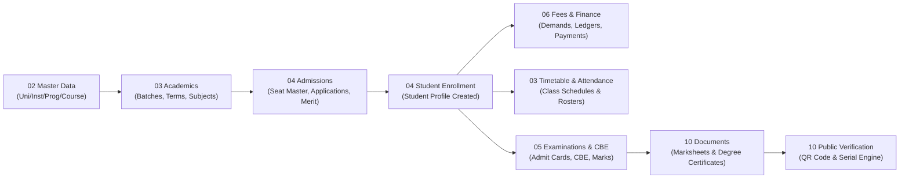

# UniversityERP — System Architecture & Flow Directory

> **Master System Architecture, Domain Module Catalog, Role-Based Access Control (RBAC) Matrix, and Navigation Index.**  
> Updated for the latest codebase release, reflecting recent updates across all 68 NestJS controllers, 49 React portal pages, and 138 Prisma database models.

---

## 1. Directory Structure

The `flow/` directory is organized into **13 domain module folders**, mapping directly to functional subsystems in UniversityERP. Each module folder contains three authoritative artifacts:

1. **`UI_CLICK_FLOWS.md`**: Granular, button-by-button, screen-to-screen user walkthroughs with form inputs, modals, toasts, error validations, and redirection paths.
2. **`END_TO_END_ACTION_PROCESSES.md`**: Full HTTP lifecycle specifications detailing route endpoints, HTTP methods, headers, DTO validation schemas, NestJS controllers, security guards, Prisma service queries, database mutations, and event emissions.
3. **`TECHNICAL_ARCHITECTURE.md`**: Mermaid sequence diagrams, state machine transition graphs, entity relationship models, and architectural specifications.

```
flow/
├── README.md                                    # This master index & system map
├── 01_auth_and_access_control/                  # Authentication, MFA/OTP, Account Setup, RBAC
│   ├── UI_CLICK_FLOWS.md
│   ├── END_TO_END_ACTION_PROCESSES.md
│   └── TECHNICAL_ARCHITECTURE.md
├── 02_master_data_and_structure/                # University, Institutes, Departments, Programmes, Courses, Batches
│   ├── UI_CLICK_FLOWS.md
│   ├── END_TO_END_ACTION_PROCESSES.md
│   └── TECHNICAL_ARCHITECTURE.md
├── 03_academics_curriculum_and_timetable/       # Batches, Terms, Subject Pools, Electives, Timetable, Attendance
│   ├── UI_CLICK_FLOWS.md
│   ├── END_TO_END_ACTION_PROCESSES.md
│   └── TECHNICAL_ARCHITECTURE.md
├── 04_admissions_and_student_lifecycle/         # Applications, Seat Master (XLSX/PDF), Merit List, Onboarding & Undo
│   ├── UI_CLICK_FLOWS.md
│   ├── END_TO_END_ACTION_PROCESSES.md
│   └── TECHNICAL_ARCHITECTURE.md
├── 05_examinations_grading_and_cbe/             # Papers, CBE Engine (/exam/:id), Proctoring, Grading, Results
│   ├── UI_CLICK_FLOWS.md
│   ├── END_TO_END_ACTION_PROCESSES.md
│   └── TECHNICAL_ARCHITECTURE.md
├── 06_fees_finance_and_payments/                # Fee Heads, Structures, Payment Windows, Demands, Gateways, Ledger
│   ├── UI_CLICK_FLOWS.md
│   ├── END_TO_END_ACTION_PROCESSES.md
│   └── TECHNICAL_ARCHITECTURE.md
├── 07_campus_facilities_and_logistics/          # Hostel, Transport, Library, Space/Resource Reservations
│   ├── UI_CLICK_FLOWS.md
│   ├── END_TO_END_ACTION_PROCESSES.md
│   └── TECHNICAL_ARCHITECTURE.md
├── 08_human_resources_and_leaves/               # Faculty/Staff Profiles, Designations, Leaves, Workloads, Directory
│   ├── UI_CLICK_FLOWS.md
│   ├── END_TO_END_ACTION_PROCESSES.md
│   └── TECHNICAL_ARCHITECTURE.md
├── 09_counselling_and_student_welfare/          # Counsellor Desk, Admin, Appointments, Case Notes
│   ├── UI_CLICK_FLOWS.md
│   ├── END_TO_END_ACTION_PROCESSES.md
│   └── TECHNICAL_ARCHITECTURE.md
├── 10_documents_certificates_and_verification/  # Canvas Designer, Certificate Inventory, Pre-printed Serials, QR Verification
│   ├── UI_CLICK_FLOWS.md
│   ├── END_TO_END_ACTION_PROCESSES.md
│   └── TECHNICAL_ARCHITECTURE.md
├── 11_dynamic_forms_and_surveys/                # Form Template Builder, Dynamic Schema, Submissions
│   ├── UI_CLICK_FLOWS.md
│   ├── END_TO_END_ACTION_PROCESSES.md
│   └── TECHNICAL_ARCHITECTURE.md
├── 12_workflow_engine_and_approvals/            # Visual Workflow Designer, State Transitions, Task Inbox, SLA
│   ├── UI_CLICK_FLOWS.md
│   ├── END_TO_END_ACTION_PROCESSES.md
│   └── TECHNICAL_ARCHITECTURE.md
└── 13_system_governance_and_administration/     # User Management, Security Gear, Navigation Layout, DLT SMS, Audit, Backup
    ├── UI_CLICK_FLOWS.md
    ├── END_TO_END_ACTION_PROCESSES.md
    └── TECHNICAL_ARCHITECTURE.md
```

---

## 2. Global Role Matrix & Hierarchy

UniversityERP supports multi-dimensional role resolution through `appRoles()`, `allRoles()`, and `adminRole()` in `web/admin-portal/src/auth/roles.ts`. Users hold both an **Application Role** (system privilege tier) and optional **Functional Roles** (job/staff assignments).

| Role Key | Category | Scope | Primary Permissions & Navigation Access |
|:---|:---|:---|:---|
| `SuperAdmin` | System Admin | Multi-Tenant / Global | Unrestricted access across all universities, institutes, database backups, settings, and navigation layouts. |
| `UnivAdmin` | University Admin | University Scope | Manages institutes, programmes, fee heads, document templates, workflow definitions, and counselling administration. |
| `InstAdmin` | Institute Admin | Institute Scope | Manages departments, batches, sections, seat capacities, timetables, examinations, and staff allocations. |
| `HOD` | Academic Lead | Department Scope | Manages curriculum pools, course offerings, staff-subject mappings, leave approvals, and merit list publishing. |
| `TeachingFaculty` | Academic Staff | Subject / Section | Views personal timetable, marks subject attendance, manages topic weightages (`/my-subjects`), invigilates exams (`/my-invigilation`). |
| `NonTeachingStaff`| Operational Staff | Functional Unit | Accesses operational modules (Library, Hostel, Transport, Facilities) according to assigned module configurations. |
| `Admission Approver`| Admissions Desk | Institute Scope | Evaluates submitted student applications, verifies uploaded certificates, runs merit rankings, issues seat offers. |
| `ExaminationController`| Exam Controller| Institute Scope | Schedules examinations, approves question papers, monitors proctoring dashboards, locks grading components, publishes results. |
| `Counsellor` | Student Welfare | University Scope | Manages counsellor desk (`/counsellor-desk`), schedules sessions, maintains confidential case logs, tracks credit hours. |
| `Student` (Enrolled) | Student | Self Scope | Views dashboard, timetable, attendance records, fee ledger/dues, elective choices, issued documents, examination hall tickets. |
| `Applicant` | Pre-Admission | Self Scope | Fills admission applications (`/my-applications`), pays application fees, tracks merit lists, accepts seat offers. |

---

## 3. Technology Stack & Runtime Topology

```mermaid
graph TD
    Client["Browser (Chrome/Firefox/Safari)"] --> Nginx["Nginx Reverse Proxy (:80 / :443)"]
    Nginx -->|/ (Static Shell)| AdminPortal["Admin Portal (Vite + React 18 SPA)"]
    Nginx -->|/api/*| CoreAPI["Core API (NestJS + Fastify / Express :3000)"]
    Nginx -->|/cbe/*| CBEEngine["CBE Engine (Realtime Exam Worker :3002)"]
    
    CoreAPI --> Postgres[("PostgreSQL Database (138 Models)")]
    CoreAPI --> Redis[("Redis (Tokens, Queues, Cache)")]
    CoreAPI --> MinIO[("MinIO S3 (Documents, Photos, Attachments)")]
    CoreAPI --> NotifWorker["Notification Worker (BullMQ + SMTP + SMS DLT)"]
    CoreAPI --> CertWorker["Certificate Generator Microservice (Puppeteer/PDF)"]
```

### Core Technologies
- **Frontend**: React 18, Vite, TypeScript, TanStack Query v5, Zustand, Tailwind CSS, Lucide Icons, Recharts, xyflow (`@xyflow/react`).
- **Backend API**: NestJS 10, Node.js 20 LTS, Fastify / Express adapter, Class-Validator, Passport JWT.
- **Database Layer**: PostgreSQL 16 with Prisma ORM 5.x (138 relational models, connection pooling).
- **Background Queues & Messaging**: BullMQ over Redis, Nodemailer for SMTP, Telco DLT SMS Gateway.
- **Storage & Artifacts**: MinIO S3 object storage for profile pictures, admission documents, generated PDF certificates.

---

## 4. Cross-Module Lifecycle & Data Flow



---

## 5. Domain Module Directory Links

| Module Directory | Key Feature Scope | Primary Frontend Routes | Core Backend Controllers |
|:---|:---|:---|:---|
| [01_auth_and_access_control](file:///home/admin/UniversityERP/flow/01_auth_and_access_control/UI_CLICK_FLOWS.md) | Login, Register, MFA/OTP, Reset Password, Setup Account, RBAC | `/login`, `/register`, `/reset-password`, `/setup-account` | `auth.controller.ts` |
| [02_master_data_and_structure](file:///home/admin/UniversityERP/flow/02_master_data_and_structure/UI_CLICK_FLOWS.md) | Universities, Institutes, Departments, Programmes, Batches | `/master-data`, `/validation` | 16 Master Data controllers |
| [03_academics_curriculum_and_timetable](file:///home/admin/UniversityERP/flow/03_academics_curriculum_and_timetable/UI_CLICK_FLOWS.md) | Terms, Subject Pools, Electives, Timetable, Attendance | `/timetable`, `/attendance`, `/electives`, `/my-subjects` | `attendance`, `timetable`, `election` |
| [04_admissions_and_student_lifecycle](file:///home/admin/UniversityERP/flow/04_admissions_and_student_lifecycle/UI_CLICK_FLOWS.md) | Seat Master (XLSX/PDF), Applications, Merit Lists, Onboard & Undo | `/admissions`, `/merit-list`, `/my-applications`, `/onboard-students` | `admissions`, `onboarding`, `cancel-enrollment` |
| [05_examinations_grading_and_cbe](file:///home/admin/UniversityERP/flow/05_examinations_grading_and_cbe/UI_CLICK_FLOWS.md) | Question Bank, Fullscreen CBE, Monitor, Item Analysis, Results | `/exams`, `/exam/:paperId`, `/exams/:id/monitor`, `/results` | `examination`, `question-bank`, `pbe-paper` |
| [06_fees_finance_and_payments](file:///home/admin/UniversityERP/flow/06_fees_finance_and_payments/UI_CLICK_FLOWS.md) | Fee Heads, Payment Windows Gear, Demands, Gateways, Ledger | `/fees` | `fee.controller.ts` |
| [07_campus_facilities_and_logistics](file:///home/admin/UniversityERP/flow/07_campus_facilities_and_logistics/UI_CLICK_FLOWS.md) | Hostel Rooms & Allocations, Transport Routes, Library Circulation | `/hostel`, `/transport`, `/library` | `hostel`, `transport`, `library`, `reservation` |
| [08_human_resources_and_leaves](file:///home/admin/UniversityERP/flow/08_human_resources_and_leaves/UI_CLICK_FLOWS.md) | Staff Profiles, Designations, Leave Applications & Approval Chain | `/hr`, `/leave-requests`, `/directory` | `hr.controller.ts` |
| [09_counselling_and_student_welfare](file:///home/admin/UniversityERP/flow/09_counselling_and_student_welfare/UI_CLICK_FLOWS.md) | Counsellor Administration, Student Appointments, Case Logs | `/counselling`, `/counsellor-desk` | `counselling.controller.ts` |
| [10_documents_certificates_and_verification](file:///home/admin/UniversityERP/flow/10_documents_certificates_and_verification/UI_CLICK_FLOWS.md) | Canvas Designer, Certificate Inventory (5/10/20), Pre-printed Serials, Verify | `/documents`, `/verify` | `documents`, `document-extras`, `id-format` |
| [11_dynamic_forms_and_surveys](file:///home/admin/UniversityERP/flow/11_dynamic_forms_and_surveys/UI_CLICK_FLOWS.md) | Drag-and-drop Form Schema Builder, Submissions, Read-only Views | `/forms` | `forms.controller.ts`, `forms-public` |
| [12_workflow_engine_and_approvals](file:///home/admin/UniversityERP/flow/12_workflow_engine_and_approvals/UI_CLICK_FLOWS.md) | Visual Workflow Designer, State Machine, Task Inbox, SLA Holds | `/workflows`, `/workflow-monitor`, `/my-tasks` | `workflow.controller.ts` |
| [13_system_governance_and_administration](file:///home/admin/UniversityERP/flow/13_system_governance_and_administration/UI_CLICK_FLOWS.md) | User RBAC, Security Gear, SMS DLT (4-Col), Audit, Disaster Recovery | `/users`, `/settings`, `/audit`, `/banners`, `/notice-board` | `users`, `settings`, `audit`, `backup` |
