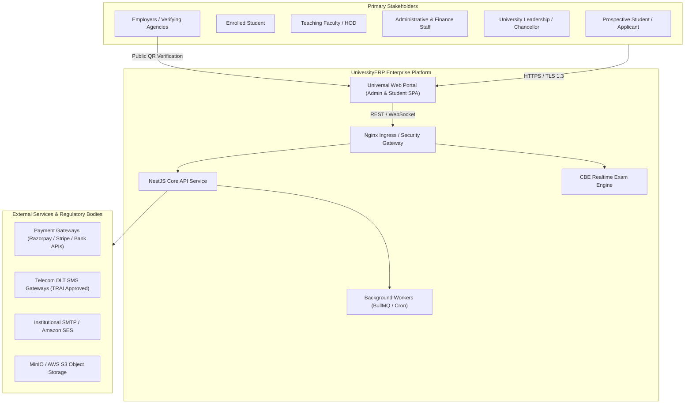
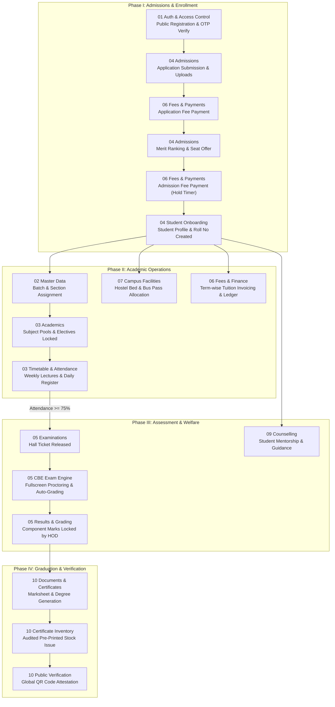

# UniversityERP — Enterprise Architectural Blueprint & Platform Showcase

> **Executive System Architecture, Comprehensive Domain Catalog, Multi-Tier Security Model, Regulatory Alignment, and Technical Reference.**  
> **Target Audience**: Executive Leadership, University Chancellors & Deans, Enterprise Architects, Security Auditors, and Core Engineering Teams.  
> **Platform Version**: 2026.3 Release (Monorepo: NestJS Core API, Fastify/Express, Vite + React 18 SPA, PostgreSQL 16, Redis, MinIO, Docker Compose).

---

## 1. Executive Summary & Value Proposition

**UniversityERP** is a next-generation, cloud-native, multi-tenant Higher Education Enterprise Resource Planning (ERP) platform. Engineered to govern the complete academic, administrative, financial, and logistical lifecycle of modern collegiate institutions, the system unifies disparate departmental silos into a cohesive, event-driven, real-time operating system.

### Key Value Pillars
- **Student-Centric Lifecycle**: Unbroken digital continuum from public application, entrance exams, and merit seat allocation through degree issuance and cryptographic QR verification.
- **NEP 2020 & Choice-Based Credit System (CBCS)**: Built-in support for flexible multi-disciplinary curriculum models, elective subject pools, credit banks, relative/absolute grading, and outcome-based education.
- **Enterprise-Grade Governance & Auditability**: Immutable audit logs, double-entry financial ledgers, legally governed student profile modification workflows, and role-based access control with granular permission overrides.
- **Continuous Operations & Fault Tolerance**: Automated disaster recovery, live zero-downtime maintenance polling, containerized microservices, and decoupled background worker queues.

---

## 2. Enterprise System Architecture (C4 Model)

### Level 1: System Context Diagram
Visualizes how UniversityERP interfaces with external users, regulatory portals, payment gateways, and communication networks.



---

### Level 2: Container & Runtime Topology
Physical deployment architecture showing network isolation, database persistence, caching tiers, and worker pools.

```mermaid
graph TD
    subgraph DMZ ["Public DMZ (Ports 80 / 443)"]
        Nginx["Nginx Reverse Proxy & Load Balancer<br/>- Keepalive Connection Pooling<br/>- Rate Limiting & SSL Offload<br/>- Cache-Control: no-store on Shell HTML"]
    end

    subgraph AppTier ["Application Tier (Docker Virtual Network)"]
        SPA["Universal Web Portal<br/>(React 18, Vite, TypeScript, Tailwind)"]
        Core["Core API Service<br/>(NestJS, Fastify/Express, Node 20 LTS :3000)"]
        CBE["CBE Exam Engine<br/>(High-Concurrency Realtime Service :3002)"]
        Cert["Certificate Generator Microservice<br/>(Puppeteer, Headless PDF Engine)"]
        Worker["Notification Worker<br/>(BullMQ, SMTP, SMS Dispatcher)"]
    end

    subgraph DataTier ["Data & Persistence Tier (Private Subnet)"]
        Postgres[("Primary PostgreSQL 16 DB<br/>(138 Prisma Models, Read/Write Pool)")]
        Redis[("Redis Cluster / In-Memory Store<br/>(JWT Tokens, Rate Limits, Job Queues)")]
        MinIO[("MinIO S3 Storage<br/>(Documents, Photos, Marksheets)")]
    end

    Nginx -->|/ (Static Shell)| SPA
    Nginx -->|/api/*| Core
    Nginx -->|/cbe/*| CBE
    
    Core --> Postgres
    Core --> Redis
    Core --> MinIO
    Core --> Cert
    Core --> Worker

    CBE --> Redis
    CBE --> Postgres
    Worker --> Redis
    Worker --> Postgres
```

---

## 3. Regulatory & Accreditation Compliance Matrix

UniversityERP is architected to satisfy strict statutory standards mandated by higher education regulatory and accrediting agencies.

| Regulatory Body / Standard | Mandatory Statutory Requirement | System Implementation & Architectural Enforcement |
|:---|:---|:---|
| **NEP 2020 / UGC** | Choice-Based Credit System (CBCS) & Multiple Entry/Exit | Configurable Program Labels, Subject Pools with credit minimums/maximums, and semester-wise term promotion rules in `Module 02` and `Module 03`. |
| **AICTE / Statutory Councils** | Strict Intake Capacity & Reservation Quotas | Seat Master ledger with statutory approval caps, Category quotas (General, OBC, SC, ST, EWS), and per-batch student accounting in `Module 04`. |
| **NAAC / NBA** | Continuous Internal Evaluation (CIE) & Question Psychometrics | Direct OBE tracking, topic weightages, Bloom's taxonomy tagging, and real-time Item Analysis (Facility & Discrimination Indices) in `Module 05`. |
| **TRAI / Telecom DLT** | Anti-Spam Commercial Communication Enforcement | SMS Template Engine capturing DLT Template Name, 19-digit DLT Template ID, category, and strict byte-matching text with `{#var#}` tokens in `Module 13`. |
| **FERPA / GDPR / DPDP** | Student Privacy & Confidential Case Management | Application-level privacy fence separating academic records from psychological counselling notes in `Module 09`; immutable audit logs in `Module 13`. |
| **Digital Verification** | Fraud-Resistant Degree & Transcript Attestation | Cryptographically signed 2D QR codes embedding SHA-256 serial hashes, physical certificate stock audit tracking, and public lookup portal in `Module 10`. |

---

## 4. Master Cross-Module End-to-End Lifecycle Map

The following flowchart illustrates the unbroken lifecycle of an institutional participant—from prospective candidate registration to alumnus—and how data moves seamlessly across all 13 core modules.



---

## 5. Domain Module Directory Catalog

The `flow/` directory contains 13 dedicated, self-contained business domain modules. Each module provides complete, authoritative specifications across three engineering dimensions:
1. **`UI_CLICK_FLOWS.md`**: Granular screen-by-screen, tab, button, modal, form input, validation, and toast walkthroughs.
2. **`END_TO_END_ACTION_PROCESSES.md`**: Full HTTP lifecycles including routes, methods, headers, DTOs, controller endpoints, guards, services, Prisma transactions, and response payloads.
3. **`TECHNICAL_ARCHITECTURE.md`**: Mermaid sequence diagrams, state machine transitions, entity relationship models, and architectural constraints.

| # | Domain Module Folder | Functional Scope & Architectural Responsibilities | Key React Pages | Primary Controllers |
|:---:|:---|:---|:---|:---|
| **01** | [01_auth_and_access_control](file:///home/admin/UniversityERP/flow/01_auth_and_access_control/UI_CLICK_FLOWS.md) | Identity management, multi-factor OTP verification, session security, password policies, account setup, SuperAdmin impersonation, and multi-dimensional role resolution (`appRoles`, `allRoles`, `adminRole`). | `LoginPage`, `RegisterPage`, `ForgotPasswordPage`, `ResetPasswordPage`, `SetupAccountPage` | `auth.controller.ts` |
| **02** | [02_master_data_and_structure](file:///home/admin/UniversityERP/flow/02_master_data_and_structure/UI_CLICK_FLOWS.md) | Multi-tier academic structural hierarchy (University, Institute, Department, Programme, Course, Batch, Section), sole university auto-selection, configurable middle layers, 5-tab Program Label rule designer, and bulk edit spreadsheets. | `MasterDataPage`, `ValidationPage`, `ProgramFeeManager` | 16 Master Data controllers |
| **03** | [03_academics_curriculum_and_timetable](file:///home/admin/UniversityERP/flow/03_academics_curriculum_and_timetable/UI_CLICK_FLOWS.md) | Batch-term curriculum mapping, subject pools, student elective elections, weekly class timetable grids with collision detection, faculty personal timetable self-views, attendance registers, and draft result publishing. | `TimetablePage`, `AttendancePage`, `ElectivesPage`, `MySubjectsPage` | `attendance`, `timetable`, `election`, `marks` |
| **04** | [04_admissions_and_student_lifecycle](file:///home/admin/UniversityERP/flow/04_admissions_and_student_lifecycle/UI_CLICK_FLOWS.md) | Seat Master interactive capacity ledger with collapsible hierarchy and XLSX/PDF exports, applicant portal, entrance merit calculation, seat allocation, student onboarding, and guarded student removal (undo onboarding). | `AdmissionsPage`, `MeritListPage`, `StudentApplicationsPage`, `OnboardStudentsPage`, `StudentProfilePage` | `admissions`, `onboarding`, `cancel-enrollment` |
| **05** | [05_examinations_grading_and_cbe](file:///home/admin/UniversityERP/flow/05_examinations_grading_and_cbe/UI_CLICK_FLOWS.md) | Examination paper scheduling, Question Bank, fullscreen Computer-Based Exam (CBE) execution (`/exam/:id`), live proctor monitoring, question item psychometrics (Facility/Discrimination index), and public result lookups. | `ExaminationsPage`, `ExamTakePage`, `ExamMonitorPage`, `ExamItemAnalysisPage`, `MyInvigilationPage`, `PublicResultsPage` | `examination`, `question-bank`, `pbe-paper`, `cbe-engine` |
| **06** | [06_fees_finance_and_payments](file:///home/admin/UniversityERP/flow/06_fees_finance_and_payments/UI_CLICK_FLOWS.md) | Fee Heads, Structure rules, Payment Windows gear settings (application/admission fee expiry hours), online Razorpay/Stripe checkout, offline cashier receipts, double-entry student ledgers, and fee waivers. | `FeesPage`, `FeeSettingsModal`, `ChargeFeeModal`, `ProgramFeeManager` | `fee.controller.ts` |
| **07** | [07_campus_facilities_and_logistics](file:///home/admin/UniversityERP/flow/07_campus_facilities_and_logistics/UI_CLICK_FLOWS.md) | Hostel blocks, room layouts, bed allocation, vacating refunds, transport route/stop planning, vehicle fleet management, digital bus passes, library barcode circulation desk, and campus resource reservations. | `HostelPage`, `TransportPage`, `LibraryPage` | `hostel`, `transport`, `library`, `reservation` |
| **08** | [08_human_resources_and_leaves](file:///home/admin/UniversityERP/flow/08_human_resources_and_leaves/UI_CLICK_FLOWS.md) | Faculty and staff directories, designations, document repositories, leave quotas, self-service leave applications with substitute lecture planning, multi-tier HOD/Registrar approvals, and holiday calendars. | `HRPage`, `LeaveRequestsPage`, `DirectoryPage` | `hr.controller.ts` |
| **09** | [09_counselling_and_student_welfare](file:///home/admin/UniversityERP/flow/09_counselling_and_student_welfare/UI_CLICK_FLOWS.md) | Student welfare counselling, career guidance, counsellor registry, contract credit tracking, student booking desk (`/counsellor-desk`), encrypted confidential case logs, and session rating feedback. | `CounsellingAdminPage`, `CounsellingDeskPage` | `counselling.controller.ts` |
| **10** | [10_documents_certificates_and_verification](file:///home/admin/UniversityERP/flow/10_documents_certificates_and_verification/UI_CLICK_FLOWS.md) | Visual Canvas Document Designer (Student Details pair layouts, field picker, table headers), Certificate Inventory (5/10/20 paging, actor audit comments), Pre-printed serial prompts, scaled A4 in-app preview with direct print, and `/verify` public portal. | `DocumentsPage`, `DocumentSettingsModal`, `DocumentPreviewModal`, `PublicVerifyPage` | `documents`, `document-extras`, `id-format` |
| **11** | [11_dynamic_forms_and_surveys](file:///home/admin/UniversityERP/flow/11_dynamic_forms_and_surveys/UI_CLICK_FLOWS.md) | Visual drag-and-drop form schema builder, dynamic input components (text, date, file, signature), conditional field visibility rules, form submissions tracking, and read-only inspection views. | `FormsPage`, `ReadOnlyFormView` | `forms.controller.ts`, `forms-public` |
| **12** | [12_workflow_engine_and_approvals](file:///home/admin/UniversityERP/flow/12_workflow_engine_and_approvals/UI_CLICK_FLOWS.md) | Visual node-based workflow designer (`@xyflow/react`), deterministic state machines, transition rules, unified task inbox (`/my-tasks`), aging monitors, and Saga-pattern resource reservation holds. | `WorkflowDesignerPage`, `WorkflowMonitorPage`, `MyTasksPage` | `workflow.controller.ts` |
| **13** | [13_system_governance_and_administration](file:///home/admin/UniversityERP/flow/13_system_governance_and_administration/UI_CLICK_FLOWS.md) | User RBAC, Security Policy gear modal on `/users`, visual Navigation Menu builder, SMS Communication templates with 4-column DLT layout, Notice Board gear settings, immutable audit stream, and database backup/restore with live maintenance banner. | `UserManagementPage`, `SettingsPage`, `NoticeBoardPage`, `AuditLogPage`, `BannersPage` | `users`, `settings`, `audit`, `backup` |

---

## 6. Engineering Conventions & Future Developer Guidelines

For software engineers, DevOps leads, and architects extending or maintaining UniversityERP:

1. **Transactional Integrity**: All multi-entity state mutations (e.g. Onboarding, Fee Payment, Exam Result Publishing, Document Issuance) must execute within Prisma `$transaction` blocks to prevent orphaned database records.
2. **Modular Settings Placement**: New feature-specific configurations must follow the page-level gear modal pattern (e.g., Payment Windows on Fees, Security on Users, Notice Board config on Notice Board) rather than dumping all settings into the global Settings page.
3. **Auditability Standard**: Every administrative action that creates, updates, or revokes privileges, financial records, or student academic data must create an explicit `AuditLog` entry detailing `action`, `userId`, `entity`, `entityId`, and `ipAddress`.
4. **Idempotent Database Seeding**: All database seed scripts (`seed-config.js`, `seed-catalog.js`) must be strictly create-only (`upsertById` checking existing IDs) to guarantee that user-customized workflows, forms, document templates, fee heads, and navigation layouts survive container redeployments.
