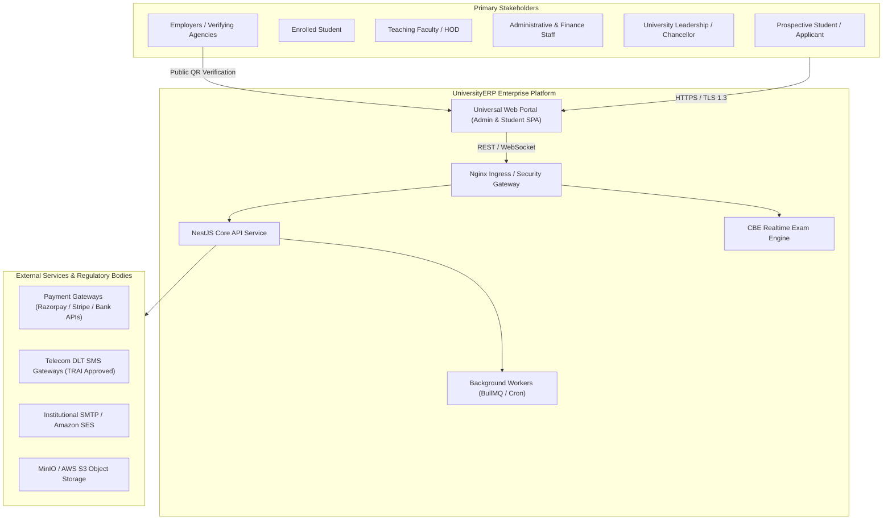
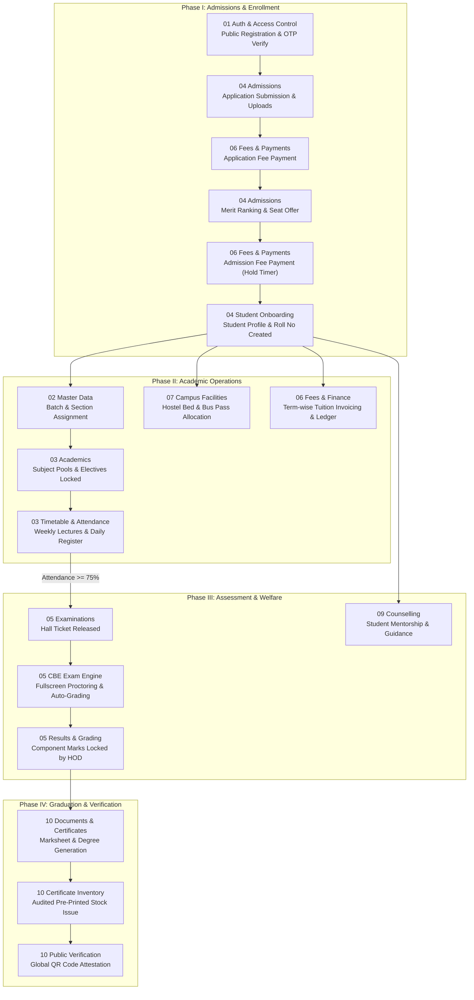

# UniversityERP — Enterprise Architectural Blueprint & Platform Showcase

> **Executive System Architecture, Comprehensive Domain Catalog, Multi-Tier Security Model, Regulatory Alignment, and Technical Reference.**  
> **Target Audience**: Executive Leadership, University Chancellors & Deans, Enterprise Architects, Security Auditors, and Core Engineering Teams.  
> **Platform Version**: 2026.3 Release (Monorepo: NestJS Core API, Fastify/Express, Vite + React 18 SPA, PostgreSQL 16, Redis, MinIO, Docker Compose).

---

## 1. Executive Summary & Value Proposition

**UniversityERP** is a next-generation, cloud-native, multi-tenant Higher Education Enterprise Resource Planning (ERP) platform. Engineered to govern the complete academic, administrative, financial, and logistical lifecycle of modern collegiate institutions, the system unifies disparate departmental silos into a cohesive, event-driven, real-time operating system.

### Key Value Pillars
- **Student-Centric Lifecycle**: Unbroken digital continuum from public application, entrance exams, and merit seat allocation through degree issuance and cryptographic QR verification.
- **NEP 2020 & Choice-Based Credit System (CBCS)**: Built-in support for flexible multi-disciplinary curriculum models, elective subject pools, credit banks, relative/absolute grading, and outcome-based education.
- **Enterprise-Grade Governance & Auditability**: Immutable audit logs, double-entry financial ledgers, legally governed student profile modification workflows, and role-based access control with granular permission overrides.
- **Continuous Operations & Fault Tolerance**: Automated disaster recovery, live zero-downtime maintenance polling, containerized microservices, and decoupled background worker queues.

---

## 2. Enterprise System Architecture (C4 Model)

### Level 1: System Context Diagram
Visualizes how UniversityERP interfaces with external users, regulatory portals, payment gateways, and communication networks.



---

### Level 2: Container & Runtime Topology
Physical deployment architecture showing network isolation, database persistence, caching tiers, and worker pools.

```mermaid
graph TD
    subgraph DMZ ["Public DMZ (Ports 80 / 443)"]
        Nginx["Nginx Reverse Proxy & Load Balancer<br/>- Keepalive Connection Pooling<br/>- Rate Limiting & SSL Offload<br/>- Cache-Control: no-store on Shell HTML"]
    end

    subgraph AppTier ["Application Tier (Docker Virtual Network)"]
        SPA["Universal Web Portal<br/>(React 18, Vite, TypeScript, Tailwind)"]
        Core["Core API Service<br/>(NestJS, Fastify/Express, Node 20 LTS :3000)"]
        CBE["CBE Exam Engine<br/>(High-Concurrency Realtime Service :3002)"]
        Cert["Certificate Generator Microservice<br/>(Puppeteer, Headless PDF Engine)"]
        Worker["Notification Worker<br/>(BullMQ, SMTP, SMS Dispatcher)"]
    end

    subgraph DataTier ["Data & Persistence Tier (Private Subnet)"]
        Postgres[("Primary PostgreSQL 16 DB<br/>(138 Prisma Models, Read/Write Pool)")]
        Redis[("Redis Cluster / In-Memory Store<br/>(JWT Tokens, Rate Limits, Job Queues)")]
        MinIO[("MinIO S3 Storage<br/>(Documents, Photos, Marksheets)")]
    end

    Nginx -->|/ (Static Shell)| SPA
    Nginx -->|/api/*| Core
    Nginx -->|/cbe/*| CBE
    
    Core --> Postgres
    Core --> Redis
    Core --> MinIO
    Core --> Cert
    Core --> Worker

    CBE --> Redis
    CBE --> Postgres
    Worker --> Redis
    Worker --> Postgres
```

---

## 3. Regulatory & Accreditation Compliance Matrix

UniversityERP is architected to satisfy strict statutory standards mandated by higher education regulatory and accrediting agencies.

| Regulatory Body / Standard | Mandatory Statutory Requirement | System Implementation & Architectural Enforcement |
|:---|:---|:---|
| **NEP 2020 / UGC** | Choice-Based Credit System (CBCS) & Multiple Entry/Exit | Configurable Program Labels, Subject Pools with credit minimums/maximums, and semester-wise term promotion rules in `Module 02` and `Module 03`. |
| **AICTE / Statutory Councils** | Strict Intake Capacity & Reservation Quotas | Seat Master ledger with statutory approval caps, Category quotas (General, OBC, SC, ST, EWS), and per-batch student accounting in `Module 04`. |
| **NAAC / NBA** | Continuous Internal Evaluation (CIE) & Question Psychometrics | Direct OBE tracking, topic weightages, Bloom's taxonomy tagging, and real-time Item Analysis (Facility & Discrimination Indices) in `Module 05`. |
| **TRAI / Telecom DLT** | Anti-Spam Commercial Communication Enforcement | SMS Template Engine capturing DLT Template Name, 19-digit DLT Template ID, category, and strict byte-matching text with `{#var#}` tokens in `Module 13`. |
| **FERPA / GDPR / DPDP** | Student Privacy & Confidential Case Management | Application-level privacy fence separating academic records from psychological counselling notes in `Module 09`; immutable audit logs in `Module 13`. |
| **Digital Verification** | Fraud-Resistant Degree & Transcript Attestation | Cryptographically signed 2D QR codes embedding SHA-256 serial hashes, physical certificate stock audit tracking, and public lookup portal in `Module 10`. |

---

## 4. Master Cross-Module End-to-End Lifecycle Map

The following flowchart illustrates the unbroken lifecycle of an institutional participant—from prospective candidate registration to alumnus—and how data moves seamlessly across all 13 core modules.



---

## 5. Domain Module Directory Catalog

The `flow/` directory contains 13 dedicated, self-contained business domain modules. Each module provides complete, authoritative specifications across three engineering dimensions:
1. **`UI_CLICK_FLOWS.md`**: Granular screen-by-screen, tab, button, modal, form input, validation, and toast walkthroughs.
2. **`END_TO_END_ACTION_PROCESSES.md`**: Full HTTP lifecycles including routes, methods, headers, DTOs, controller endpoints, guards, services, Prisma transactions, and response payloads.
3. **`TECHNICAL_ARCHITECTURE.md`**: Mermaid sequence diagrams, state machine transitions, entity relationship models, and architectural constraints.

| # | Domain Module Folder | Functional Scope & Architectural Responsibilities | Key React Pages | Primary Controllers |
|:---:|:---|:---|:---|:---|
| **01** | [01_auth_and_access_control](file:///home/admin/UniversityERP/flow/01_auth_and_access_control/UI_CLICK_FLOWS.md) | Identity management, multi-factor OTP verification, session security, password policies, account setup, SuperAdmin impersonation, and multi-dimensional role resolution (`appRoles`, `allRoles`, `adminRole`). | `LoginPage`, `RegisterPage`, `ForgotPasswordPage`, `ResetPasswordPage`, `SetupAccountPage` | `auth.controller.ts` |
| **02** | [02_master_data_and_structure](file:///home/admin/UniversityERP/flow/02_master_data_and_structure/UI_CLICK_FLOWS.md) | Multi-tier academic structural hierarchy (University, Institute, Department, Programme, Course, Batch, Section), sole university auto-selection, configurable middle layers, 5-tab Program Label rule designer, and bulk edit spreadsheets. | `MasterDataPage`, `ValidationPage`, `ProgramFeeManager` | 16 Master Data controllers |
| **03** | [03_academics_curriculum_and_timetable](file:///home/admin/UniversityERP/flow/03_academics_curriculum_and_timetable/UI_CLICK_FLOWS.md) | Batch-term curriculum mapping, subject pools, student elective elections, weekly class timetable grids with collision detection, faculty personal timetable self-views, attendance registers, and draft result publishing. | `TimetablePage`, `AttendancePage`, `ElectivesPage`, `MySubjectsPage` | `attendance`, `timetable`, `election`, `marks` |
| **04** | [04_admissions_and_student_lifecycle](file:///home/admin/UniversityERP/flow/04_admissions_and_student_lifecycle/UI_CLICK_FLOWS.md) | Seat Master interactive capacity ledger with collapsible hierarchy and XLSX/PDF exports, applicant portal, entrance merit calculation, seat allocation, student onboarding, and guarded student removal (undo onboarding). | `AdmissionsPage`, `MeritListPage`, `StudentApplicationsPage`, `OnboardStudentsPage`, `StudentProfilePage` | `admissions`, `onboarding`, `cancel-enrollment` |
| **05** | [05_examinations_grading_and_cbe](file:///home/admin/UniversityERP/flow/05_examinations_grading_and_cbe/UI_CLICK_FLOWS.md) | Examination paper scheduling, Question Bank, fullscreen Computer-Based Exam (CBE) execution (`/exam/:id`), live proctor monitoring, question item psychometrics (Facility/Discrimination index), and public result lookups. | `ExaminationsPage`, `ExamTakePage`, `ExamMonitorPage`, `ExamItemAnalysisPage`, `MyInvigilationPage`, `PublicResultsPage` | `examination`, `question-bank`, `pbe-paper`, `cbe-engine` |
| **06** | [06_fees_finance_and_payments](file:///home/admin/UniversityERP/flow/06_fees_finance_and_payments/UI_CLICK_FLOWS.md) | Fee Heads, Structure rules, Payment Windows gear settings (application/admission fee expiry hours), online Razorpay/Stripe checkout, offline cashier receipts, double-entry student ledgers, and fee waivers. | `FeesPage`, `FeeSettingsModal`, `ChargeFeeModal`, `ProgramFeeManager` | `fee.controller.ts` |
| **07** | [07_campus_facilities_and_logistics](file:///home/admin/UniversityERP/flow/07_campus_facilities_and_logistics/UI_CLICK_FLOWS.md) | Hostel blocks, room layouts, bed allocation, vacating refunds, transport route/stop planning, vehicle fleet management, digital bus passes, library barcode circulation desk, and campus resource reservations. | `HostelPage`, `TransportPage`, `LibraryPage` | `hostel`, `transport`, `library`, `reservation` |
| **08** | [08_human_resources_and_leaves](file:///home/admin/UniversityERP/flow/08_human_resources_and_leaves/UI_CLICK_FLOWS.md) | Faculty and staff directories, designations, document repositories, leave quotas, self-service leave applications with substitute lecture planning, multi-tier HOD/Registrar approvals, and holiday calendars. | `HRPage`, `LeaveRequestsPage`, `DirectoryPage` | `hr.controller.ts` |
| **09** | [09_counselling_and_student_welfare](file:///home/admin/UniversityERP/flow/09_counselling_and_student_welfare/UI_CLICK_FLOWS.md) | Student welfare counselling, career guidance, counsellor registry, contract credit tracking, student booking desk (`/counsellor-desk`), encrypted confidential case logs, and session rating feedback. | `CounsellingAdminPage`, `CounsellingDeskPage` | `counselling.controller.ts` |
| **10** | [10_documents_certificates_and_verification](file:///home/admin/UniversityERP/flow/10_documents_certificates_and_verification/UI_CLICK_FLOWS.md) | Visual Canvas Document Designer (Student Details pair layouts, field picker, table headers), Certificate Inventory (5/10/20 paging, actor audit comments), Pre-printed serial prompts, scaled A4 in-app preview with direct print, and `/verify` public portal. | `DocumentsPage`, `DocumentSettingsModal`, `DocumentPreviewModal`, `PublicVerifyPage` | `documents`, `document-extras`, `id-format` |
| **11** | [11_dynamic_forms_and_surveys](file:///home/admin/UniversityERP/flow/11_dynamic_forms_and_surveys/UI_CLICK_FLOWS.md) | Visual drag-and-drop form schema builder, dynamic input components (text, date, file, signature), conditional field visibility rules, form submissions tracking, and read-only inspection views. | `FormsPage`, `ReadOnlyFormView` | `forms.controller.ts`, `forms-public` |
| **12** | [12_workflow_engine_and_approvals](file:///home/admin/UniversityERP/flow/12_workflow_engine_and_approvals/UI_CLICK_FLOWS.md) | Visual node-based workflow designer (`@xyflow/react`), deterministic state machines, transition rules, unified task inbox (`/my-tasks`), aging monitors, and Saga-pattern resource reservation holds. | `WorkflowDesignerPage`, `WorkflowMonitorPage`, `MyTasksPage` | `workflow.controller.ts` |
| **13** | [13_system_governance_and_administration](file:///home/admin/UniversityERP/flow/13_system_governance_and_administration/UI_CLICK_FLOWS.md) | User RBAC, Security Policy gear modal on `/users`, visual Navigation Menu builder, SMS Communication templates with 4-column DLT layout, Notice Board gear settings, immutable audit stream, and database backup/restore with live maintenance banner. | `UserManagementPage`, `SettingsPage`, `NoticeBoardPage`, `AuditLogPage`, `BannersPage` | `users`, `settings`, `audit`, `backup` |
| **14** | [14_institutional_analytics_and_intelligence](file:///home/admin/UniversityERP/flow/14_institutional_analytics_and_intelligence/UI_CLICK_FLOWS.md) | Executive Cockpit, macro institutional telemetry, demographic Sankey funnel, attendance risk radars, fee collection velocity, and faculty teaching workload monitors. | `AnalyticsPage`, `DashboardPage` | `analytics.controller.ts`, `me.controller.ts` |

---


## 6. Master Student Lifecycle End-to-End Operational Journey

For an exhaustive, executive-level technical specification of the entire student continuum from initial application to institutional graduation/exit ("getting the student out"), refer to:

👉 **[Master Student Lifecycle End-to-End Journey](file:///home/admin/UniversityERP/flow/STUDENT_LIFECYCLE_END_TO_END_JOURNEY.md)**

### Key Highlights Documented:
- **11-Stage Operational Continuum**: Lead Acquisition $\to$ Scrutiny $\to$ Merit Listing $\to$ Offer Letters $\to$ Invoicing $\to$ Matriculation $\to$ NEP Cohort Allocation $\to$ Recurring Demands $\to$ Facilities $\to$ Assessments $\to$ Institutional Exit.
- **Explicit Role Governance**: Details precisely **who initiates**, **who reviews**, **who approves**, and **who creates fees** at every decision gate.
- **The Two Exit Pathways**:
  1. **Voluntary Cancellation / Withdrawal**: `CancelEnrollmentRequest` lifecycle (requester, reviewer, approver roles), 15-day account deactivation timer, and deposit refund settlements.
  2. **Graduation & Convocation**: Multi-department **"No Dues"** clearance workflow across 5 institutional divisions (Labs, Library, Hostels, Sports, Accounts), Senate gazette approval, security certificate stock printing, and Alumni SSO provisioning.

---

## 7. Enterprise Data Migration & Bulk Import Suite

For institutional data architects, ETL engineers, and deployment teams migrating multi-campus universities into UniversityERP, the **`flow/DATA_MIGRATION_AND_TEMPLATES/`** suite provides production-ready artifacts:

| Asset | Specification Document | Description & Scope |
| :---: | :--- | :--- |
| **01** | [Topological Ingestion Dependency Graph](file:///home/admin/UniversityERP/flow/DATA_MIGRATION_AND_TEMPLATES/01_DATA_INGESTION_DEPENDENCY_GRAPH.md) | Strict 10-level DAG ensuring zero foreign key constraint violations during legacy database cutover. |
| **02** | [Bulk Import Templates & Schemas](file:///home/admin/UniversityERP/flow/DATA_MIGRATION_AND_TEMPLATES/02_BULK_IMPORT_TEMPLATES_AND_SCHEMAS.md) | Copy-pasteable CSV and JSON schemas with sample data, formats, and enum validation rules for all 10 core entities. |
| **03** | [Field Mapping Matrix & Data Dictionary](file:///home/admin/UniversityERP/flow/DATA_MIGRATION_AND_TEMPLATES/03_FIELD_MAPPING_MATRIX_AND_DATA_DICTIONARY.md) | Authoritative 4-way cross-reference: `Legacy CSV` $\longleftrightarrow$ `UI Input` $\longleftrightarrow$ `API DTO` $\longleftrightarrow$ `Prisma DB Column`. |
| **04** | [Dynamic Tokens & Interpolation Catalog](file:///home/admin/UniversityERP/flow/DATA_MIGRATION_AND_TEMPLATES/04_DYNAMIC_TOKENS_CATALOG.md) | Exhaustive reference of runtime tokens for Canvas Document Designer, ID Formats, and TRAI DLT SMS templates. |
| **05** | [Institutional Go-Live Runbook](file:///home/admin/UniversityERP/flow/DATA_MIGRATION_AND_TEMPLATES/05_INSTITUTIONAL_GO_LIVE_RUNBOOK.md) | 30-day cutover playbook (T-30 to T+7) including staging dry-runs, financial reconciliation, and hour-by-hour weekend schedule. |

---

## 8. Enterprise Roles & Persona Operating Manuals

For a deep, role-by-role operational guide on how every single participant in the university operates their screens, actions, permissions, approvals, and signatures, the **`flow/ROLES_AND_PERMISSIONS_MANUALS/`** suite provides dedicated playbooks:

| Manual Document | Target Personas | Operational Scope & Primary Capabilities |
| :--- | :--- | :--- |
| **[00 Master Role & Permissions Matrix](file:///home/admin/UniversityERP/flow/ROLES_AND_PERMISSIONS_MANUALS/00_MASTER_ROLE_PERMISSIONS_MATRIX.md)** | All 24 Recognized Roles | Master cross-reference across all 49 React pages, 68 NestJS controllers, multi-dimensional role resolution (`roles.util.ts`), and module write guards. |
| **[01 System Administrators Manual](file:///home/admin/UniversityERP/flow/ROLES_AND_PERMISSIONS_MANUALS/01_SYSTEM_ADMINISTRATORS_MANUAL.md)** | `SuperAdmin`, `UnivAdmin`, `InstAdmin` | Multi-tenant governance, live user impersonation, maintenance mode banners, disaster recovery / backup restores, statutory catalogs, and security lockout policies. |
| **[02 Academic Leadership & Faculty Manual](file:///home/admin/UniversityERP/flow/ROLES_AND_PERMISSIONS_MANUALS/02_ACADEMIC_LEADERSHIP_AND_FACULTY_MANUAL.md)** | `Registrar`, `Controller of Examinations`, `Dean/HOD`, `TeachingFaculty` | Legal matriculation register, final cancellation sign-offs, double-blind exam coding (`ExamAnonCode`), result publishing, elective pools locking, attendance registers, and substitute leaves. |
| **[03 Finance, Accounts & Logistics Manual](file:///home/admin/UniversityERP/flow/ROLES_AND_PERMISSIONS_MANUALS/03_FINANCE_ACCOUNTS_AND_LOGISTICS_MANUAL.md)** | `Finance Head`, `Accounts Officer`, `Warden`, `Transport Incharge`, `Librarian` | Fee structure authoring, recurring billing, offline cashiering with verified receipts, hostel room inventory, transit QR bus passes, RFID library circulation, and central No Dues. |
| **[04 Specialized Workflow Officers Manual](file:///home/admin/UniversityERP/flow/ROLES_AND_PERMISSIONS_MANUALS/04_SPECIALIZED_WORKFLOW_OFFICERS_MANUAL.md)** | `Admission Approver`, `Document Issuer`, `Results Publisher`, `QuestionBank Approver`, `Counsellor`, `AdminStaff` | Scrutiny defect raising, bulk merit seat offers, visual Canvas designer with pre-printed stock serials, 3-tier grading firewall, psychometric item analysis, and encrypted case notes. |
| **[05 Students, Parents & Alumni Manual](file:///home/admin/UniversityERP/flow/ROLES_AND_PERMISSIONS_MANUALS/05_STUDENTS_PARENTS_AND_ALUMNI_MANUAL.md)** | `Applicant`, `Student`, `Parent`, `Alumni` | Digital admissions and offer acceptance, student dashboard with real-time timetable & attendance alerts, Razorpay fee payments, admit cards, Parent OTP portal, and verified alumni transcripts. |

---

## 9. External Integrations & Statutory Gateways Architecture

For enterprise systems integration engineers, payment gateway developers, and compliance auditors, the external integration perimeter is fully specified in:

👉 **[External Integrations & Statutory Gateways Specification](file:///home/admin/UniversityERP/flow/EXTERNAL_INTEGRATIONS_AND_STATUTORY_GATEWAYS.md)**

### Integration Highlights:
- **Banking & Payment Gateways**: Razorpay server-side HMAC-SHA256 signature verification, asynchronous webhook idempotency engines, and automated refund lifecycles.
- **Telecom Regulatory Authority of India (TRAI) DLT SMS**: Principal Entity (`PE_ID`), Sender Header (`HEADER_ID`), and approved transactional content template mapping (`{#var#}`).
- **National Depository & Academic Bank of Credits (ABC / APAAR / DigiLocker)**: NEP 2020 automated credit push APIs, student APAAR ID verification, and XML digital award uploads.
- **Biometric & Campus IoT Hardware**: HTTP/HTTPS Push API for facial recognition / fingerprint classroom attendance, turnstile circulation, and GPS bus telemetry.
- **Enterprise Object Storage**: S3-compatible MinIO / AWS S3 clusters with AES-256 server-side encryption and 15-minute ephemeral presigned GET URLs.

---

## 10. Executive Whitepaper & Strategic Capabilities Presentation

For university chancellors, boards of governors, chief information officers, and client executives, the strategic institutional value proposition is articulated in:

👉 **[Executive Platform Overview & Institutional Capabilities Whitepaper](file:///home/admin/UniversityERP/flow/EXECUTIVE_PLATFORM_OVERVIEW_AND_CAPABILITIES.md)**

### Executive Value Highlights:
- **Competitive Superiority & TCO**: Quantifiable advantages over legacy monolithic ERPs (SAP Campus, Ellucian Banner, Oracle PeopleSoft).
- **Statutory Accreditation Alignment**: Automated data telemetry for NAAC (Criteria 1–7), NBA Outcome-Based Education, and NIRF rankings.
- **Institutional ROI Metrics**: Elimination of fee default leakage, 90% reduction in administrative turnaround times, and eradication of credential forgery.
- **High-Availability SLA**: Horizontal scalability supporting 10,000+ concurrent examinees with sub-50ms keystroke synchronization.

---

## 11. Master Technical Blueprints & Relational Encyclopedias

For principal database administrators, full-stack software engineers, and system auditors requiring complete visibility into the code and data layers:

| Technical Encyclopedia | Scope & Coverage |
| :--- | :--- |
| **[Master Database Schema & Entity Dictionary](file:///home/admin/UniversityERP/flow/DATABASE_SCHEMA_AND_RELATIONAL_DATA_DICTIONARY.md)** | **Exhaustive coverage of ALL 138 Prisma Models** across 10 domain clusters, complete with tables, primary keys, foreign key relations, unique indexes, and cascade deletion behaviors. |
| **[Master API Controller & Endpoint Catalog](file:///home/admin/UniversityERP/flow/COMPLETE_API_CONTROLLER_AND_ENDPOINT_CATALOG.md)** | **Exhaustive coverage of ALL 71 NestJS Controllers** across all 43 backend modules, detailing HTTP routes, methods, `@UseGuards`, allowed roles, DTO schemas, and response shapes. |
| **[Master Frontend Pages & UI Catalog](file:///home/admin/UniversityERP/flow/FRONTEND_PAGES_AND_UI_INTERACTIONS_CATALOG.md)** | **Exhaustive coverage of ALL 49 React Pages** in `web/admin-portal/src/pages/`, detailing route paths, allowed roles, modals, data grids, export capabilities (CSV/XLSX/PDF), and state management. |

---

## 12. Engineering Conventions & Future Developer Guidelines

For software engineers, DevOps leads, and architects extending or maintaining UniversityERP:

1. **Transactional Integrity**: All multi-entity state mutations (e.g. Onboarding, Fee Payment, Exam Result Publishing, Document Issuance) must execute within Prisma `$transaction` blocks to prevent orphaned database records.
2. **Modular Settings Placement**: New feature-specific configurations must follow the page-level gear modal pattern (e.g., Payment Windows on Fees, Security on Users, Notice Board config on Notice Board) rather than dumping all settings into the global Settings page.
3. **Auditability Standard**: Every administrative action that creates, updates, or revokes privileges, financial records, or student academic data must create an explicit `AuditLog` entry detailing `action`, `userId`, `entity`, `entityId`, and `ipAddress`.
4. **Idempotent Database Seeding**: All database seed scripts (`seed-config.js`, `seed-catalog.js`) must be strictly create-only (`upsertById` checking existing IDs) to guarantee that user-customized workflows, forms, document templates, fee heads, and navigation layouts survive container redeployments.

---

## 13. Master Executive Presentation & Slide Deck Suite (PPTX & HTML5)

For institutional chancellors, boards of trustees, enterprise IT evaluation committees, and client sales presentations, UniversityERP includes a comprehensive **32-slide widescreen 16:9 executive presentation deck**:

| Presentation Asset | File Format | Purpose & Capabilities |
| :--- | :---: | :--- |
| **[Master Enterprise Architecture Presentation](file:///home/admin/UniversityERP/flow/UniversityERP_Enterprise_Master_Architecture.pptx)** | `.pptx` (Microsoft PowerPoint) | **Authoritative 32-slide executive presentation** in 16:9 widescreen format, styled in dark slate corporate palette with metric callouts, comparison tables, domain matrices, and technical topology. Ready to present or edit in PowerPoint, Apple Keynote, or Google Slides. |
| **[Interactive HTML5 Presentation Deck](file:///home/admin/UniversityERP/flow/UniversityERP_Master_Presentation_Deck.html)** | `.html` (Standalone Web Deck) | **Interactive browser-based presentation deck** mirroring all 32 slides. Features keyboard shortcuts (`◀` `▶` `Space`, `Home` `End`, `F` for Fullscreen), slide selector dropdown, progress indicator, and glassmorphic dark-mode UI. Operates 100% offline with zero dependencies. |
| **[Master PowerPoint Generator Script](file:///home/admin/UniversityERP/flow/generate_master_presentation.py)** | `.py` (Python 3 / `python-pptx`) | Automated Python generator script utilizing `python-pptx` to build or programmatically update the 32-slide presentation deck. |
| **[HTML5 Deck Generator Script](file:///home/admin/UniversityERP/flow/generate_deck_html.py)** | `.py` (Python 3) | Automated Python generator script producing the standalone interactive HTML5 presentation deck. |

### Presentation Slide Outline (32 Comprehensive Slides)
1. **Slide 1: Title Slide & Platform Overview** (Hero metrics: 14 Modules, 24 Roles, 138 Models, 71 Controllers, 49 Pages)
2. **Slide 2: Executive Summary & The Unified Campus Paradigm Shift** (Legacy ERP silos vs Unified Operating System)
3. **Slide 3: Enterprise Architecture & C4 Technical Topology** (React 18 SPA + NestJS 10 API + PostgreSQL 16 + Redis 7)
4. **Slide 4: Master Domain Functional Matrix** (Overview of all 14 enterprise modules with APIs & stakeholders)
5. **Slide 5: End-to-End Student Lifecycle Journey** (11 comprehensive stages from prospect lead to alumni)
6. **Slide 6: Admissions, Lead Funnel & Seat Master Governance** (Merit calculation, quotas, 48h defect cure, intake cap)
7. **Slide 7: Fee Structures, Invoicing & Razorpay Integration** (Finance setup, dual verify HMAC-SHA256, double-entry ledger)
8. **Slide 8: Academic Curriculum, CBCS & NEP 2020 Governance** (Major/minor courses, prerequisites, conflict-free timetable)
9. **Slide 9: Student Attendance & Faculty Operations** (1-click marking, biometric IoT sync, UGC 75% rule, condonation)
10. **Slide 10: Examination Management & Controller of Exams (COE)** (Anonymous barcoded roll numbers, CIA marks lock)
11. **Slide 11: Computer-Based Exam (CBE) & Digital Proctoring** (Fullscreen lockdown, Bloom's taxonomy item banking)
12. **Slide 12: Visual Document Designer & Certificate Stock Security** (Canvas designer, vector encrypted QR, paper serials)
13. **Slide 13: Campus Facilities: Hostel & Residential Life** (Room matrix, warden approval, curfew logs, No Dues)
14. **Slide 14: Campus Facilities: Fleet & Transport Logistics** (Vehicle master, GPS telematics, dynamic QR bus passes)
15. **Slide 15: Campus Facilities: Library & Resource Center (RFID)** (Marc21 cataloging, RFID self-checkout, automated fines)
16. **Slide 16: Human Resources, Faculty & Leave Governance** (Staff master, biometric shifts, proxy arrangement engine)
17. **Slide 17: Campus Health Clinic, Counselling & Student Welfare** (Clinic EHR, confidential AES-256 counselling notes)
18. **Slide 18: Student Exit Governance & 5-Department "No Dues" Clearance** (Multi-department sign-offs, 15-day cancel grace)
19. **Slide 19: Degree Conferral, National Repositories & Alumni Network** (Senate gazette, DigiLocker / ABC / APAAR)
20. **Slide 20: Master Roles & Permissions Governance** (24 system roles mapped across tiers, scopes, and guards)
21. **Slide 21: Zero-Trust Security, Multi-Tenant Isolation & Audit Trails** (JWT, Argon2id, row-level tenant filters, diff logs)
22. **Slide 22: Statutory Gateways & External Integrations Architecture** (Razorpay, TRAI DLT SMS, DigiLocker, IoT hardware)
23. **Slide 23: Relational Database Architecture** (138 Prisma models across 10 domain clusters with relational integrity)
24. **Slide 24: Backend API Architecture** (71 NestJS controllers, 43 modules, OpenAPI docs, validation DTOs)
25. **Slide 25: Frontend Architecture & User Experience** (49 React pages, Vite SPA, responsive Tailwind, micro-interactions)
26. **Slide 26: Enterprise Data Migration & Bulk Ingestion Engine** (10-level topological DAG, 4-way field dictionary)
27. **Slide 27: 30-Day Institutional Cutover & Go-Live Playbook** (T-30 to T+7 cutover plan, hour-by-hour weekend schedule)
28. **Slide 28: Accreditation Intelligence & Statutory Compliance** (NEP 2020, NAAC Criteria 1-7 SSR, NBA OBE attainment)
29. **Slide 29: Institutional Analytics & Executive Cockpit (Module 14)** (Real-time VC cockpit, enrollment funnels, forecasting)
30. **Slide 30: Disaster Recovery, High Availability & Enterprise SLA** (Multi-AZ PostgreSQL, Redis sentinel, RPO < 5m, RTO < 15m)
31. **Slide 31: Total Cost of Ownership (TCO) & Strategic ROI Analysis** (60% lower TCO vs SAP/Banner, zero fee leakage)
32. **Slide 32: Strategic Vision, Enterprise Roadmap & Next Steps** (4-month rollout, AI academic advisors, executive demonstration)

