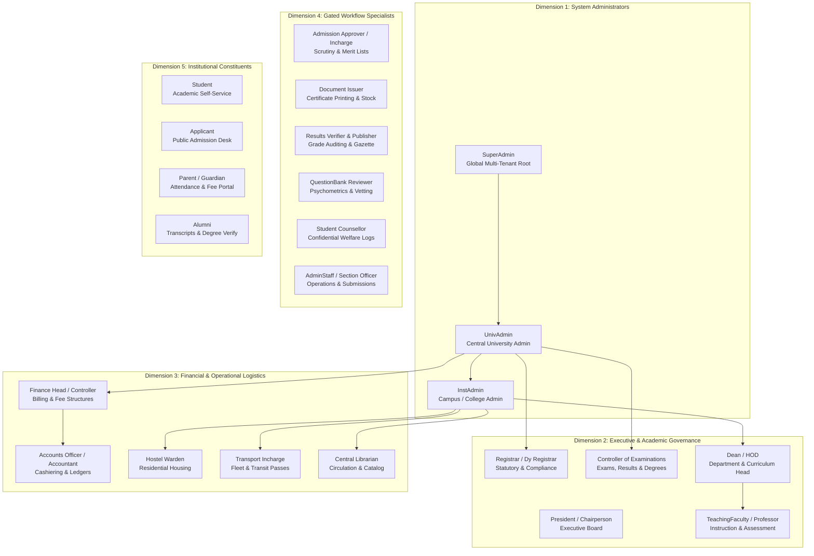

# Master Role & Permissions Matrix
## Comprehensive Security & Access Control Governance across UniversityERP

```
========================================================================================================================
UNIVERSITY ENTERPRISE RESOURCE PLANNING (UniversityERP)
DOCUMENT ID: UERP-SEC-ROLES-MATRIX-V4.2
CLASSIFICATION: ENTERPRISE SECURITY SPECIFICATION & ACCESS CONTROL GOVERNANCE
TARGET AUDIENCE: CHIEF INFORMATION SECURITY OFFICERS, SYSTEM ADMINISTRATORS, LEAD DEVELOPERS, AUDITORS
========================================================================================================================
```

---

## Executive Overview & Multi-Dimensional RBAC Architecture

**UniversityERP** implements an advanced multi-dimensional Role-Based Access Control (RBAC) architecture designed for complex collegiate and multi-campus university environments. Access governance operates across four concurrent dimensions:

1. **Role Classification**:
   - **Application Roles (`application_role`)**: Drive primary ERP navigation, module access guards, and workflow stage routing (e.g. `SuperAdmin`, `UnivAdmin`, `InstAdmin`, `Admission Approver`, `Student`).
   - **User / Staff Roles (`user_role`)**: Represent organizational employment titles and designations (e.g. `Professor`, `Lecturer`, `Section Officer`, `Librarian`).
2. **Effective Role Resolution (`roles.util.ts`)**:
   - The authorization engine evaluates the union set:
     $$\text{Effective Roles} = \{\text{user.applicationRole}\} \cup \{\text{user.applicationRoles}\} \cup \{\text{user.roles}\}$$
   - This ensures multi-role personnel (e.g. a `Professor` who also serves as `Admission Approver` and `HOD`) seamlessly inherit all permitted actions without session switching.
3. **Multi-Tenant Scoping (`ScopeBearer`)**:
   - **`university` Scope**: Cross-campus purview; authorized to view and mutate records across all constituent colleges and central university departments.
   - **`institute` Scope**: Strictly isolated to a single constituent campus (`instituteId`); enforced at the database query level via `canAccessInstitute()`.
   - **`both` Scope**: Role can be deployed at either the central university level or an individual institute level.
4. **Dynamic Module-Level Write Guards (`ModuleAccessGuard`)**:
   - Beyond static `@Roles()` decorators, UniversityERP evaluates dynamic per-module read/write permissions stored in `ModuleAccess` table, allowing university administrators to fine-tune operational access dynamically without code redeployments.

---

## Master System Role Taxonomy (24 Recognized Roles)



---

## Global Role Permissions & Page Access Matrix

The following matrix maps every system role to its authorized UI Pages (`web/admin-portal/src/pages/`) and underlying Controller Endpoints (`apps/core-api/src/modules/`):

| # | Role Name | Type | Natural Scope | Accessible Portal Pages | Gated Action Permissions & Controller Authorities |
| :---: | :--- | :---: | :---: | :--- | :--- |
| **01** | **`SuperAdmin`** | App | `university` | **ALL 49 Pages** + Impersonation Bar, Maintenance Modal, DB Backup/Restore | Unrestricted multi-tenant access, tenant seeding, global password policy, bypass all module locks. |
| **02** | **`UnivAdmin`** | App | `university` | **All University Pages** (Settings, Users, Catalog, Fee Structures, Roles, Audit, Notice Board) | Central university catalog, degree programs, university-wide fee heads, cross-campus reporting. |
| **03** | **`InstAdmin`** | App | `institute` | Master Data, Admissions, Timetable, Fees, Campus Facilities, HR, Documents, Forms, Workflows | Campus operational master: Batches, Sections, Faculty leaves, Local fee collection, Room allotments. |
| **04** | **`Registrar`** | User | `university` | Admissions, Cancel Enrollment, Documents, User Management, Audit Logs, Staff Directory | Statutory matriculation sign-off, enrollment cancellation approvals, degree gazette approval, legal audits. |
| **05** | **`Controller of Examinations`**| User | `university` | Examinations, CBE Monitoring, Item Analysis, Public Results, Certificate Inventory | Scheduling university exams, blind grading codes, admit card rules, result publishing, security stock. |
| **06** | **`Dean/HOD`** | Both | `both` | Master Data, Curriculum, Timetable, Attendance, Electives, Marks, Question Bank, Leave Sanction | Subject pool election locks, timetable conflicts, CIA marks approval, faculty substitute leaves, No Dues. |
| **07** | **`TeachingFaculty`** | User | `institute` | My Subjects, Timetable, Attendance Register, Marks Entry, Question Bank, Leave Applications | Daily lecture attendance, CIA marks entry, exam paper creation, personal leave with substitute planner. |
| **08** | **`Finance Head`** | Both | `both` | Fees Page, Fee Structures, Waivers, Concessions, Reports, Cancelled Enrollment Ledger | Fee structure definition, recurring billing schedules, waiver approval, caution deposit refund advice. |
| **09** | **`Accounts Officer`**| Both | `both` | Fees Page, Charge Candidates, Offline Payments, Receipt Search, Defaulters Report | Generating individual demands, offline cashiering, issuing official receipts, applying late fee waivers. |
| **10** | **`Admission Approver`**| App | `both` | Admissions, Applications Queue, Seat Master, Merit List Workbench | Application scrutiny, document defect raising, merit list compilation, issuing bulk provisional offers. |
| **11** | **`Document Issuer`** | App | `both` | Documents Page, Canvas Designer, Certificate Stock Inventory, Print Modal | Rendering bonafide, transcripts, degree certificates, assigning pre-printed security serial numbers. |
| **12** | **`Results Publisher`**| App | `both` | Examinations, Result Review, Tabulation Register, Public Results | Multi-tier result verification, holding back results for fee/disciplinary reasons, official publishing. |
| **13** | **`QuestionBank Approver`**| App | `both` | Question Bank Page, Question Review Desk, Blueprint Config | Vetting exam questions, Bloom's taxonomy verification, approving items for live CBE exam pools. |
| **14** | **`Warden`** | App | `institute` | Hostel Page, Room Matrix, Allocations, Vacating Ledger, Mess Demands | Room allocation, check-in inspections, vacating damage assessments, hostel dues clearance. |
| **15** | **`Transport Incharge`**| App | `institute` | Transport Page, Routes, Vehicle Fleet, Transit Passes | Route stop scheduling, bus capacity management, generating QR transit passes, transport clearance. |
| **16** | **`Librarian`** | User | `institute` | Library Page, Book Catalog, Circulation Desk, RFID Checkout, Fine Ledger | Book cataloging, check-out/check-in, calculating overdue fines, lost book replacement, library No Dues. |
| **17** | **`Counsellor`** | User | `both` | Counsellor Desk, Student Booking Calendar, Private Case Notes | Student psychological and career counselling, confidential case notes (encrypted), session tracking. |
| **18** | **`AdminStaff`** | User | `institute` | Forms Submissions, Notice Board, Student Lookup, Directory, Profile Changes | Verification of student profile changes, publishing campus notices, executing bulk student lookups. |
| **19** | **`Section Officer`**| Both | `both` | Workflow Tasks Inbox (`/my-tasks`), Forms Queue, Verification Desk | First-line verification for leave requests, document verification, administrative task dispatch. |
| **20** | **`Student`** | App | `both` | Student Portal, My Timetable, Attendance, Electives, Fee Payments, Hall Ticket, Results, Requests | Self-service student operations: viewing timetable, paying fees online, downloading admit cards/results. |
| **21** | **`Applicant`** | App | `university` | Public Admission Portal (`/admissions/apply`), Candidate Dashboard | Submitting application forms, uploading academic certificates, paying application fees, accepting offers. |
| **22** | **`Parent`** | App | `both` | Parent Portal (Mobile OTP Access) | Monitoring student attendance, viewing semester report cards, paying pending fee invoices. |
| **23** | **`Alumni`** | App | `both` | Alumni Portal, Document Verification Desk, Convocation Archive | Ordering official migration certificates and duplicate degrees, viewing institutional convocation records. |
| **24** | **`General Staff`** | User | `both` | Directory, Notice Board, Personal Leave Applications, Profile Settings | Basic institutional staff self-service: applying for leaves, viewing notices, institutional directory. |

---

## Technical Enforcement: Guards, Decorators & Middleware

In UniversityERP, security enforcement is layered across three technical checkpoints:

### Checkpoint 1: HTTP API Route Guarding (`NestJS`)
```typescript
// Example from AttendanceController
@ApiTags('attendance')
@Controller('academic/attendance')
@UseGuards(JwtAuthGuard, RolesGuard)
@Roles('SuperAdmin', 'UnivAdmin', 'InstAdmin', 'TeachingFaculty', 'HOD')
export class AttendanceController {
  @Post('record')
  async recordAttendance(@Body() dto: AttendanceDto, @CurrentUser() user: JwtPayload) {
    // Controller verifies scoped institute access:
    if (!canAccessInstitute(user, dto.instituteId)) {
      throw new ForbiddenException('Cross-institute mutation rejected');
    }
    return this.attendanceService.record(dto, user);
  }
}
```

### Checkpoint 2: UI Dynamic Navigation Filtering (`React`)
In `web/admin-portal/src/components/Sidebar.tsx`, menu items are filtered dynamically against the user's `effectiveRoles`:
```typescript
const isVisible = (item: NavItem) => {
  if (user.roles.includes('SuperAdmin')) return true;
  if (!item.allowedRoles) return true;
  return item.allowedRoles.some(r => effectiveRoles.includes(r));
};
```

### Checkpoint 3: Row-Level Database Tenant Isolation (`Prisma`)
Every repository query filters by `universityId`, and where applicable, by `instituteId` unless the user possesses `hasUniversityScope(user) == true`.

---
```
========================================================================================================================
END OF SPECIFICATION: MASTER ROLE & PERMISSIONS MATRIX (UERP-SEC-ROLES-MATRIX-V4.2)
========================================================================================================================
```
