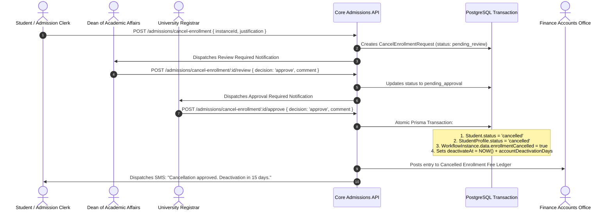
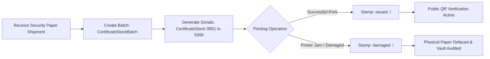
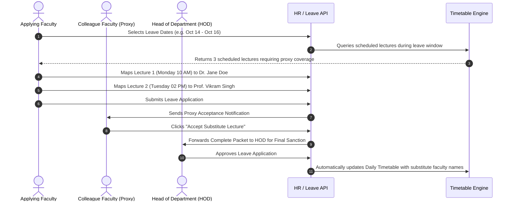

# Academic Leadership & Faculty Master Operating Manual & SOP
## Authoritative Technical Playbook for Registrar, Controller of Examinations, Dean/HOD, and Teaching Faculty

```
========================================================================================================================
UNIVERSITY ENTERPRISE RESOURCE PLANNING (UniversityERP)
DOCUMENT ID: UERP-SOP-ACAD-V4.2
CLASSIFICATION: CONFIDENTIAL // ACADEMIC GOVERNANCE & EXAMINATION MANUAL
AUTHORITY: OFFICE OF THE VICE-CHANCELLOR, REGISTRAR & CONTROLLER OF EXAMINATIONS
APPLIES TO: ALL UNIVERSITY SCHOOLS, FACULTIES, CONSTITUENT COLLEGES & DEPARTMENT CHAIRS
========================================================================================================================
```

---

## 1. Academic Governance Framework & Regulatory Compliance

Academic delivery, curriculum rigor, and evaluation integrity in **UniversityERP** are structured in compliance with statutory guidelines established by:
- **University Grants Commission (UGC)**: Choice Based Credit System (CBCS), Continuous Internal Assessment (CIA), Minimum Attendance Thresholds.
- **National Education Policy (NEP 2020)**: Multiple Entry/Exit Pathways, Academic Bank of Credits (ABC), Skill & Value-Added Courses.
- **All India Council for Technical Education (AICTE)** & Professional Regulatory Bodies: Faculty-Student Ratio (FSR), Approved Intake Pools.

```
+--------------------------------------------------------------------------------------------------------------------+
|                                      STATUTORY ACADEMIC GOVERNANCE CONTINUUM                                       |
+--------------------------------------------------------------------------------------------------------------------+
  [1] University Registrar (Statutory Authority)
      * Custodian of Matriculation Register, Enrollment Cancellations, Degree Scrolls & Legal Attestations
                                   │
                                   v
  [2] Controller of Examinations (Examination Authority)
      * Paper Setting, Blind Anonymous Coding, Admit Card Gates, Live CBE Monitoring & Result Gazetting
                                   │
                                   v
  [3] Dean of Faculty & Head of Department (Pedagogical Operations)
      * Subject Allocations, NEP 2020 Elective Pools, Timetable Approval, CIA Marks Locking & No Dues
                                   │
                                   v
  [4] Teaching Faculty (Instruction & Continuous Assessment)
      * Daily Classroom Attendance, CIA Marks Entry, Question Bank Authoring & Leave Substitute Planning
+--------------------------------------------------------------------------------------------------------------------+
```

---

## 2. The University Registrar & Deputy Registrar Persona

### 2.1 Statutory Office & Legal Purview
- **Role Keys**: `Registrar`, `Dy Registrar`
- **Scope**: `university`
- **Primary Mandate**: Act as the chief administrative officer of the university, maintain the official register of matriculated students, execute student enrollment cancellations, and sign off on all legally binding certificates.

---

### 2.2 Standard Operating Procedure: Adjudicating Student Enrollment Cancellations (SOP-REG-001)

When a student requests early withdrawal or an admission clerk files for cancellation (`CancelEnrollmentRequest`):



#### Step-by-Step Registrar Review Checklist:
1. Registrar logs into the administrative portal and navigates to `/admissions/cancel-enrollment`.
2. Selects the **Pending Approval** queue.
3. Clicks on the student record to review the complete audit packet:
   - Student's Full Legal Name, Enrollment Number, and Batch.
   - Requester identity (`requestedBy`) and date of request.
   - Justification details (e.g. *"Secured seat in National Law School; requesting document release"*).
   - Prior Academic Dean's review remarks (`reviewedBy`, `reviewComment`, `reviewedAt`).
4. Verifies statutory UGC fee refund tier compliance:
   - Days elapsed since commencement of classes.
   - Non-retention of original certificates guarantee.
5. In the decision modal, inputs official registrar remarks:
   - e.g. *"Approved under UGC Withdrawal Guidelines 2026. Authorize caution deposit refund and release original 12th certificate."*
6. Clicks **Confirm & Sign Cancellation**:
   - System executes `POST /admissions/cancel-enrollment/:id/approve`.
   - Schedules background deactivation sweep (`cancel-enrollment.scheduler.ts`).

---

### 2.3 Standard Operating Procedure: Senate Convocation Gazette Approval (SOP-REG-002)

Prior to the annual convocation ceremony:
1. Receives the audited Degree Eligibility Roster from the Controller of Examinations.
2. Cross-references against the university Senate minutes for academic awards and university gold medals.
3. Inspects the multi-department institutional clearance status:
   $$\text{Institutional Clearance} = \text{Lab Clearance} \land \text{Library Clearance} \land \text{Hostel Clearance} \land \text{Finance Clearance}$$
4. Signs off on the **Senate Convocation Gazette**:
   - Freezes student records against any further post-graduation grade modifications.
   - Authorizes the Controller of Examinations to issue parchment degree certificates from the security paper vault.

---

## 3. The Controller of Examinations (COE) Persona

### 3.1 Office & Authority
- **Role Keys**: `Controller of Examinations`, `ExaminationController`
- **Scope**: `university`
- **Primary Mandate**: Preserve the absolute confidentiality, fairness, and academic rigor of all university assessments, enforce attendance and fee clearance prerequisites, manage double-blind grading, and publish verified results.

---

### 3.2 Standard Operating Procedure: Double-Blind Anonymous Evaluation Coding (SOP-COE-001)

To eliminate unconscious bias, regional bias, or nepotism during the evaluation of end-semester answer scripts:

```
[Student Physical / Digital Answer Script]
  * Visible Student Data: Enrollment No: 2024CSE0042, Roll No: R-012, Name: Rohit Sharma
       │
       v  (COE Triggers Cryptographic Coding Algorithm)
[Cryptographic Pseudorandom Assignment]
  * System generates: ExamAnonCode = "ANON-8F92-K012"
  * Physical Flap / Digital Mask covers original student identifiers
  * Encrypted Mapping Stored in Isolated COE Vault Table (ExamAnonCode)
       │
       v
[Faculty Evaluation Process]
  * Evaluator sees ONLY: "ANON-8F92-K012"
  * Evaluator enters marks: Question 1 = 8, Question 2 = 12, Total = 64/80
       │
       v  (Evaluation Concluded & Locked)
[COE Unmasking & Results Compilation]
  * COE triggers unmasking batch job: "ANON-8F92-K012" -> Rohit Sharma (2024CSE0042)
  * System calculates Final SGPA and Letter Grades
```

---

### 3.3 Standard Operating Procedure: Examination Admit Card (Hall Ticket) Release Gate (SOP-COE-002)

1. Navigate to `/examinations` $\to$ **Admit Card Configuration**.
2. Define eligibility parameters for the upcoming examination session:
   - **Minimum Attendance Threshold**: `75.0%` (strictly enforced across lecture + practical sessions).
   - **Financial Clearance Enforcement**: Toggle `Require Fee Clearance` to `true`.
   - **Academic Hold Check**: Verify student is not under disciplinary suspension (`ResultHold`).
3. System runs the automated **Pre-Exam Audit**:
   - Identifies ineligible students and records entries in `ExamAdmitCardIneligibility`:
     - *Type*: `ATTENDANCE_SHORTAGE` (e.g. Student has 68.4% attendance in Discrete Math).
     - *Type*: `FEE_DEFAULT` (e.g. Student has ₹45,000 overdue tuition balance).
4. Generates verified Hall Tickets for eligible candidates:
   - Embeds candidate photograph, examination center, seat number, and dynamic 2D QR code.
   - The QR code contains an HMAC-SHA256 signature validating the authenticity of the hall ticket.
5. Center invigilators use the **Invigilator Scanner** on their mobile devices (`/my-invigilation`) to scan candidate Hall Tickets at the examination hall door.

---

### 3.4 Standard Operating Procedure: Computer-Based Exam (CBE) Proctoring & Telemetry (SOP-COE-003)

For online and hybrid computer-based examinations administered via `/exam/:id`:
1. **Fullscreen Enforcement**:
   - The CBE client invokes the HTML5 Fullscreen API and pointer lock.
   - Any attempt to press `Alt+Tab`, `Cmd+Tab`, open browser developer tools, or switch monitors triggers an `ExamDirective: WARNING`.
2. **Proctoring Event Telemetry**:
   - The real-time CBE service (`:3002`) streams proctoring events via WebSockets to the COE Live Monitor (`/examinations/monitor`):
     - `BLUR_EVENT`: Window lost focus.
     - `FACE_ABSENT`: Webcam detected no face in viewport.
     - `MULTIPLE_FACES`: Webcam detected secondary unauthorized person.
     - `AUDIO_ANOMALY`: Ambient noise exceeded decibel threshold.
3. If an examinee exceeds the maximum violation threshold (e.g. 3 warnings), the COE or live proctor executes **Remote Examination Terminate**, locking the attempt with reason `MALPRACTICE_DETECTED`.

---

### 3.5 Standard Operating Procedure: Security Certificate Stock Inventory Auditing (SOP-COE-004)

Parchment paper used for printing official degree certificates and consolidated transcripts is subject to strict statutory chain-of-custody tracking:



#### Step-by-Step Stock Governance via `/documents`:
1. Navigate to `/documents` $\to$ **Certificate Inventory**.
2. Click **Add Stock Batch**:
   - Prefix: `STU-DEG-2026-`
   - Start Range: `1001`
   - End Range: `5000`
   - Security Features: *Rainbow Hot-Foil University Seal, Micro-Text Border, Anti-Copy Guilloche Pattern*.
3. System pre-populates 4,000 unique `CertificateStock` rows with status `AVAILABLE`.
4. During degree generation, the system mandates typing the physical serial number into the modal.
5. In the inventory table, the COE can filter by:
   - Page sizes: `5`, `10`, or `20` records per page.
   - Status: `AVAILABLE`, `ISSUED`, or `DAMAGED`.
   - Comments: Displays the exact actor who printed or damaged the certificate (`issued: 2024CSE0042/coe@university.edu`).

---

## 4. The Dean / Head of Department (HOD) Persona

### 4.1 Departmental Command & Academic Authority
- **Role Keys**: `Dean/HOD`, `HOD`
- **Scope**: `both` (Operates over specific Department and constituent academic cohorts)
- **Primary Mandate**: Oversee course allocations, balance faculty teaching workloads, lock NEP 2020 elective subject pools, approve master timetables, and sign off on continuous internal assessment (CIA) marks.

---

### 4.2 Standard Operating Procedure: NEP 2020 Elective Pools & Subject Elections (SOP-HOD-001)

1. Navigate to `/academics/electives` $\to$ **Subject Pools**.
2. Create CBCS Elective Baskets:
   - **Basket A (Discipline-Centric Elective)**: Machine Learning, Cloud Computing, Cyber Security.
   - **Basket B (Generic Interdisciplinary)**: Financial Analytics, Robotics for Non-Engineers, Environmental Law.
3. Configure Capacity Constraints:
   - Minimum Batch Size to run course: `15 Students`.
   - Maximum Class Capacity: `60 Students`.
4. Open the Student Election Window (e.g. 5 business days).
5. Monitor live enrollment quotas on the dashboard.
6. Once the deadline passes, HOD clicks **Lock Elective Roster**:
   - Invokes `SubjectComponentLock`.
   - System commits student records into `StudentSubjectEnrollment`.
   - Closes elective window; students can no longer drop or swap electives.

---

### 4.3 Standard Operating Procedure: Departmental Timetable Master Approval (SOP-HOD-002)

1. Navigate to `/timetable` $\to$ **Department Schedule Matrix**.
2. Review weekly lecture, tutorial, and laboratory slots across all departmental sections (`Section A`, `Section B`).
3. System Automated Conflict Validator detects:
   - **Hard Collision**: Faculty Dr. Sharma assigned to Section A and Section B at Monday 09:00 AM.
   - **Hall Collision**: Physics Lab 1 double-booked for Mechanical and Civil sections.
4. HOD drags and drops lecture blocks to resolve collisions.
5. Clicks **Sign & Publish Timetable**:
   - Dispatches timetable updates to student and faculty web/mobile dashboards.
   - Generates the official printable departmental timetable PDF (`timetablePdfExport.ts`).

---

### 4.4 Standard Operating Procedure: Locking Continuous Internal Assessment (CIA) Marks (SOP-HOD-003)

1. Navigate to `/academics/marks` $\to$ **Department Marks Register**.
2. Select Academic Year, Term, and Course.
3. Review submitted scores for:
   - Internal Test 1 (20 Marks).
   - Internal Test 2 (20 Marks).
   - Practical Lab Viva / Continuous Evaluation (30 Marks).
   - Seminar / Project Presentation (10 Marks).
4. Inspect class statistical distributions (Mean, Median, Standard Deviation):
   - Identifies abnormal clusters (e.g. 95% of students given full 20/20).
   - If discrepancies exist: Clicks **Return to Faculty for Re-Moderation** with notes.
5. If verified and compliant: Clicks **Lock & Transmit to COE**:
   - Executes `POST /academic/marks/lock`.
   - Creates an immutable digital snapshot. Faculty can no longer modify grades.

---

## 5. The Teaching Faculty Persona

### 5.1 Instructional Mission & Classroom Execution
- **Role Keys**: `TeachingFaculty`, `Professor`, `Lecturer`
- **Scope**: `institute`
- **Primary Mandate**: Deliver pedagogical lectures, record real-time daily classroom attendance, evaluate continuous internal assessments, author question items, and arrange substitute coverage during leaves.

---

### 5.2 Standard Operating Procedure: Daily Classroom Attendance Recording (SOP-FAC-001)

1. Faculty opens mobile PWA or web portal and navigates to `/my-timetable`.
2. Locates current active lecture slot $\to$ Clicks **Take Attendance**.
3. System loads classroom roll grid:
   - Displays student photographs, Roll Numbers, and Full Names.
   - Current overall attendance percentage badge next to each student.
4. Marking Modes:
   - **Default Present**: All students pre-marked *Present*; faculty clicks absentees (efficient for small classes).
   - **Manual Call**: Mark *Present* (`P`), *Absent* (`A`), or *On Duty / Medical* (`OD`).
   - **Biometric Device Sync**: Ingests automated RFID door-reader logs; highlights absent students for visual confirmation.
5. Faculty clicks **Submit Attendance Register**:
   - Persists `StudentSubjectAttendance` records.
   - Updates student running attendance percentage.
   - If a student's attendance drops below the 75% statutory bar, the system automatically triggers an SMS alert to the registered guardian:
     ```
     Alert: Attendance of Rohit Sharma in CS101 has fallen to 71.4% (minimum 75% required). Contact HOD immediately. - UNIVER
     ```

---

### 5.3 Standard Operating Procedure: Applying for Leave with Substitute Lecturer Mapping (SOP-FAC-002)

To ensure academic continuity and zero cancelled lectures when a faculty member takes leave:



#### Step-by-Step UI Execution:
1. Faculty navigates to `/hr/leaves` $\to$ **Apply for Leave**.
2. Selects Leave Category: `Casual Leave (CL)`, `Earned Leave (EL)`, or `Duty Leave (OD)`.
3. Selects Start Date and End Date. System verifies balance from `LeaveBalance`.
4. If lectures are scheduled during the selected window, the **Substitute Arrangement Modal** opens automatically:
   - System lists every affected lecture with subject, batch, and room.
   - Faculty selects an available colleague from the dropdown for each lecture.
5. Submits application. The nominated colleagues receive an instant notification on their dashboard.
6. Once all substitute colleagues confirm, the application is transmitted to the HOD for final approval.

---
```
========================================================================================================================
END OF MANUAL: ACADEMIC LEADERSHIP & FACULTY MASTER OPERATING MANUAL (UERP-SOP-ACAD-V4.2)
========================================================================================================================
```
