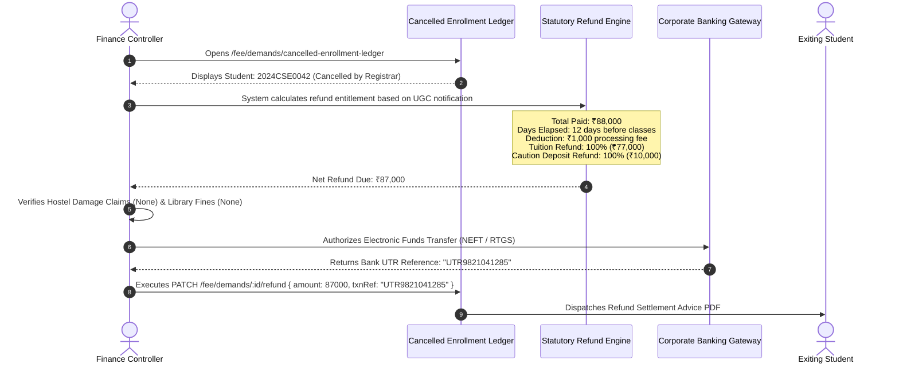

# Finance, Accounts & Logistics Master Operating Manual & SOP
## Authoritative Technical Playbook for Finance Head, Accounts Officer, Hostel Warden, Transport Incharge, and Central Librarian

```
========================================================================================================================
UNIVERSITY ENTERPRISE RESOURCE PLANNING (UniversityERP)
DOCUMENT ID: UERP-SOP-FINLOG-V4.2
CLASSIFICATION: CONFIDENTIAL // FINANCIAL GOVERNANCE & AUXILIARY LOGISTICS MANUAL
AUTHORITY: OFFICE OF THE CHIEF FINANCIAL OFFICER & DEAN OF CAMPUS INFRASTRUCTURE
APPLIES TO: BURSAR'S OFFICE, CASHIER DESKS, RESIDENTIAL HALLS, TRANSIT FLEET & UNIVERSITY LIBRARIES
========================================================================================================================
```

---

## 1. Enterprise Fiscal Architecture & Double-Entry Accounting Model

Financial operations in **UniversityERP** enforce strict double-entry ledger discipline across all student, departmental, and institutional accounts:

```
                                  +-----------------------+
                                  |   Master Fee Head     |
                                  | (TUITION, LAB, DEV)   |
                                  +-----------------------+
                                              │
                                              v
                                  +-----------------------+
                                  | Master Fee Structure  |
                                  | (Programme, Year)     |
                                  +-----------------------+
                                              │
                                              v
                                  +-----------------------+
                                  |      FeeDemand        |
                                  | (Invoice / Obligation)|
                                  +-----------------------+
                                       │             │
                    Debit Obligation   │             │   Credit Settlement
                                       v             v
                           +-------------------------------+
                           |          FeeLedger            |
                           |   (Double-Entry Running Bal)  |
                           +-------------------------------+
                                              │
                                              v
                                  +-----------------------+
                                  |        Payment        |
                                  | (Bank Ref, Receipt No)|
                                  +-----------------------+
```

### Relational Model Guarantees:
1. **Zero Negative Balances**: System ledger balances strictly reflect:
   $$\text{Outstanding Balance} = \sum \text{FeeDemands.amountDue} - \sum \text{Payments.amountPaid} - \sum \text{FeeWaivers.amount}$$
2. **Immutable Payment Receipts**: Once a `Payment` record receives an official `receiptNo` (e.g. `REC-2026-00812`), the transaction record is locked against deletion or mutation. Corrections require an explicit reverse credit memo.
3. **Segregated Caution Deposits**: Refundable caution deposits are isolated in dedicated `DEPOSIT` ledgers, ensuring they are never co-mingled with recognized operational revenue.

---

## 2. The Finance Head / Finance Controller Persona

### 2.1 Office & Authority
- **Role Keys**: `Finance Head`, `Finance Controller`
- **Scope**: `both` (University or Institute level)
- **Primary Mandate**: Design multi-tier fee structures, manage the Automated Recurring Billing Engine, govern scholarship endowments, approve fee waivers, and authorize caution deposit refund vouchers.

---

### 2.2 Standard Operating Procedure: Master Fee Structure Configuration (SOP-FIN-001)

1. Navigate to `/fees` $\to$ **Fee Structures**.
2. Click **Create Fee Structure**:
   - Target Programme: `B.Tech Computer Science & Engineering (BTECH_CS)`.
   - Academic Year: `2026`.
   - Applicable Term: `Semester I (Year 1)`.
3. Add itemized **Fee Head** components:
   - `TUITION`: ₹65,000.00 (Academic Delivery, Recurring).
   - `LAB`: ₹8,000.00 (Computing Consumables, Recurring).
   - `DEV`: ₹5,000.00 (University Development Fund, Non-refundable).
   - `CAUTION`: ₹10,000.00 (Institute Caution Deposit, Refundable Security).
   - `EXAM`: ₹2,500.00 (Examination Conduct & Evaluation).
4. Configure Invoicing Rules:
   - **Due Date**: `2026-08-10`.
   - **Grace Period**: `7 Days`.
   - **Daily Compounding Late Fine**: `₹100.00 / Day` after grace period.
5. Click **Publish Structure**:
   - Enters published state; becomes the baseline template for automated semester billing.

---

### 2.3 Standard Operating Procedure: Automated Recurring Billing Engine (SOP-FIN-002)

To invoice an entire incoming or senior academic cohort:
1. Navigate to `/fees` $\to$ **Recurring Billing Workbench**.
2. Select Target Cohort: e.g., `B.Tech CSE 2024-2028`, Term: `Semester III`.
3. System runs the **Pre-Billing Simulation**:
   - Calculates baseline charges across all active matriculated students (e.g. 120 students $\times$ ₹75,000 = ₹90,00,000).
   - Applies active **Category Concessions** (`batch-concessions`):
     - SC/ST Students: 50% tuition waiver (deducts ₹32,500 per eligible student).
     - Merit Scholarship Holders: Full tuition waiver (deducts ₹65,000).
   - Calculates net billable receivables.
4. Finance Head reviews simulation breakdown $\to$ Clicks **Execute Invoicing Run** (`POST /fee/recurring/run`):
   - In an atomic transaction, generates individual `FeeDemand` records per student per fee head.
   - Posts corresponding debit entries to each student's `FeeLedger`.
   - Emits batch email invoices with itemized PDF vouchers to parents and students.

---

### 2.4 Standard Operating Procedure: Cancelled Enrollment & Caution Deposit Refunds (SOP-FIN-003)

When an enrollment cancellation is approved by the Registrar:



---

## 3. The Accounts Officer / Accountant Persona

### 3.1 Frontline Cashiering & Collections
- **Role Keys**: `Accounts Officer`, `Accountant`
- **Scope**: `both`
- **Primary Mandate**: Execute offline fee collections, reconcile payment gateway settlements, issue audited receipts, and manage fee defaulter restrictions.

---

### 3.2 Standard Operating Procedure: Frontline Offline Fee Cashiering (SOP-ACC-001)

1. Student or guardian presents at the Cashier Counter.
2. Accountant navigates to `/fees` $\to$ **Collect Fee**.
3. Enters student identifier: `Enrollment No`, `Roll No`, or `Mobile Phone`.
4. System displays student financial profile:
   - Total Invoiced: ₹88,000.00
   - Previously Paid: ₹0.00
   - Accrued Late Fines: ₹500.00
   - Net Outstanding: ₹88,500.00
5. Cashier enters collection breakdown:
   - Payment Mode: `CASH`, `DEMAND_DRAFT`, `NEFT_CHALLAN`, or `POS_MACHINE`.
   - If Demand Draft: Enters DD Number, Date, Issuing Bank, and Branch.
   - If NEFT/RTGS: Enters Bank UTR Number.
   - Amount Tendered (supports split payment, e.g. ₹50,000 now, ₹38,500 pending).
6. Clicks **Confirm & Record Payment** (`PATCH /fee/demands/:id/pay`):
   - Generates official signed **University Fee Receipt** (`Payment.receiptNo`).
   - Thermal / Laser printer produces duplicate receipt (Student copy + Accounts copy).
   - Real-time ledger balance updates instantly on student mobile dashboard.

---

### 3.3 Standard Operating Procedure: Defaulters Management & Hall Ticket Holds (SOP-ACC-002)

1. Navigate to `/fees` $\to$ **Defaulters Report**.
2. Filters by Institute, Department, Batch, and Minimum Overdue Days (e.g. $> 30$ days overdue).
3. System aggregates all students carrying an outstanding balance.
4. Selects delinquent cohort $\to$ Clicks **Apply Examination Hold**:
   - Stamps student profile with administrative hold flag.
   - Prevents the examination system from generating or releasing the end-semester Admit Card (Hall Ticket).
   - Sends urgent reminder notice to parent with direct online payment link.

---

## 4. The Campus Hostel Warden Persona

### 4.1 Residential Governance & Property Management
- **Role Keys**: `Warden`, `Hostel Warden`
- **Scope**: `institute`
- **Primary Mandate**: Oversee student residential life, maintain 100% room occupancy accuracy, conduct check-in inventory inspections, and enforce room vacation damage recovery.

---

### 4.2 Standard Operating Procedure: Room Allocation & Physical Handover (SOP-HST-001)

1. Receives student hostel request via `/hostel/requests`.
2. Inspects room matrix:
   - Filters by Hostel Block (e.g. `Boys Hostel 1`), Floor, and Room Type (`Single AC`, `Double Non-AC`).
   - Identifies room with vacant bed (e.g. `Room 304, Bed B`).
3. Executes Physical Check-In Checklist with student present:
   - [ ] Study table and ergonomic chair intact.
   - [ ] Wooden wardrobe with lock and key.
   - [ ] Electrical fixtures, ceiling fan, and LED lighting functional.
   - [ ] Air conditioner remote and cooling operational (for AC rooms).
   - [ ] Window glass panes and mesh screen undamaged.
4. Clicks **Confirm Room Allocation** (`POST /hostel/allocations`):
   - Updates room occupancy count.
   - Generates `HostelAllocation` record.
   - Automatically posts monthly `HostelFeeComponent` (Room Rent + Mess Advance) to student's central ERP fee ledger.

---

### 4.3 Standard Operating Procedure: Room Vacation & Residential "No Dues" Clearance (SOP-HST-002)

1. Student initiates room vacation or graduation clearance.
2. Warden and maintenance caretaker conduct physical room exit inspection:
   - Compares physical state against the original check-in checklist.
   - If damage is detected:
     - Warden inputs: Damage Item (`Broken Desk Drawer`), Assessment Cost (`₹850.00`), Photo Evidence.
     - System creates a damage recovery charge on student's pending ledger.
3. Warden verifies that monthly mess rebates and food billing are reconciled.
4. Clicks **Sign Off Hostel No Dues**:
   - Changes bed status to `VACANT_CLEANING_REQUIRED`.
   - Releases residential hold in the central graduation workflow.

---

## 5. The Transport Incharge Persona

### 5.1 Fleet Operations & Transit Governance
- **Role Keys**: `Transport Incharge`
- **Scope**: `institute`
- **Primary Mandate**: Manage university buses and shuttles, optimize transit routes, ensure driver regulatory compliance, and issue digital QR bus passes.

---

### 5.2 Standard Operating Procedure: Transit Route Setup & Digital Bus Pass Issuance (SOP-TRN-001)

1. Navigate to `/transport` $\to$ **Routes & Fleet**.
2. Define Transit Route:
   - Route Code: `RT-08`
   - Route Name: `South Suburban Express`
   - Assigned Vehicle: `DL-01-AB-5678` (52-Seater Ashok Leyland Bus)
   - Assigned Driver: `Mr. Harpreet Singh` (Mobile: `+91-9811223344`)
3. Configure Pickup Stops and Timetable:
   - Stop 1: Metro Gate 2 (`07:15 AM`)
   - Stop 2: Sector 14 Market (`07:30 AM`)
   - Stop 3: University South Gate (`08:15 AM`)
4. Approving Student Pass Applications:
   - Selects student applicant $\to$ selects pickup stop $\to$ verifies bus capacity.
   - Generates digital **Transport Pass** (`TransportPass`):
     - Renders pass on student mobile app with student photo, route number, and dynamic 2D QR code.
     - Bus conductor uses hand-held smartphone scanner to validate boarding QR code.

---

## 6. The Central Librarian Persona

### 6.1 Learning Resource Management & RFID Circulation Desk
- **Role Keys**: `Librarian`
- **Scope**: `institute`
- **Primary Mandate**: Catalog university learning resources, govern RFID circulation desk operations, enforce book return discipline, and sign off on library clearance.

---

### 6.2 Standard Operating Procedure: Circulation Desk Operations (SOP-LIB-001)

1. **Book Checkout (`POST /library/issue`)**:
   - Student presents physical Smart ID Card at circulation counter.
   - Librarian scans student ID card barcode $\to$ retrieves student loan profile.
   - Scans book barcode/RFID tag on physical copy (`BK-000142`).
   - System validates eligibility:
     - Undergraduates: Maximum 4 books simultaneously.
     - Postgraduates / Ph.D.: Maximum 8 books simultaneously.
     - Zero outstanding overdue fines.
   - Stamped with 14-day loan duration.
2. **Book Check-in & Automatic Fine Calculation**:
   - Librarian scans returned book barcode.
   - If returned after due date:
     - System calculates overdue fine: $\text{Fine} = \text{Overdue Days} \times ₹5.00/\text{day}$.
     - Fine paid at desk or debited to student's ERP fee account.
   - System updates shelf status to `AVAILABLE`.

---

### 6.3 Standard Operating Procedure: Library "No Dues" Clearance (SOP-LIB-002)

When a student applies for graduation, transfer certificate, or cancellation:
1. Librarian opens `/library` $\to$ **Clearance Queue**.
2. System runs automated bibliographic audit:
   $$\text{Active Borrowed Books} == 0 \quad \land \quad \text{Unsettled Fines} == 0$$
3. If unreturned books exist: Librarian contacts student or registers replacement cost charge.
4. Once verified, Librarian clicks **Sign Off Library No Dues**, releasing the academic hold.

---
```
========================================================================================================================
END OF MANUAL: FINANCE, ACCOUNTS & LOGISTICS MASTER OPERATING MANUAL (UERP-SOP-FINLOG-V4.2)
========================================================================================================================
```
