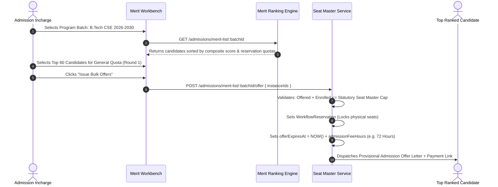
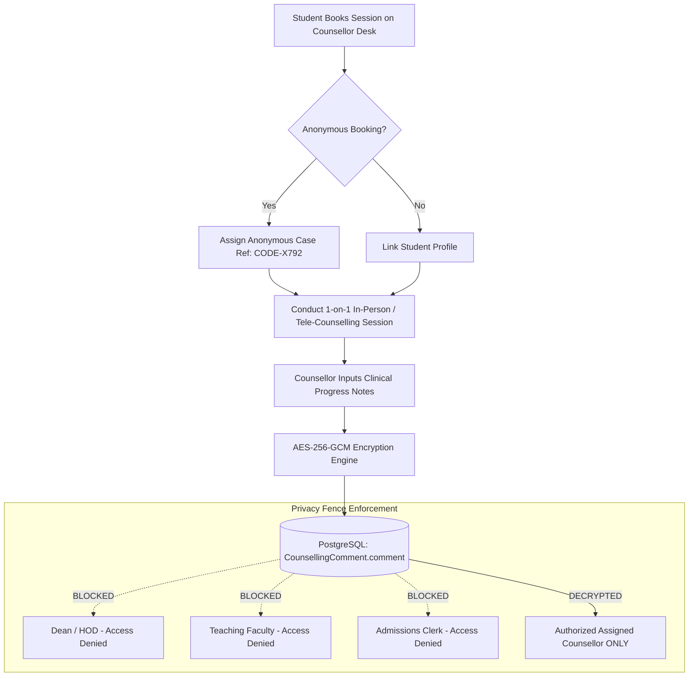

# Specialized Workflow Officers Master Operating Manual & SOP
## Authoritative Technical Playbook for Admission Approvers, Document Issuers, Results Publishers, Question Bank Approvers, Counsellors, and Administrative Staff

```
========================================================================================================================
UNIVERSITY ENTERPRISE RESOURCE PLANNING (UniversityERP)
DOCUMENT ID: UERP-SOP-WORKFLOW-V4.2
CLASSIFICATION: CONFIDENTIAL // SPECIALIZED GATED WORKFLOWS & OPERATIONS MANUAL
AUTHORITY: OFFICES OF ADMISSIONS, REGISTRAR, EXAMINATION CELL & STUDENT WELFARE
APPLIES TO: ADMISSION COMMITTEES, CREDENTIAL PRINTING VAULTS, EXAMINATION MODERATORS, PSYCHOLOGISTS
========================================================================================================================
```

---

## 1. Segregation of Duties (SoD) & High-Consequence Workflow Architecture

UniversityERP enforces strict cryptographic and institutional Segregation of Duties (SoD) to safeguard against fraud, credential forgery, grade manipulation, and privacy violations:

```
+--------------------------------------------------------------------------------------------------------------------+
|                                    SPECIALIZED WORKFLOW GATES & FIREWALLS                                          |
+--------------------------------------------------------------------------------------------------------------------+
  [Gate 1: Admissions Scrutiny & Merit Seat Allocation]
      * Handled by: Admission Incharge & Admission Approvers
      * Defense: Dual-check verification of academic proofs before merit inclusion; Seat Master intake caps enforced.

  [Gate 2: Anti-Counterfeit Document Issuance]
      * Handled by: Document Issuers & Security Paper Vault Custodians
      * Defense: Dynamic Canvas designer, pre-printed parchment paper serial tracking, and instant public QR validation.

  [Gate 3: Three-Tier Examination Result Moderation Firewall]
      * Handled by: Results Verifier -> Results Approver -> Results Publisher
      * Defense: Multi-tier approval before grade sheets are published; fee and disciplinary holds enforced.

  [Gate 4: Question Item Psychometrics & CBE Pool Approval]
      * Handled by: QuestionBank Reviewers & Subject Matter Chairs
      * Defense: Empirical validation of Facility Index (P) and Discrimination Index (D) under Bloom's Taxonomy.

  [Gate 5: Confidential Student Mental Health & Welfare]
      * Handled by: University Counsellors
      * Defense: Zero-knowledge encrypted case notes (AES-256); strict privacy fence isolating medical data from faculty.
+--------------------------------------------------------------------------------------------------------------------+
```

---

## 2. The Admission Incharge / Approver Persona

### 2.1 Office & Authority
- **Role Keys**: `Admission Approver`, `Admission Incharge`, `Admission Coordinator`
- **Scope**: `both` (University or Institute level)
- **Primary Mandate**: Scrutinize candidate application forms, verify scanned academic documents, raise defects with statutory cure windows, generate composite merit lists, and release formal admission seat offers.

---

### 2.2 Standard Operating Procedure: Candidate Application Scrutiny & Defect Raising (SOP-WFL-001)

1. Open `/admissions/applications` $\to$ Filter by `status = pending`.
2. Click **Review Application**:
   - Left Pane: Displays candidate bio-data, 10th/12th claimed scores, and entrance percentiles.
   - Right Pane: Embedded high-resolution PDF/image viewer displaying uploaded proofs.
3. Verification Audit Checks:
   - [ ] Verify candidate's date of birth matches Class 10th matriculation certificate.
   - [ ] Cross-check 12th Standard marks (Physics, Chemistry, Math/Biology) against statutory minimums (e.g. AICTE 50% aggregate).
   - [ ] For reserved category claims (OBC/SC/ST/EWS): Verify certificate validity date and issuing authority seal (e.g. Tehsildar / Sub-Divisional Magistrate).
4. Decision Paths:
   - **If Fully Compliant**: Click **Mark Documents Verified** (`scrutinyStatus = VERIFIED`).
   - **If Defect Found (e.g. Expired Certificate / Illegible Scan)**:
     - Click **Raise Scrutiny Defect**.
     - Select Defect Category: `EXPIRED_CERTIFICATE`, `ILLEGIBLE_SCAN`, `MARKS_DISCREPANCY`, or `MISSING_DOCUMENT`.
     - Input Mandatory Guidance: e.g. *"OBC Non-Creamy Layer certificate is older than 1 year. Upload certificate issued after April 1, 2026."*
     - System executes state transition to `DEFECT_RAISED`.
     - Automatically sends SMS & Email notification to applicant with a **48-hour cure window countdown**.
     - Upon applicant re-upload, system re-queues application for priority re-scrutiny.

---

### 2.3 Standard Operating Procedure: Cohort Merit List Compilation & Bulk Offers (SOP-WFL-002)



---

## 3. The Document Issuer Persona

### 3.1 Office & Authority
- **Role Key**: `Document Issuer`
- **Scope**: `both`
- **Primary Mandate**: Design official institutional certificates using the Canvas Document Designer, govern the pre-printed security paper vault, execute physical laser printing, and verify anti-counterfeit QR codes.

---

### 3.2 Standard Operating Procedure: Designing Credentials in Canvas Designer (SOP-WFL-003)

1. Navigate to `/documents` $\to$ **Document Templates** $\to$ **New Template**.
2. Canvas Setup:
   - Paper Size: `A4` or `A3` (Portrait or Landscape).
   - Margins: Set to `0mm` when printing onto pre-printed letterheads containing institutional border artwork.
3. Adding **Student Details Block**:
   - Click **Add Student Details Component**.
   - Configure Pair Layout:
     - `1 pair`: Full width row (e.g. `Student Name: Rohit Sharma`).
     - `2 pairs`: Side-by-side grid (e.g. Left: `Enrollment No`, Right: `Program`).
     - `3 pairs`: Dense tabular grid for comprehensive certificates.
   - Use Field Catalog Picker (`documentsApi.fieldCatalog`) to bind dynamic tokens:
     - `{{student.fullName}}`, `{{student.enrollmentNo}}`, `{{academic.course}}`, `{{results.cgpa}}`, `{{results.degreeClass}}`.
4. Adding **Tabular Academic Marksheet Grid**:
   - Insert Subjects Table component.
   - Toggle `firstRowHeader = true` (enforces styled header: Course Code, Course Title, Credits, Grade Secured, Points).
5. Embedding **Security Verification QR Code**:
   - Insert QR Code element. Set payload type to `Dynamic Verification URL`.
   - Engine automatically binds: `https://university.edu/verify?serial={{serialNo}}`.
6. Click **Save & Lock Template Version**.

---

### 3.3 Standard Operating Procedure: Pre-Printed Security Paper Issuance (SOP-WFL-004)

```
[Issuer Selects Approved Student Degree]
       │
       v
[System Displays Modal: "Input Security Paper Serial Number"]
       │
       v
[Issuer Retrieves Parchment Paper from Safe & Types Serial: "DEG-2026-00412"]
       │
       v
[System Validates Serial Exists in CertificateStock & Status == 'AVAILABLE']
       │
       v
[System Renders Final PDF & Updates Stock Record]
  * CertificateStock.status = 'ISSUED'
  * CertificateStock.issuedTo = studentId
  * CertificateStock.comment = 'issued: 2024CSE0042/issuer@university.edu'
  * IssuedDocument record persisted with SHA-256 integrity hash
```

---

## 4. The Results Verifier & Results Publisher Persona

### 4.1 Examination Moderation & Public Gazette
- **Role Keys**: `Results Verifier`, `Results Approver`, `Results Publisher`
- **Scope**: `both`
- **Primary Mandate**: Execute the statutory three-tier examination moderation firewall, adjust grace marks within academic council regulations, enforce financial/disciplinary result holds, and publish official results.

---

### 4.2 Standard Operating Procedure: Three-Tier Result Gazetting (SOP-WFL-005)

1. **Tier 1: Marks Verification (`Results Verifier`)**:
   - Opens `/examinations/results/verify`.
   - Audits double-blind anonymized marks entered by evaluators against raw physical score sheets.
   - Validates grace mark rules (e.g. maximum 3 grace marks to pass a borderline course).
   - Signs off on Tier 1 verification.
2. **Tier 2: Academic Council Approval (`Results Approver / Dean`)**:
   - Opens `/examinations/results/approve`.
   - Inspects cohort statistical distributions, pass percentages, and subject failure rates.
   - Authorizes formal release of results.
3. **Tier 3: Official Gazetting (`Results Publisher / COE`)**:
   - Opens `/examinations/results/publish`.
   - System evaluates active **Result Holds** (`ResultHold`):
     - Unpaid fee holds: Results withheld; displays message: *"Result withheld due to pending fee dues. Contact Accounts Office."*
     - Disciplinary holds: Results withheld pending Proctorial Board inquiry.
   - COE clicks **Publish to Student & Public Portals**:
     - Instantaneous availability on student mobile dashboard.
     - Grade cards rendered with verifiable QR codes.
     - Updates National Academic Depository (NAD) / DigiLocker sync queue.

---

## 5. The QuestionBank Reviewer & Approver Persona

### 5.1 Psychometrics & Examination Integrity
- **Role Keys**: `QuestionBank Reviewer`, `QuestionBank Approver`
- **Scope**: `both`
- **Primary Mandate**: Vet assessment question items, enforce Bloom's taxonomy distribution, validate empirical psychometrics, and approve randomized pools for Computer-Based Exams (CBE).

---

### 5.2 Standard Operating Procedure: Item Psychometrics & Pool Approval (SOP-WFL-006)

1. Navigate to `/question-bank` $\to$ **Item Review Desk**.
2. Select target Discipline and Course (e.g. `CS201 - Object Oriented Programming`).
3. For each submitted question:
   - **Content Validation**: Verify technical accuracy, question clarity, and unambiguous answer keys.
   - **Bloom's Taxonomy Classification**: Tag item as *Remembering (L1)*, *Understanding (L2)*, *Applying (L3)*, *Analyzing (L4)*, or *Evaluating (L5)*.
   - **Empirical Psychometrics Review**:
     - **Facility Index ($P$)**:
       $$P = \frac{R}{T}$$
       *(Where $R$ is correct answers, $T$ is total attempts. Target: $0.30 \le P \le 0.80$)*.
     - **Discrimination Index ($D$)**:
       $$D = \frac{U - L}{N}$$
       *(Where $U$ is top 27% cohort score, $L$ is bottom 27% cohort score. Target: $D \ge 0.30$)*.
4. Click **Approve for Exam Pool**:
   - Item is marked `APPROVED` and locked against further edits.
   - Enters the automated randomization bank for live CBE paper generation.

---

## 6. The Student Welfare Counsellor Persona

### 6.1 Mental Health Governance & Privacy Fence
- **Role Key**: `Counsellor`
- **Scope**: `both`
- **Primary Mandate**: Provide psychological support, personal counselling, and career mentorship while enforcing strict medical-grade data encryption and zero-knowledge confidentiality.

---

### 6.2 Standard Operating Procedure: Counsellor Desk & Private Case Logs (SOP-WFL-007)



#### Operational Directives for Counsellors:
1. All written session notes (`CounsellingComment.comment`) are encrypted at rest.
2. The database administrator and general faculty **cannot** read clinical case notes under any circumstances.
3. Outcome tracking: Upon session conclusion, counsellor logs wellness improvement ratings (1–5) and recommends follow-up sessions or institutional accommodations (e.g. extra exam time for documented anxiety).

---
```
========================================================================================================================
END OF MANUAL: SPECIALIZED WORKFLOW OFFICERS MASTER OPERATING MANUAL (UERP-SOP-WORKFLOW-V4.2)
========================================================================================================================
```
