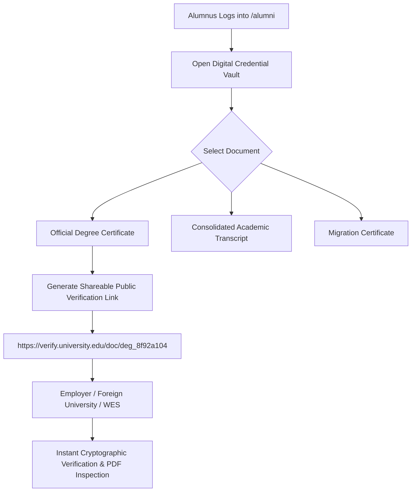

# Students, Parents & Alumni Master Operating Manual & User Guide
## Authoritative Technical Playbook for Applicants, Matriculated Students, Guardians, and Alumni

```
========================================================================================================================
UNIVERSITY ENTERPRISE RESOURCE PLANNING (UniversityERP)
DOCUMENT ID: UERP-SOP-CONSTITUENT-V4.2
CLASSIFICATION: USER EXPERIENCE & CONSTITUENT STANDARD OPERATING PROCEDURES (SOP)
AUTHORITY: OFFICES OF ADMISSIONS, ACADEMIC AFFAIRS, BURSAR & ALUMNI RELATIONS
APPLIES TO: ALL PROSPECTIVE CANDIDATES, ENROLLED STUDENTS, PARENTS/GUARDIANS & GRADUATED ALUMNI
========================================================================================================================
```

---

## 1. The Constituent Journey Framework

UniversityERP places the learner and their family at the center of the university experience. Every digital touchpoint is optimized for zero friction, responsive mobile access, and complete operational transparency:

```
+--------------------------------------------------------------------------------------------------------------------+
|                                      THE COMPLETE CONSTITUENT CONTINUUM                                            |
+--------------------------------------------------------------------------------------------------------------------+
  [Stage 1: Prospective Applicant]
      * Public Discovery -> Form Submission -> Razorpay App Fee -> Defect Resolution -> Offer Acceptance
                                   │
                                   v
  [Stage 2: Matriculated Enrolled Student]
      * Daily Schedule -> Real-Time Attendance -> NEP 2020 Electives -> Invoices -> CBE Exams -> Campus Facilities
                                   │
                                   v
  [Stage 3: Parent / Legal Guardian]
      * Passwordless Mobile OTP -> Daily Attendance Inspection -> Report Cards -> Direct Fee Invoicing
                                   │
                                   v
  [Stage 4: Graduated Alumnus]
      * Permanent Credential Vault -> Shareable Public Verification QR -> Transcripts -> Alumni Network
+--------------------------------------------------------------------------------------------------------------------+
```

---

## 2. The Prospective Applicant Persona

### 2.1 Access & Account Lifecycle
- **Role Key**: `Applicant`
- **Portal URL**: `/admissions/apply`
- **Device Support**: Optimized for Mobile Safari, Chrome, and Desktop Browsers.
- **Session Lifespan**: Ephemeral candidate session governed by Mobile OTP verification.

---

### 2.2 Standard Operating Procedure: Application to Matriculation (SOP-CST-001)

#### Step 1: Candidate Account Registration
1. Access `/admissions/apply`.
2. Enter First Name, Last Name, Date of Birth, Email Address, and 10-digit Mobile Phone Number.
3. Click **Send Verification Code**:
   - System dispatches a 6-digit numeric OTP via SMS and Email (`MobileOtp`).
   - Enter OTP within 5 minutes.
   - Upon verification, system creates candidate account and issues immediate session token.

#### Step 2: Completing the Admission Application Form
1. **Academic Selection**:
   - Select Target Campus / Institute (e.g. *Main Campus College of Engineering*).
   - Select Degree Level (`Undergraduate`) $\to$ Select Programme (`B.Tech Computer Science`).
2. **Personal & Demographic Details**:
   - Father's / Mother's Legal Name, Occupation, and Annual Family Income.
   - Social Category: `General`, `OBC-NCL`, `SC`, `ST`, or `EWS`.
   - Permanent Residential Address and Domicile State.
3. **Academic Credentials Entry**:
   - Class 10th Board, Passing Year, Roll Number, and Aggregate Percentage.
   - Class 12th Board, Subject-wise Marks (Physics, Chemistry, Mathematics).
   - Competitive Entrance Score (e.g. JEE Main Application Number and All India Rank).
4. **Document Scans Upload**:
   - Upload Passport Size Photo (`JPG/PNG`, Max: 2 MB).
   - Upload Candidate Signature Scan (`JPG/PNG`, Max: 1 MB).
   - Upload 10th & 12th Marksheets (`PDF`, Max: 5 MB).
   - Upload Category Certificate (if claiming reservation).

#### Step 3: Application Fee Checkout
1. System validates all form fields against the Zod schema (`OnboardImportSchema`).
2. Click **Proceed to Payment**:
   - Embedded **Razorpay Modal** launches displaying order details.
   - Select payment mode: UPI (Google Pay, PhonePe, Paytm), NetBanking, or Debit/Credit Card.
3. Upon successful transaction:
   - System displays **Payment Successful** confirmation.
   - Download official **Application Fee Receipt** (`REC-APP-2026-XXXXX`).
   - Application status transitions to `SUBMITTED_UNDER_SCRUTINY`.

#### Step 4: Tracking Scrutiny & Curing Defect Remarks
1. Applicant logs into `/admissions/status` using mobile number and OTP.
2. If an admission officer identifies an illegible document:
   - Status badge turns **Amber: Action Required**.
   - Defect banner displays:
     ```
     DEFECT NOTIFICATION: Class 12th marksheet scan is blurry and cut off at the bottom.
     Please re-upload a clear, full-page scanned PDF within 48 Hours.
     Deadline: 2026-06-14 18:00 IST
     ```
3. Applicant clicks **Resolve Defect & Upload**:
   - Uploads high-resolution scan.
   - Clicks **Submit Document**.
   - System confirms receipt and places application back in the scrutiny priority queue.

#### Step 5: Accepting Provisional Offer & Seat Lock
1. When candidate is selected on the Merit List:
   - System dispatches formal SMS & Email: *"Congratulations! You have been offered provisional admission to B.Tech CSE."*
2. Applicant logs into portal $\to$ Views **Provisional Admission Offer Letter**:
   - Displays official university letterhead, candidate details, and seat quota.
   - Itemized Admission Fee Demand:
     - Tuition Fee (Term 1): ₹65,000.00
     - Lab & Computing: ₹8,000.00
     - Caution Deposit (Refundable): ₹10,000.00
     - Total Due: ₹83,000.00
   - **Countdown Hold Timer**: Displays ticking timer: `68h 14m remaining`.
3. Applicant clicks **Pay Admission Fee & Accept Offer**:
   - Completes payment via Razorpay.
   - System automatically converts applicant into a matriculated student:
     - Assigns permanent **Enrollment Number** (`2026CSE0042`).
     - Provisions university Single Sign-On (SSO) email account.
     - Issues official **Admission Confirmation Certificate**.

---

## 3. The Matriculated Active Student Persona

### 3.1 Portal Access & Daily Routine
- **Role Key**: `Student`
- **Portal URL**: `/portal` (Web & Mobile PWA)
- **Primary Credentials**: University Enrollment Number (e.g. `2026CSE0042`) + Password.

---

### 3.2 Standard Operating Procedure: Daily Academic & Campus Life (SOP-CST-002)

#### A. The Interactive Daily Dashboard (`/portal/home`)
- **Today's Classes Carousel**:
  - Highlights currently active and upcoming lectures with live countdown.
  - Displays Lecture Subject (`CS101`), Classroom Number (`Hall 204`), and Faculty Name (`Dr. Jane Doe`).
- **Cumulative Attendance Health Gauge**:
  - Displays real-time aggregate percentage across all courses:
    - **Green Indicator ($\ge 75\%$)**: Good standing; fully eligible for examination hall ticket.
    - **Amber Indicator ($70\% - 74.9\%$)**: Shortage warning; requires immediate attendance recovery.
    - **Red Indicator ($< 70\%$)**: Critical default; exam admit card blocked by system.
- **Financial Obligation Widget**:
  - Displays `FEES CLEARED` badge or highlights upcoming semester demand due dates.

#### B. NEP 2020 CBCS Elective Course Election (`/portal/electives`)
1. When the department opens the election window:
   - Student receives in-app banner alert: *"Term III Elective Selection is Open"*.
2. Student navigates to `/portal/electives`:
   - Browses available course baskets: Discipline Specific Electives (DSE) and Open Electives (OE).
   - Clicks on course cards to view syllabus outline, course credits, and assigned professor.
   - Real-time vacancy indicator: Displays remaining seats (e.g. *Robotics: 8 / 60 seats remaining*).
3. Selects preferred electives $\to$ Clicks **Validate & Submit Selection**:
   - System runs instantaneous collision check against core lectures.
   - If collision-free: Confirms enrollment and adds subjects to personal timetable.

#### C. Semester Fee Payment & Receipt Vault (`/portal/fees`)
1. Navigates to `/portal/fees` $\to$ Views itemized `FeeDemand` line items.
2. Selects payment option:
   - **Full Payment**: Clears entire term obligation.
   - **Installment / Partial Payment**: Pays designated installment before grace period.
3. Completes payment via Razorpay gateway.
4. Accesses **Receipts Vault**:
   - Instant 1-click download of signed PDF receipts containing transaction reference, bank UTR, and official university QR seal (valid for income tax exemptions under 80E).

#### D. Examination Hall Ticket Download & Computer-Based Testing (CBE)
1. **Admit Card Download (`/portal/examinations`)**:
   - 14 days prior to examinations, student opens Examinations tab.
   - If attendance is $\ge 75\%$ and fee balance is cleared: Clicks **Download Admit Card (Hall Ticket)**.
   - Renders PDF containing candidate photograph, exam timetable, assigned examination hall, seat number, and an encrypted 2D QR code.
2. **Taking an Online Computer-Based Exam (CBE)**:
   - Navigates to `/exam/:id` on an approved desktop computer with webcam.
   - System initiates **Hardware Pre-Check**: Webcam feed active, microphone verified, single monitor detected.
   - Fullscreen proctoring mode locks the screen.
   - Solves randomized question items, marks questions for review, tracks countdown clock, and submits.
   - Instant score breakdown displayed upon test conclusion (for objective items).

#### E. Campus Facilities Self-Service
- **Hostel Bed Booking**: Opens `/portal/hostel` $\to$ selects room category (Single AC / Double Non-AC) $\to$ views allocated room and bed number.
- **Digital Bus Pass**: Opens `/portal/transport` $\to$ displays scannable digital transit pass with live QR code for bus conductor verification.
- **Library Catalog & Reservations**: Searches university OPAC $\to$ views shelf stack location $\to$ clicks **Reserve Copy**.
- **Confidential Counselling**: Opens `/portal/counselling` $\to$ books private session with university mental health counsellor.

---

## 4. The Parent / Legal Guardian Persona

### 4.1 Access & Security
- **Role Key**: `Parent`
- **Portal URL**: `/parent`
- **Authentication**: Passwordless Mobile OTP sent directly to the verified guardian mobile number registered during admission (`ParentLink`). Students cannot alter or bypass this link.

---

### 4.2 Standard Operating Procedure: Guardian Monitoring & Fee Clearance (SOP-CST-003)

```
+----------------------------------------------------------------------------------------------------+
|                                      PARENT PORTAL CAPABILITIES                                    |
+----------------------------------------------------------------------------------------------------+
  [1] Real-Time Biometric Attendance Inspection
      * Class-by-class daily attendance logs (e.g. Monday: 4/4 Present; Tuesday: 1 Absent in Math)
      * Monthly aggregate graphs; instant alert if attendance drops near the 75% examination threshold

  [2] Academic Evaluation & Report Cards
      * View Continuous Internal Assessment (CIA) test scores, mid-term marks & faculty mentor feedback
      * Instant download of official semester grade cards (SGPA / CGPA) upon formal gazetting

  [3] Direct Invoicing & Fee Payment Desk
      * Parents can view all pending semester fee demands directly
      * Integrated 1-click Razorpay payment allows parents to clear dues without needing student login
      * Immediate download of payment receipts for education loan disbursement or tax filings

  [4] Campus Circulars & Direct Faculty Connect
      * Direct view of official university circulars, exam dates, vacation schedules & holiday notices
      * One-click direct email link to the student's assigned Faculty Mentor and HOD
+----------------------------------------------------------------------------------------------------+
```

---

## 5. The Graduated Alumnus Persona

### 5.1 Credential Sovereignty & Lifelong Relationship
- **Role Key**: `Alumni`
- **Portal URL**: `/alumni`
- **Access Privilege**: Lifetime Single Sign-On access to the university digital credential vault.

---

### 5.2 Standard Operating Procedure: Credential Vault & Verification (SOP-CST-004)



#### Detailed Capabilities for Alumni:
1. **Instant Digital Credential Vault**:
   - High-resolution PDF downloads of Degree Scrolls, Transcripts, and Migration Certificates containing embedded SHA-256 cryptographic security hashes.
2. **Third-Party Verification URL Generator**:
   - Alumnus can generate an unguessable, read-only public verification link to paste on resumes, LinkedIn profiles, or submit to background check agencies.
   - When clicked, prospective employers see the official university attestation stamp confirming the graduate's degree authenticity without manual registrar verification delays.
3. **Ordering Official Sealed Transcripts**:
   - Submits requests for stamped, sealed physical transcript envelopes for foreign university admissions (e.g. WES, US/UK/Canada graduate admissions).
   - Pays transcript fee online; tracks international courier tracking number directly in the portal.
4. **Alumni Association Network**:
   - Directory of alumni across global chapters.
   - Access to campus guest lecture invitations, career mentorship opportunities, and annual convocation reunion registrations.

---
```
========================================================================================================================
END OF MANUAL: STUDENTS, PARENTS & ALUMNI MASTER OPERATING MANUAL (UERP-SOP-CONSTITUENT-V4.2)
========================================================================================================================
```
