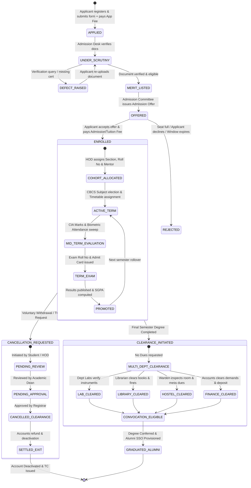
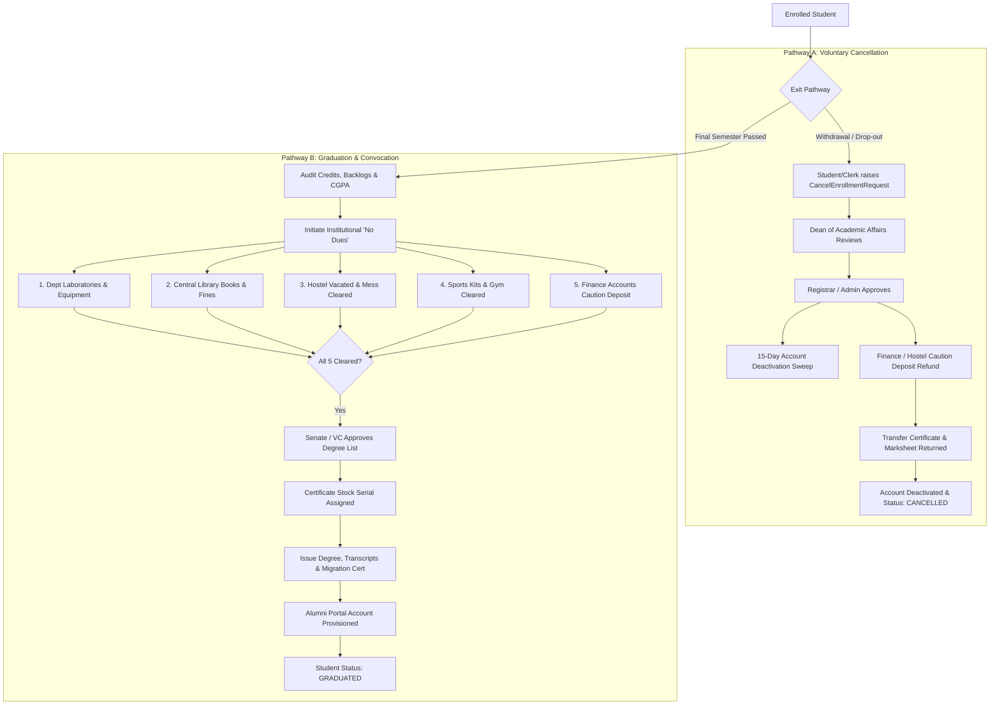

# End-to-End Student Lifecycle Architecture & Operational Journey
## From Prospective Applicant to Institutional Exit ("Getting the Student Out")

```
========================================================================================================================
UNIVERSITY ENTERPRISE RESOURCE PLANNING (UniversityERP)
DOCUMENT ID: UERP-ARCH-STU-LIFECYCLE-V4.2
CLASSIFICATION: INSTITUTIONAL GOVERNANCE & TECHNICAL SPECIFICATION
TARGET AUDIENCE: CHANCELLORS, REGISTRARS, FINANCE DIRECTORS, DEANS, PRINCIPAL ARCHITECTS, AUDITORS
========================================================================================================================
```

---

## Executive Summary & Scope

The **UniversityERP Student Lifecycle Engine** orchestrates every operational, financial, and pedagogical event in a learner's institutional journey. Unlike fragmented campus point solutions, UniversityERP governs the student journey across a unified transactional continuum:

1. **Intake & Admissions**: Lead acquisition, public application, scrutiny, merit generation, fee invoicing, and formal matriculation.
2. **Pedagogical Engagement**: NEP 2020 CBCS course election, timetable scheduling, biometric/RFID attendance, continuous internal assessment (CIA), and proctored examinations.
3. **Fiscal Lifecycle**: Automated recurring fee demands, dynamic concessions, scholarship disbursements, and penalty engines.
4. **Campus Logistics**: Hostel room allocation, biometric transit passes, and RFID circulation library management.
5. **Institutional Exit & Clearance**: Multi-department "No Dues" clearance, fee caution deposit reconciliation, enrollment cancellation/withdrawal, degree conferral, tamper-proof blockchain-style QR certificate issuance, and alumni network transition.

This document serves as the authoritative operational blueprint detailing **who initiates**, **who reviews**, **who approves**, and **who creates fees** across every milestone.

---

## High-Level Lifecycle State Machine



---

## Detailed Milestone Governance Matrix

| Stage | Milestone Name | Primary Actor (Initiator) | Reviewer / Verification Gate | Final Approver (Sign-off) | Fee Creation & Financial Engine | System Artifact Generated |
| :--- | :--- | :--- | :--- | :--- | :--- | :--- |
| **01** | Application Submission | Prospective Student / Parent | Dynamic Validation Engine (`Zod`) | System Registration Desk | Automated Application Fee Demand (`FeeHead: APPLICATION`) | `RegistrationRequest`, `WorkflowInstance (ADMISSION)` |
| **02** | Application Fee Settlement | Applicant (Razorpay / Cashier) | Gateway Webhook / Cashier Audit | Finance Officer | Invoiced Demand paid (`Payment.status = success`) | Official Digital Receipt (`REC-APP-XXXXX`) |
| **03** | Application Scrutiny | Admission Scrutiny Clerk | Verification Officer | Admission Convener | Defect penalty / fine if late re-submission | Document Verification Audit Stamp |
| **04** | Merit List & Quota Allocation | Admission Committee Clerk | Program Chair / HOD | Academic Dean / Registrar | Quota Seat Master Allocation (`ProgramSeatApproval`) | Merit Rank Card & Provisional Admission Offer |
| **05** | Admission & Term Fee Creation | Finance Officer / Accounts Desk | Automated Fee Master Policy | Finance Officer / Dean | **Fee Demand Created** (`FeeHead: ADMISSION, TUITION, LAB, CAUTION`) | Invoiced Student Demand (`FeeDemand`) with payment timer |
| **06** | Fee Payment & Enrollment | Candidate (via Razorpay or Bank Challan) | Finance Cashier / Auto-webhook | Registrar / System Core | Fee ledger marked PAID; Caution deposit credited to ledger | `Student`, `StudentProfile`, `EnrollmentNo`, Official ID Card |
| **07** | Academic Cohort & NEP Election | Department Timetable In-charge | Faculty Advisor / Mentor | Head of Department (HOD) | Laboratory / Elective Differential Fee Demand (if any) | `Batch`, `Section`, `RollNo`, `StudentSubjectEnrollment` |
| **08** | Semester Invoicing & Waivers | Automated Recurring Billing Engine | HOD / Scholarship Committee | Dean / Finance Officer | Semester Recurring Demands + Means/Merit Concessions | `FeeDemand`, `FeeWaiver`, `Scholarship` |
| **09** | Campus Facilities Allotment | Student via Self-Service Portal | Hostel Caretaker / Transport Clerk | Chief Warden / Logistics Officer | **Hostel & Transport Fee Demands** (`HostelFeeComponent`, `TransportPass`) | Room Key Allotment, Bus Pass QR, Library RFID |
| **10** | Continuous Assessment & Exams | Course Faculty | Department Examination Committee | Controller of Examinations (COE) | Exam Fee Demand (Regular / Backlog / Re-evaluation) | CIA Marksheets, Admit Card (`HallTicket`), Tabulation Register |
| **11A**| Voluntary Withdrawal / Cancellation | Student / Parent or Admission Clerk | Dean of Academic Affairs | Registrar / University Admin | **Caution Deposit Refund Request** (`ProgramDepositRefundRequest`) | `CancelEnrollmentRequest`, Transfer Certificate (TC) |
| **11B**| Graduation & "No Dues" Clearance | Outgoing Final-year Student | Lab In-charge, Librarian, Warden | Registrar & Controller of Examinations | Final Dues Settlement, Caution Deposit Cheque / NEFT | Institutional Clearance Certificate, Degree, Migration Cert |

---

## Detailed 11-Stage Operational Workflow

### Stage 1: Lead Capture, Registration & Application Submission
- **Business Goal**: Allow domestic and international candidates to discover university programs, register credentials, submit verifiable identity/academic records, and commit their candidature.
- **Who Initiates**: Prospective Student or Parent via the Public Admission Portal (`/admissions/apply`) or Admission Counselor via CRM Lead Desk (`/counselling/leads`).
- **Who Creates Fees**: 
  - The System Auto-Pricing Engine evaluates the candidate's chosen course (`UniversityStream` / `Course`).
  - Generates an immediate `FeeDemand` under `FeeHead: Application Fee` based on category (General, SC/ST, International).
- **Process Steps**:
  1. Candidate fills basic details (Full Name, Date of Birth, Gender, Mobile OTP, Email).
  2. Candidate chooses target Institute, Degree (`Programme`), and Specialization (`Course`).
  3. Candidate uploads scanned documents (10th/12th Marksheets, Entrance Exam Scorecard, Category Certificate, Government Photo ID).
  4. Candidate generates Razorpay checkout order for the Application Fee.
- **API Endpoints**:
  - `POST /auth/register-request` (Candidate onboarding)
  - `POST /forms/submit` (Admission dynamic form submission)
  - `POST /fee/razorpay/application-order` (Generates payment gateway order)
- **Data Mutation**:
  - `WorkflowInstance` created (`entityType = 'ADMISSION'`, `status = 'pending'`, `currentStep = 'document_scrutiny'`).
  - `RegistrationRequest` created with state `PENDING_VERIFICATION`.

---

### Stage 2: Application Fee Payment & Verification
- **Business Goal**: Secure institutional revenue before application review and lock the application against concurrent edits.
- **Who Initiates**: Candidate (online via UPI/Credit Card/NetBanking) or Cashier (offline cash/DD receipt at counter).
- **Who Approves**: 
  - Automated: Razorpay Webhook signature verification (`crypto.createHmac('sha256')`).
  - Manual: Finance Officer (`InstAdmin` / `UnivAdmin`) for Demand Draft/NEFT challans.
- **Process Steps**:
  1. Candidate completes transaction on checkout modal.
  2. Webhook triggers `verify-payment` endpoint; verifies payload signature against `university.config.razorpaySecret`.
  3. Demands marked `paid`; `FeeLedger` record appended with transaction reference.
  4. System dispatches SMS/Email notification with digital receipt.
- **API Endpoints**:
  - `POST /fee/razorpay/verify-payment`
  - `PATCH /fee/demands/:id/pay` (Manual offline settlement)
  - `GET /fee/payments/receipt/:receiptNo`
- **Data Mutation**:
  - `Payment` record created with status `SUCCESS`.
  - `FeeDemand.status` $\to$ `PAID`.
  - `WorkflowInstance.data.applicationFeePaid` set to `true`.

---

### Stage 3: Application Scrutiny & Document Verification
- **Business Goal**: Ensure candidate meets statutory statutory minimums (e.g. AICTE 50% PCM in 10+2, UGC age/reservation criteria) and eliminate fraudulent certificates.
- **Who Reviews**: Admission Scrutiny Clerk / Document Verification Officer.
- **Who Approves**: Admission Convener / Verification Superintendent.
- **Process Steps**:
  1. Officer accesses Admission Queue (`/admissions/applications`).
  2. Views uploaded certificates side-by-side with claimed grades.
  3. Inspects document authenticity; if genuine, marks document `VERIFIED`.
  4. If illegible or incorrect document uploaded:
     - Officer clicks **Raise Defect**.
     - Enters mandatory defect remark (e.g. "OBC Non-Creamy Layer certificate is expired. Upload certificate issued after April 1st").
     - Workflow status moves to `DEFECT_RAISED`; SMS/Email notification sent to applicant with 48-hour re-upload window.
  5. Upon candidate re-upload, document returns to verification queue.
- **API Endpoints**:
  - `GET /admissions/applications?status=pending`
  - `POST /workflow/instances/:id/transition` (`action = 'verify'` or `'raise_defect'`)
  - `POST /documents/verify-request`
- **Data Mutation**:
  - `WorkflowInstance.data.scrutinyStatus` updated to `VERIFIED`.
  - `WorkflowInstanceEvent` audit row appended with Clerk's User ID and timestamp.

---

### Stage 4: Merit List Generation, Quota Allocation & Admission Offers
- **Business Goal**: Select eligible candidates strictly against approved seat intake limits per category (Open, Reserved, Sports, Management, EWS).
- **Who Initiates**: Admission Committee Convener.
- **Who Approves**: Academic Dean and Registrar (validating against `ProgramSeatApproval` caps).
- **Process Steps**:
  1. Convener opens Merit Workbench (`/admissions/merit-list/:batchId`).
  2. System aggregates candidate entrance exam percentiles, qualifying exam marks, and bonus reservation points.
  3. Seat Master engine checks statutory intake:
     $$\text{Seats Offered} \le \text{Approved Intake Pool} - \text{Previously Enrolled}$$
  4. Convener selects top $N$ candidates and clicks **Issue Bulk Offers**.
  5. System generates formal **Provisional Admission Offer Letter** (using Canvas Document Designer template `ADMISSION_OFFER_V1`) stamped with institutional digital signature and QR verification URL.
- **API Endpoints**:
  - `GET /admissions/seat-master`
  - `GET /admissions/merit-list/:batchId`
  - `POST /admissions/merit-list/:batchId/offer`
- **Data Mutation**:
  - `WorkflowInstance.data.offerStatus` $\to$ `OFFERED`.
  - `WorkflowInstance.data.offerExpiresAt` $\to$ `NOW() + admissionFeeHours` (configurable via `FeeSettingsModal`).
  - Dynamic admission offer document stored in `IssuedDocument`.

---

### Stage 5: Admission Fee Demand Creation & Seat Acceptance
- **Business Goal**: Secure the candidate's firm commitment by collecting first-year/first-semester tuition, lab, library, and caution deposit fees within the validity window.
- **Who Creates the Fee**:
  - **Finance Officer / Accounts Desk**: Configures the institutional `FeeStructure` linked to the `Programme` and `AcademicYear`.
  - **Automated Engine**: Triggered automatically upon issuance of Admission Offer in Stage 4.
- **Components of Admission Fee Demand**:
  - Tuition Fee (Term 1)
  - Laboratory & Computing Fee
  - University Development Fee
  - Caution Deposit (Refundable upon graduation/exit)
  - Library Security Deposit (Refundable)
- **Process Steps**:
  1. Candidate logs in to Admission Portal, views Offer Letter and itemized Fee Demand.
  2. Payment window timer counts down (e.g. 72 hours). If expired without payment, seat offer is automatically revoked and rolled over to the waiting list (`bulkReject`).
  3. Candidate chooses online payment (Razorpay) or uploads Bank RTGS/NEFT payment counterfoil.
- **API Endpoints**:
  - `POST /fee/demands`
  - `POST /fee/razorpay/admission-order`
  - `POST /fee/razorpay/verify-admission-payment`
- **Data Mutation**:
  - `FeeDemand` records created for the student instance.
  - `FeeLedger` balances updated.
  - `WorkflowReservation` locks the physical seat during checkout.

---

### Stage 6: Formal Student Onboarding, Enrollment & Identity Issuance
- **Business Goal**: Convert applicant into a formal, legal matriculated student of the university with official identifiers and access privileges.
- **Who Initiates**: System Automated Core / Admission Registrar.
- **Who Approves**: University Registrar (Statutory authority for enrollment register).
- **Process Steps**:
  1. Upon successful admission fee payment verification, the system invokes the enrollment generator.
  2. System queries `IdFormat` configured for the institute (e.g. `{{YEAR}}{{PROG_CODE}}{{SEQ:4}}` $\to$ `2026CSE0042`).
  3. Atomically increments `IdSequenceCounter` within a database transaction to guarantee zero gap or collision.
  4. Creates permanent `Student` and `StudentProfile` records.
  5. Dispatches welcome SMS/Email containing University Single Sign-On (SSO) credentials (`username = enrollmentNo`, initial temporary password).
  6. Sends Parent Portal linking code to registered guardian mobile.
  7. Invokes Canvas Document Designer to render the official **Student Smart ID Card** (with barcoded Enrollment No and QR security hash).
- **API Endpoints**:
  - `POST /onboarding/students/commit`
  - `POST /id-format/generate`
  - `POST /documents/render`
- **Data Mutation**:
  - `WorkflowInstance.status` $\to$ `completed`, `outcome` $\to$ `approved`.
  - `Student.status` $\to$ `active`.
  - `StudentProfile` created with complete demographic, guardian, and address fields.
  - `UserRoleAssignment` grants `STUDENT` application role.

---

### Stage 7: Academic Cohort Allocation & NEP 2020 CBCS Enrollment
- **Business Goal**: Group students into teaching cohorts (Sections) and register them into Major, Minor, Ability Enhancement (AEC), and Skill Enhancement (SEC) courses.
- **Who Initiates**: Department Timetable Coordinator / Student Self-Service.
- **Who Approves**: Head of Department (HOD) / Faculty Mentor.
- **Process Steps**:
  1. Department admin opens `/master-data/batches` and assigns newly enrolled students to `Section` (A, B, C) ensuring gender/merit balance.
  2. System assigns academic `RollNo` (e.g. `CS-01`, `CS-02`).
  3. NEP 2020 CBCS Election Window opens:
     - Student logs into student portal.
     - Selects Core Courses (Mandatory).
     - Selects Open Elective (Inter-disciplinary, e.g. "Robotics for Civil Engineers").
     - Selects Value Addition Course (VAC, e.g. "Environmental Studies").
  4. HOD reviews and locks department subject election roster (`SubjectComponentLock`).
- **API Endpoints**:
  - `POST /academic/batches/:id/sections/assign`
  - `POST /academic/cbc/electives/select`
  - `POST /academic/subject-enrollments/lock`
- **Data Mutation**:
  - `StudentSubjectEnrollment` rows created linking student to `BatchTermSubject`.
  - Student timetable populated on mobile/web calendar.

---

### Stage 8: Semester Billing, Concessions, Waivers & Recurring Invoicing
- **Business Goal**: Manage recurring term fee collection, track defaults, grant financial aid, and disburse government reimbursements.
- **Who Creates Fees**: 
  - **Finance Officer / Accounts Super-Admin**: Sets up semester fee schedules.
  - **Recurring Billing Scheduler**: Executes batch demand generation 30 days prior to term commencement.
- **Who Approves Waivers/Scholarships**:
  - **Scholarship Committee / Dean of Student Welfare**: Reviews income certificates.
  - **Finance Officer**: Approves fee waivers (`FeeWaiver`) and applies category concessions (`batch-concessions`).
- **Process Steps**:
  1. Scheduler executes `POST /fee/recurring/run` or admin executes `POST /fee/batch-charge`.
  2. System calculates individual billables:
     $$\text{Net Payable} = \text{Base Tuition} + \text{Special Lab Fee} - \text{Concession} - \text{Approved Waiver}$$
  3. Invoices dispatched to students and parents with due date.
  4. Penalty Engine: If unpaid after grace period, `PATCH /fee/ledger/:id/late-fee` automatically calculates daily/flat compounding fines.
  5. Defaulter List: Admin generates `/fee/reports/defaulters` to restrict exam hall tickets or library loans.
- **API Endpoints**:
  - `POST /fee/recurring/run`
  - `POST /fee/batch-charge`
  - `POST /fee/waivers`
  - `PATCH /fee/waivers/:id/approve`
  - `GET /fee/reports/defaulters`
- **Data Mutation**:
  - `FeeDemand` records created per student per fee head.
  - `StudentConcession` or `FeeWaiver` applied as credit entries in `FeeLedger`.

---

### Stage 9: Campus Logistics & Facilities Management
- **Business Goal**: Provide residential, transportation, and learning resources to the matriculated student.
- **Who Requests**: Student via Self-Service Portal.
- **Who Approves**: 
  - Hostel: Chief Warden (`InstAdmin`).
  - Transport: Transport Supervisor.
  - Library: Central Librarian.
- **Who Creates Fees**:
  - System adds `HostelFeeComponent` (Room Rent, Mess Advance) and `TransportPass` route charges to the student's central `FeeDemand`.
- **Process Steps**:
  1. **Hostel Allocation**:
     - Student submits room preference (Single AC, Double Non-AC).
     - Warden reviews medical history and room vacancy matrix.
     - Warden clicks **Allocate Room**; creates `HostelAllocation`.
     - Key handover logged with physical inventory checklist.
  2. **Transport Route Pass**:
     - Student selects pickup stop (Route 4, Stop 12).
     - Transport officer validates bus capacity.
     - Digital transit pass generated with scannable QR.
  3. **Library Circulation**:
     - Student card scanned at checkout desk; RFID gate detects book barcode.
     - System creates `BookIssue` with 14-day loan duration.
- **API Endpoints**:
  - `POST /hostel/requests`
  - `POST /hostel/allocations`
  - `POST /transport/passes`
  - `POST /library/issue`
- **Data Mutation**:
  - `HostelAllocation` record active.
  - `TransportPass` issued.
  - `BookIssue` recorded against student library account.

---

### Stage 10: Continuous Internal Assessment, Exams & Degree Progression
- **Business Goal**: Measure learning outcomes, enforce attendance prerequisites, administer proctored examinations, and evaluate GPA/backlogs.
- **Who Manages**:
  - Faculty: Enters CIA marks (Test 1, Test 2, Seminars, Assignments).
  - Controller of Examinations (COE): Schedules end-semester university exams.
- **Prerequisite Gate (Eligibility Check)**:
  - Attendance threshold: Student must have $\ge 75\%$ overall attendance (`AttendanceConfig.minAttendancePercent`).
  - Financial clearance: Student must have zero overdue tuition fees.
  - If threshold violated, system flags `ExamAdmitCardIneligibility`.
- **Process Steps**:
  1. Faculty completes evaluation and locks marks (`SubjectComponentLock`).
  2. COE publishes examination timetable (`ExamSchedule`).
  3. Eligible students download QR-coded **Admit Card / Hall Ticket**.
  4. Center invigilators scan Hall Ticket QR at exam hall entry to verify seating.
  5. Post-examination, COE evaluates answer scripts (using double-blind `ExamAnonCode`), enters marks, and computes SGPA and Cumulative CGPA (`StudentCumulativeResult`).
  6. If candidate fails: backlog flagged; candidate registers for `SupplementaryExam`.
- **API Endpoints**:
  - `POST /academic/attendance/lock`
  - `GET /examination/admit-card/:studentId`
  - `POST /examination/results/publish`
- **Data Mutation**:
  - `StudentMarks`, `StudentTermResult`, and `StudentCumulativeResult` persisted.
  - Grade sheet rendered via `marksheet-render.ts`.

---

## Stage 11: The Two Exit Pathways ("Getting the Student Out")

A university ERP must support two distinct terminal exit pathways:
- **Pathway A**: Early voluntary withdrawal or disciplinary cancellation during the study program.
- **Pathway B**: Successful graduation, convocation, degree conferral, and transition to alumni status.



---

### Pathway A: Voluntary Cancellation & Withdrawal Operational Flow

- **Business Goal**: Handle mid-stream withdrawals (e.g. transfer to another university, personal reasons) compliantly, ensuring institutional property is returned, caution deposits refunded, and accounts cleanly deactivated.
- **Who Initiates**: 
  - The Student/Parent via written application or self-service portal.
  - Or the Admission Clerk / HOD via `/admissions/cancel-enrollment`.
- **Who Reviews**: Dean of Academic Affairs / Program Chair (`reviewerRoles`).
- **Who Approves**: University Registrar / InstAdmin (`approverRoles`).
- **Who Handles Refunds**: Finance Officer via Cancelled Enrollment Ledger (`/fee/demands/cancelled-enrollment-ledger`).

#### Detailed Workflow Steps:
1. **Request Creation**:
   - Authorized requester opens `/admissions/cancel-enrollment` and submits target `instanceId` with mandatory `justification`.
   - System validates that student is currently enrolled and no duplicate cancellation request is in flight.
   - Status becomes `pending_review`. Notifications dispatched to configured `reviewerRoles`.
2. **Academic Review**:
   - Academic Dean reviews student's academic standing, scholarship commitments, or disciplinary obligations.
   - Dean approves or rejects with mandatory `reviewComment`.
   - Upon approval, status moves to `pending_approval`. Notifications dispatched to `approverRoles`.
3. **Registrar Final Sign-off**:
   - Registrar evaluates statutory requirements (e.g. UGC refund policy rules based on days elapsed since admission).
   - Registrar executes `POST /admissions/cancel-enrollment/:id/approve`.
   - **System Actions Executed in Prisma Transaction**:
     - `Student.status` set to `'cancelled'`.
     - `StudentProfile.status` set to `'cancelled'`.
     - `WorkflowInstance.data.enrollmentCancelled` set to `true`.
     - `deactivateAt` timestamp computed: $\text{NOW()} + \text{accountDeactivationDays}$ (default: 15 days).
4. **Institutional Clearance & Fee Refund**:
   - Accounts department accesses `/fee/demands/cancelled-enrollment-ledger`.
   - System aggregates paid fees vs unconsumed hostel mess balances and caution deposits.
   - Finance Officer executes `ProgramDepositRefundRequest` and `HostelRefundRequest`.
   - Cheque / Bank NEFT payment reference logged.
5. **Document Issuance**:
   - Transfer Certificate (TC) and Migration Certificate generated via Canvas Document Designer (`DOCUMENT_TYPE: TC`).
   - Physical original certificates returned with signed acknowledgment receipt.
6. **Account Deactivation Sweep**:
   - Daily cron scheduler (`cancel-enrollment.scheduler.ts`) sweeps records where `deactivateAt <= NOW()`.
   - Deactivates student user account (`User.isActive = false`).
   - Revokes active JWT refresh tokens (`RefreshToken.deleteMany`).

---

### Pathway B: Graduation, Institutional "No Dues" & Convocation

- **Business Goal**: Formally graduate final-year students, ensure complete multi-department institutional clearance, refund caution security deposits, confer degrees, issue anti-counterfeit certificates, and onboard graduates into the Alumni Association.
- **Prerequisites**:
  - Total Credits Earned $\ge$ Program Requirement (e.g. 160 credits for B.Tech).
  - Zero active backlogs (`totalBacklogs == 0`).
  - Minimum CGPA criteria satisfied (e.g. $\text{CGPA} \ge 5.0$).

#### The 5-Department Institutional "No Dues" Workflow:

```
+----------------------------------------------------------------------------------------------------+
|                                    CENTRAL "NO DUES" ENGINE                                        |
+----------------------------------------------------------------------------------------------------+
  [1] Department Laboratories & Workshops
      * Equipment return verification (Oscilloscopes, Microcontroller kits, Chemical glassware)
      * Breakage assessment & fine clearance
      * Approver: Department Lab In-charge / HOD

  [2] Central University Library
      * Book return verification (all RFID-tagged books checked in)
      * Overdue fine clearance
      * Surrender of physical Library ID pass
      * Approver: Chief Librarian

  [3] Campus Hostel & Mess Administration
      * Physical room inspection (furniture, electrical fixtures, air conditioner integrity)
      * Mess rebate & monthly dues reconciliation
      * Key surrender & physical checkout timestamp
      * Approver: Hostel Warden / Caretaker

  [4] Sports, Logistics & Extra-Curricular
      * Return of university sports kits, athletic gear, and musical instruments
      * Surrender of Transport RFID Bus Pass
      * Approver: Director of Physical Education / Logistics Officer

  [5] Finance & Accounts Division (The Final Gate)
      * Verification of all 8 semester fee demands (Tuition, Lab, Exam, Library)
      * Calculation of Refundable Caution Deposit ($D_{refund} = D_{paid} - \text{Damage Deductions}$)
      * Generation of Refund Advice voucher for NEFT wire
      * Approver: Chief Finance Officer / Accounts Superintendent
+----------------------------------------------------------------------------------------------------+
```

#### Step-by-Step Graduation Process:
1. **Final Audit & Eligibility Roster**:
   - COE executes degree eligibility audit (`/examination/results/degree-audit`).
   - System flags candidates meeting graduation criteria.
2. **Clearance Initiation**:
   - System triggers the multi-department `WorkflowInstance (NO_DUES)` for each graduating student.
   - Each department head views pending clearance requests in their specialized portal dashboard.
   - Department heads click **Sign Off Clearance** (or record an outstanding claim).
3. **Academic Council & Senate Gazette**:
   - Once all 5 departments sign off, the list of graduates is compiled into the **Senate Convocation Gazette**.
   - Academic Council approves conferring of degrees.
4. **Certificate Stock & Tamper-Proof Printing**:
   - Examination cell retrieves allocated security certificate paper batch (`CertificateStockBatch`).
   - System assigns individual anti-counterfeit serial numbers (`CertificateStock.serialNumber`).
   - Documents service merges student demographic, CGPA, and academic data with the Canvas Document template.
   - Embeds:
     - High-density micro-text.
     - Dynamic 2D QR Code linking to `https://university.edu/verify?serial=XXXXX` with cryptographic SHA-256 integrity hash.
     - Gold-foil seal position guide.
   - System records the actor who printed/issued the certificate (`certificateStock.comment = 'issued: <enrollmentNo>/<user email>'`).
5. **Alumni Transition**:
   - Student's institutional status updated to `GRADUATED`.
   - Single Sign-On (SSO) account switched from active academic student privileges to **Alumni Network Portal**.
   - Lifetime institutional email address forwarding or alumni domain mailbox provisioned.

---

## Technical Architecture & Database Impact Summary

### Key Prisma Models & Relational Linkages

```
  +------------------+         1:N         +-----------------------+
  |    University    | ------------------->|       Institute       |
  +------------------+                     +-----------------------+
           |                                           |
           | 1:N                                       | 1:N
           v                                           v
  +------------------+                     +-----------------------+
  | WorkflowInstance |                     |        Program        |
  +------------------+                     +-----------------------+
           |                                           |
           | 1:1                                       | 1:N
           v                                           v
  +------------------+         1:1         +-----------------------+
  |     Student      | <================== |    StudentProfile     |
  +------------------+                     +-----------------------+
       |   |   |
       |   |   +---------------------------------------+
       |   |                                           |
   1:N |   | 1:N                                   1:N |
       v   v                                           v
  +-----------+  +-------------------+  +--------------------------+
  | FeeDemand |  | HostelAllocation  |  | StudentCumulativeResult  |
  +-----------+  +-------------------+  +--------------------------+
       |                                               |
   1:N |                                           1:1 |
       v                                               v
  +-----------+                         +--------------------------+
  | FeeLedger |                         |  IssuedDocument (Degree) |
  +-----------+                         +--------------------------+
                                                       |
                                                   1:1 |
                                                       v
                                        +--------------------------+
                                        |     CertificateStock     |
                                        +--------------------------+
```

### Critical API Catalog for Student Journey

| Phase | Method | Route | Controller | Guard / Authority |
| :--- | :--- | :--- | :--- | :--- |
| **Admission** | `GET` | `/admissions/seat-master` | `AdmissionsController` | `JwtAuthGuard` |
| **Admission** | `POST`| `/admissions/seat-master/approvals` | `AdmissionsController` | `Roles('UnivAdmin', 'SuperAdmin')` |
| **Admission** | `GET` | `/admissions/applications` | `AdmissionsController` | `Roles('InstAdmin', 'UnivAdmin')` |
| **Admission** | `POST`| `/admissions/merit-list/:batchId/offer`| `AdmissionsController` | `Roles('InstAdmin', 'UnivAdmin')` |
| **Admission** | `POST`| `/admissions/merit-list/:batchId/reject`| `AdmissionsController` | `Roles('InstAdmin', 'UnivAdmin')` |
| **Fees** | `POST`| `/fee/structures` | `FeeController` | `Roles('FinanceOfficer', 'UnivAdmin')`|
| **Fees** | `POST`| `/fee/demands` | `FeeController` | `Roles('FinanceOfficer', 'InstAdmin')`|
| **Fees** | `POST`| `/fee/razorpay/admission-order` | `FeeController` | `JwtAuthGuard` |
| **Fees** | `POST`| `/fee/razorpay/verify-admission-payment`| `FeeController`| `JwtAuthGuard` |
| **Fees** | `PATCH`| `/fee/demands/:id/pay` | `FeeController` | `Roles('FinanceOfficer', 'Cashier')` |
| **Onboarding**| `POST`| `/onboarding/students/commit` | `OnboardingController` | `Roles('SuperAdmin', 'UnivAdmin')` |
| **Exit** | `POST`| `/admissions/cancel-enrollment` | `CancelEnrollmentController`| `canRequest` role check |
| **Exit** | `POST`| `/admissions/cancel-enrollment/:id/review`| `CancelEnrollmentController`| `canReview` role check |
| **Exit** | `POST`| `/admissions/cancel-enrollment/:id/approve`| `CancelEnrollmentController`| `canApprove` role check |
| **Exit** | `GET` | `/fee/demands/cancelled-enrollment-ledger`| `FeeController` | `Roles('FinanceOfficer', 'UnivAdmin')`|
| **Degree** | `POST`| `/documents/render` | `DocumentsController` | `Roles('COE', 'Registrar')` |
| **Degree** | `POST`| `/documents/certificate-stock/issue` | `DocumentExtrasController`| `Roles('COE', 'ExamSuperintendent')`|
| **Verification**| `GET`| `/documents/verify/:serialNo` | `DocumentExtrasController`| Public / Unauthenticated |

---

## Statutory & Regulatory Compliance Standards

1. **UGC Fee Refund Mandate (Notification on Refund of Fees & Non-Retention of Original Certificates)**:
   - System automatically implements percentage refund tiers based on the time difference between admission cancellation approval date and formal commencement of classes:
     - $\ge 15$ days before: $100\%$ refund minus max ₹1,000 processing fee.
     - $< 15$ days before: $90\%$ refund.
     - $\le 15$ days after: $80\%$ refund.
     - $> 15$ days but $\le 30$ days after: $50\%$ refund.
     - $> 30$ days after: $0\%$ refund (caution deposit refunded in full).
2. **National Education Policy (NEP 2020) & ABC (Academic Bank of Credits)**:
   - System records unique 12-digit ABC ID (`StudentProfile.ext.abcId`) and maps all course credits to the APAAR / DigiLocker National Academic Depository (NAD).
3. **FERPA & Digital Personal Data Protection (DPDP) Act**:
   - Explicit role-based compartmentalization of student data.
   - PII data masked for general viewers; visible only to verified academic advisors and finance officers.
   - Complete immutable audit logs for profile modifications (`ProfileChangeLog`).

---
```
========================================================================================================================
END OF SPECIFICATION: STUDENT LIFECYCLE END-TO-END JOURNEY (UERP-ARCH-STU-LIFECYCLE-V4.2)
========================================================================================================================
```
